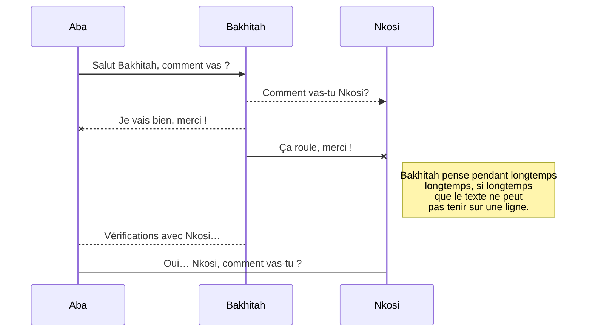

Bienvenue, félicitations et merci pour l'nitérêt que vous portez à <a href="/fr/home" style="font-family:'Yatra One', 'PT-Serif', serif;color: gold" >Ba-Moun𓅝Save</a>.

Vous trouverez sur cette page comment créer et modifier une page.


# Créer une nouvelle page

Dans le but de créer une nouvelle page, cliquez sur le bouton *Créer une nouvelle page* (voir première image de cette page). La boite de dialogue suivante apparait.


1. Choisissez la langue de la page à créer. La langue actuelle est sélectionnée par défaut.
2. Saisissez le chemin complet menant vers la page à créer.
   * Le chemin ne doit pas contenir d'espace. Utilisez des tirets à la place. Vous n'avez droit qu'à des caractères alphanumériques.
   * NE PAS mettre de barre oblique.
   * Il n'est pas nécessaire de créer des dossiers. Saisissez le chemin complet menant vers la page. Les dossiers seront créés automatiquement. Par exemple, en saisissant univers/planète/terre, les dossiers univers et planète sont créés automatiquement s'ils n'existent pas.
3. Cliquez sur *SELECT* pour poursuivre.

> Vous avez le droit de créer dans l'arborescence `en-cours/` uniquement.
> L'arborescence `encyclopédie/` n'est accessible en écriture qu'aux **𓄂 Nkonsonkonson**.
> Plus d'infos sur les groupes de la communauté <a href="/fr/home" style="font-family:'Yatra One', 'PT-Serif', serif;color: gold" >Ba-Moun𓅝Save</a> [-> ici <-](/fr/faq)
{.is-warning}

## Sélectionner un éditeur

À la création d'une nouvelle page, la boîte de dialogue suivante s'affichera.


Vous avez le choix entre plusieurs éditeurs. Choisissez l'éditeur en fonction du contenu que vous souhaitez rédiger. Vous pouvez aussi choisir l'éditeur en fonction de vos préférences. Les informaticiens ont habitiellement une préférence pour l'éditeur Markdown. Les personnes non techniques ont des préférences pour l'éditeur visuel.

Référez-vous à la section suivante pour une liste complète des éditeurs. Vous y verrez comment les utiliser.

### Editeurs

Vous pouvez utiliser l'éditeur de votre choix à la création d'une page. Certains utilisateurs préfèrent l'éditeur Markdown. D'autres préfèrent l'éditeur visuel.

> Une page créée avec un éditeur sera obligatoirement modifiée avec ce même éditeur.
{.is-warning}

### Éditeur Markdown

L'éditeur Markdown fournit un système de balise. Les sites Web comme GitHub fournissent de tels éditeurs. Ci-dessous une liste non exhaustive des balises mises à disposition.

#### Tabs {.tabset}

##### Onglets

Ajoutez *{.tabset}* à la fin de l'en-tête parente.

> L'en-tête parente n'est pas affichée.
{.is-info}

Vous pouvez utiliser n'importe quel niveau d'en-tête avec *{.tabset}*. Vous devez utiliser des en-têtes de niveau supérieur par la suite. Les en-têtes de niveau supérieur seront le nom des onglets.Par exemple, si l'en-tête parente est ### (h3), les onglets doivent avoir une en-tête de niveau #### (h4). Le niveau maximum d'une en-tête parente est 5. Le niveau maximum pour une en-tête enfant est 6.

###### Exemple

```
# Onglets (en-tête pas affichée) {.tabset}

## Premier onglet

Contenu du premier onglet…

## Second onglet

Contenu du second onglet…

## Troisième onglet

Contenu du troisième onglet…
```

#####  Emojis

Utilisez la syntaxe `:identifier:`.

Jetez un œil à l'[antisèche des émojis](https://www.webfx.com/tools/emoji-cheat-sheet/). Vous y trouvez la liste complète des options possibles.

###### Exemple

```
:apple:

Can be also be used :fire: inline
```

###### Résultat

:apple:

Can be also be used :fire: inline

#####  Note de pied de page

Dans le texte à référencer, utilisez la syntaxe `[^1]`. Variez le chiffre en fonction du numéro de la note. À la fin de la page, saisissez `[^1]: Note de bas de page`. variez le chiffre en fonction de la note. Un lien sera créé entre la marque contenu dans le texte et la note de fin.

Les notes de pied de page apparaissent automatiquement à la fin du fichier.

###### Exemple

```
Voici une phrase[^1] nécessitant de notes en pied de page.[^2]

[^1]: Pied de page n°1.
[^2]: Pied de page n°2.
```

#####  Bloc de code

Utiliser un triple accent grave avant et après le bloc de code.

###### Exemple 1

```
	```
	function lorem (ipsum) {
	    const dolor = 'consectetur adipiscing elit'
	}
	```
```

###### Résultat 1

```
function lorem (ipsum) {
    const dolor = 'consectetur adipiscing elit'
}
```

###### Exemple 2

Saisissez le nom du langage juste après les trois premiers accents graves. Ainsi, l'affichage du code sera adapté au langage utilisé.

```
	```java
	class main {
		int i = 0;

		void main () {}
	}
	```
```

###### Résultat 2

```java
class main {
   int i = 0;
   
   void main () {}
}
```
##### Liste à cocher

Utilisez la syntaxe `- [ ]` pour un élément décoché.
Utilisez la syntaxe `- [x]` pour un élément coché.

###### Exemple

```
	- [x] Élément vérifié
  - [x] Un autre élément vérifié
  - [ ] Un élément à véifier
```

###### Résultat

- [x] Élément vérifié
- [x] Un autre élément vérifié
- [ ] Un élément à véifier


##### Diagramme PlantUML

Utilisez un bloc de code **plantuml**.

Référez-vous au [site Web de PlantUML](https://plantuml.com/).

###### Exemple

```
	```plantuml
	Bakhitah->Aba : Hotep
	```
```

###### Résultat

```plantuml
Bakhitah->Aba : Hotep
```

#####  Diagrammes Mermaid

Utiliser un block de code avec le langage **mermaid**.

Référez-vous au [site Web de Mermaid](https://mermaid-js.github.io/mermaid).

###### Exemple

```
	```mermaid
  sequenceDiagram
      Aba ->> Bakhitah: Salut Bakhitah, comment vas ?
      Bakhitah-->>Nkosi: Comment vas-tu Nkosi?
      Bakhitah--x Aba: Je vais bien, merci !
      Bakhitah-x Nkosi: Ça roule, merci !

      Note right of Nkosi: Bakhitah pense pendant longtemps<br/>longtemps, si longtemps<br/>que le texte ne peut<br/>pas tenir sur une ligne.

      Bakhitah-->Aba: Vérifications avec Nkosi…
      Aba->Nkosi: Oui… Nkosi, comment vas-tu ?
	```
```

###### Résultat



## Éditeur Code

L'éditeur de code permet de saisir la page au format HTML.

### Cas particulier, les onglets

Utilisez des en-têtes. Ajoutez la classe `tabset` à l'en-tête parente. Cette en-tête ne sera pas affichée dans le résultat final.

> Vous pouvez utiliser n'importe quel niveau d'en-tête. Cela étant, les onglets doivent être définis avec des en-têtes de plus haut niveau. Par exemple, si une en-tête parente est `<h3>`, les en-têtes enfants doivent être `<h4>`. Ces en-têtes enfants donnent leurs noms aux onglets. Le niveau maximum d'une en-tête parent est `<h5>`. L'en-tête enfant maximum est `<h6>`.
{.is-info}


## Éditeur visuel

L'éditeur visuel est parfait pour les profils non techniques. Il de voir directement le résultat de ce qui est saisis.

# Propriétés de la page

Il est demandé de remplir les propriétés d'une page lors de sa création.


Saisissez donc son **titre** et une **description**.

Attribuez aussi des **tags** à votre page. Ils permettent de trouver rapidement la page. Vous pouvez en mettre plusieurs. Par exemple, une page sur **Méroé** peut être taguée :
- `ville`,
- `nile`,
- `antiquité`,
- `Soudan`
- `Royaume`
- `Royaume de Kush`
- `Kush`
- `etc.`
La page sur **Méroé** peut donc être retrouvée à l'aide d'un de ces tags.
Un tag peut être ajouté ou supprimé à tout moment.

Pour finir, cliquez sur **OK**. Cela ferme la boîte de dialogue. Vous pouvez enfin commencer à écrire. :)

> Vous pouvez toujours retourner sur les propriétés de la page. Cliquez sur le bouton **PAGE** pour cela. Ce dernier est situé en tout en haut à droite de votre page d'édition.
{.is-info}

# Sauvegarder

> Votre page n'est créée qu'une fois que vous avez cliqué sur le bouton **CRÉER**. Celui-ci est tout en haut à droite de votre page d'édition.
{.is-warning}

Une fois sauvegardé, vous êtes redirigé vers le rendu de la page que vous avez créée.

Cliquez sur le bouton **Éditer / agir sur une page** (cf. première image de cette page) pour reprendre l'édition !
# Modifier une page

Vous pouvez éditer une page existante en cliquant sur le crayon en bas à droite. Vous pouvez aussi utiliser le bouton **Créer une nouvelle page** (cf. image en haut à droite).

> Vous devrez utiliser l'éditeur sélectionné à la création de la page.
{.is-info}

# Emplacement d'une page

## Gestion des dossiers

Vous n'avez pas besoin de créer des dossiers. Quand vous créez ou déplacez une page, vous n'avez qu'à définir le chemin complet vers le fichier. L'encyclopédie créera automatiquement les répertoires nécessaires. L'encyclopédie supprime automatiquement les dossiers vides.

Par conséquent, déplacer ou créer une page `personnalité/reine/njinga` générera automatiquement les répertoires `personnalité` et `reine`. Peu importe que ces dossiers existent ou pas.

> **Retenez bien**
> Vous n'avez pas à créer de dossiers. L'encyclopédie crée et supprime automatiquement les répertoires. Vous avez uniquement à définir le chemin complet menant vers la page.
{.is-info}

## Règles de nommage (pages)

N'utilisez que des caractères alphanumériques, des tirets ou des tirets du bas.

Les noms suivants ne peuvent être utilisés ni pour des dossiers, ni pour des fichiers :

- a
- c
- e
- f
- h
- i
- p
- s
- t
- u
- w
- Nom de deux caractères (ex. : fr, en, es, …)
- Deux lettres suivi d'un tiret puis de deux lettres (exemple : ht-ht, en-us, fr-ca, …)
- _assets
- favicon
- favicon.ico
- graphql
- healthz
- home
- login
- logout
- register
- manifest
- manifest.json
- svg

# Gestion des média

Tous les éditeurs possèdent un bouton permettant d'ajouter un médium.

## Envoyer un médium sur le serveur

Utilisez le bouton **Upload asset**. Vous pouvez cliquer sur **PARCOURIR**, ou glisser-déposer votre fichier. Cliquez sur **TÉLÉVERSER** pour envoyer vos fichiers sur le serveur.

##  Utiliser un fichier

Sélectionnez le fichier que vous souhaitez insérer. Cliquez ensuite sur le bouton **INSÉRER**.

## Aligner une image

Avant d'insérer une image, vous définir l'alignement de l'image. Le menu d'alignement est tout en bas de la fenêtre de dialogue.

- Left : Alignement à gauche de la page.
- Centered : Alignement au centre de la page.
- Right : Alignement à droite de la page.
- Absolute Top Right : Affiche l'image à l'instar d'un logo tout en haut à droite.

## Gérer les images

Pour renommer, supprimer ou éditer une image, cliquez sur `…`. Un menu contextuel apparaitra.

> Les fonctionnalités grisées ne sont pas encore disponibles.
{.is-info}

## Emplacement d'une image

### Créer un dossier

Cliquer sur le bouton **NOUVEAU DOSSIER**. Ce bouton se trouve en haut à droite de la liste des images du dossier en cours. Saisissez le nom du nouveau dossier. Respectez les règles de nommage ci-dessous.

### Règles de nommage (images)

Vous devez respecter les règles de nommage suivantes.

- Pas d'espace.
- Pas de majuscule.
- Utiliser des caractères alphanumériques.
- Tiret autorisé.
- Tiret du bas autorisé.
- Utilisez au moins trois caractères.
- Il est interdit d'utiliser deux lettres suivi d'un tiret puis de deux lettres.
- Terminer par un tiret ou un tiret du bas.