> Les dates contenues dans ce document se basent sur le `calendrier grégorien`.
{.is-info}

Cette page relate des avancées technologiques réalisées par l’espèce humaine.[^1][^2][^15]

> **Faites bien attention !**
>
> Certaines avancées technologiques citées ne viennent pas de l’être humain moderne.
> Par exemple, la première révolution technologique de l’humanité a eu lieu environ 100 000 ans avant l’apparition de l’être humain moderne.
{.is-warning}

```mermaid
flowchart TB
   firstTechnologicalRevolution["-300 000 : Première révolution technologique, à Katyopa.
      - Naissance de la meule de pierre.
      - Naissance de l’utilisation et de la préparation de pigments de couleur."]
   
   blade["-280 000 : Naissance de la lame (vestiges trouvés au Kenya)."]
   
   assegai["-230 000 : Naissance des pointes en silex ou en os."]
   
   homoSapiensSapiens["-200 000 : Naissance du premier être humain
      (homo sapiens sapiens) à Katyopa."]
      
   secondTechnologicalRevolution["-150 000 :
      - Naissance du ramassage de coquillages.
      - Naissance des échanges sur longue distance.
      - Naissance de la pêche."]
   
   etching["-140 000 :
      - Naissance de la gravure.
      - Naissance de l’exploitation minaire.
      - Naissance des pointes barbelées."]
      
   bladeInEu["-100 000 : Apparition de meules, de couteaux de pierre, de pointes et
      de l’utilisation de pigments en Europe."]

   graphicArts["-80 000 : Naissance de l’art graphique et de l’artisanat au sud de Katyopa."]
   
   technocomplex["-50 000 :
      - Naissance du collier.
      - Naissance de l’industrie microlithique au sud de Katyopa."]
   
   lebomboBone["-37 000 : Naissance de la réflexion mathématique
      avec l’os de Lebombo (trouvé au Swaziland)"]
   
   graphicArtsInEu["-36 000 : Apparition des premières formes d’art graphique en Europe."]
   
   ishangoBone["-25 000 : Naissance de la réflexion mathématique avancée
      avec l’os d’Ishango, (trouvé en RDC)"]
   
   technocomplexInEu["-10 000 :
      - Naissance des premiers outils polis (trouvés en Zambie septentrionale)
      - Apparition des premières industries microlithiques en Europe."]
   
   cattleDomestication["-10 000 / -9 000 : Apparition de la domestication des bovins
      (vestiges trouvés en Basse Nubie)."]
   
   ceramicCreationDate["-9 500 : Naissance des premiers objets en céramique
      (trouvés dans le massif de l’Aïr, au Niger)."]
   
   firstCities["-9 000 : Naissance des premières villes
      dans la région de Nabta (désert de Nubie)."]
      
   astronomicalObservatory["-4 800 : Naissance de l’astronomie et
      construction d’un observatoire astronomique (trouvé en Nubie)."]
      
   calendar["-4 236 : Naissance du calendrier de 12 mois de 4 semaines
      (trouvé en Nubie)."]
      
   hieroglyph["-3 400 : Naissance de l’écriture mdw nTr"]
   
   metalworkingIndustry["-2 900 : Naissance de la métallurgie (vestiges trouvés au Niger Oriental)."]
   
   firstTechnologicalRevolution --> blade --> assegai --> homoSapiensSapiens --> secondTechnologicalRevolution --> etching --> bladeInEu --> graphicArts --> technocomplex --> lebomboBone --> graphicArtsInEu --> ishangoBone --> technocomplexInEu --> cattleDomestication --> ceramicCreationDate --> firstCities --> astronomicalObservatory --> calendar --> hieroglyph --> metalworkingIndustry
   
```

[^1]: Jean Philippe Omotunde. Manuel d’études des Humanités Classiques Africaines. Editions MENAIBUC. `2007`, Volume 1. 157 p. ISBN 978-2-35349-011-0

[^2]: [La grotte Chauvet virtuelle, voyage à l’aube de l’art](https://www.rfi.fr/fr/podcasts/20200306-grotte-chauvet-virtuelle-voyage-%C3%A0-laube-lart). In [Radio France International](https://www.rfi.fr/fr) [en ligne]. [Radio France International](https://www.rfi.fr/fr), `06` `Mars` `2020` `07:56`, mis à jour le `06` `Mars` `2020` `12:03` [consulté le `18` `Septembre` `2020`] (`calendrier grégorien`). Dispnible sur : https://www.rfi.fr/fr/podcasts/20200306-grotte-chauvet-virtuelle-voyage-%C3%A0-laube-lart

[^15]: [Khoïsan](https://fr.wikipedia.org/wiki/Kho%C3%AFsan). In [Wikipédia](https://wikipedia.org) [en ligne]. Fondation Wikimedia, `2003`, mis à jour le `19` `Juin` `2020` [consulté le `13` `Septembre` `2020`] (calendrier grégorien). Dispnible sur : https://fr.wikipedia.org/wiki/Kho%C3%AFsan