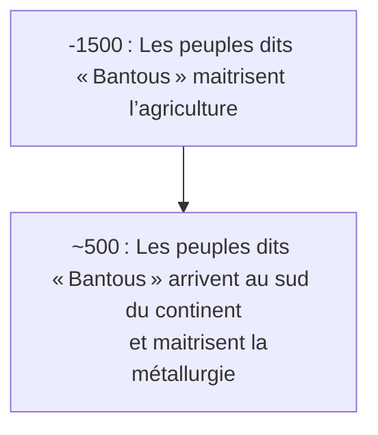

> Les dates contenues dans ce document se basent sur le `calendrier grégorien`.
{.is-info}

Cette page relate des avancées technologiques réalisées par l’espèce humaine.[^15]

[^15]: [Khoïsan](https://fr.wikipedia.org/wiki/Kho%C3%AFsan). In [Wikipédia](https://wikipedia.org) [en ligne]. Fondation Wikimedia, `2003`, mis à jour le `19` `Juin` `2020` [consulté le `13` `Septembre` `2020`] (calendrier grégorien). Dispnible sur : https://fr.wikipedia.org/wiki/Kho%C3%AFsan