> Les dates contenues dans ce document se basent sur le `calendrier grégorien`.
{.is-info}

***Afrikaans*** est le nom d’une langue leuco-africaine qui a vu le jour dans le sud du continent.
« Afrikaans » se traduit par « africain » en `néerlandais`. L’***afrikaans*** vient des Européens qui ont envahit le `sud` du `continent` à partir de `1488`. Ces `envahisseurs` sont des `Néerlandais`, des `Huguenots` et des `protestants Allemands` dénomés `Trekboers`.
L’***afrikaans*** est issue d’un dialecte hollandais originaire de la Hollande-Méridionale.  Le dialecte a évolué à l’écart de sa culture d’origine, aux Pays-Bas. Au fil du temps, la `langue néerlandaise` de ces `envahisseurs` s’est transformée jusqu’à devenir une nouvelle langue. À présent, l’***afrikaans*** est un mélange de français, d’allemand et de néerlandais. De plus, cette langue leuco-africaine est parlée en Afrique du Sud, en Namibie, au Botswana et au Zimbabwe. Cette langue est parlée par les Afrikaners mais aussi par des peuples alliénés comme les `Xirikuana`.[^12][^15]

L’***afrikaans*** est la langue nationale de la Namibie et la langue officielle de l’Afrique du Sud. Parmi les 15M de personnes parlant l’***afrikaans***, 7,2M l’utilisent comme langue maternelle.
Ci-dessous une liste de peuples parlant ***Afrikaans***[^1][^15] :

- les `Afrikaners`,
- les `Xiriqua`,
- les `métis du Cape`,
- les `Malais du Cape`,
- les `Basters de Rehoboth`.

> **Le saviez-vous ?**[^12]
>
> Les ***Khoïsans*** forment une communauté `kémit` présente depuis 40 000 ans dans le sud du continent.
> À l’inverse de l’***afrikaans***, les langues endogènes aux ***Khoïsans*** sont en voit d’extinction. Pour certaines, en `2009`, il n’existe qu’une dizaine de locutrices et/ou de locuteurs.
{.is-info}

La frise suivante présente de façon succincte l’histoire de la langue ***afrikaans***.[^4][^15]

```mermaid
flowchart TB
   khoisanArrive["-40 000 : Les ancêtres Khoïsan deviennent les premiers habitants
   du sud-sud-ouest du continent."]
   
   grassland["~500 : Les peuples originaires des hauts plateaux de l’ouest
   (et parlant bantou) atteignent l’actuelle province du KwaZulu-Natal
   (équivaut à l’Est l’Afrique du Sud 🇿🇦)"]
   
   amaXhosa["~900 : Les AmaXhosa s’installent au sud-est
   de l’espace occupé par l’Afrique du Sud 🇿🇦"]
   
   europeanInvasion["1488 : Les Européens commencent à envahir le sud du continent"]
   
   subgraph 17thCentury["XVIIème siècle"]
      boersExpantion["~1600 : Début de l’expansion des Trekboers
         (ancêtre des Boers) dans le sud du continent"]
      
      europeanInvasionNextStep["1652 : Les Européens s’installent définitivement au sud du continent"]
   end
   
   europeanFightInSouthAfricaBegin["1795 : Les Britaniques et les Néerlandais
      commencent à se disputer le sud de l’Afrique"]
   
   europeanFightInSouthAfricaEnd["1806 : Les Néerlandais cèdent leur colonie
      située au sud du continent aux Britaniques"]
   
   grandTrek["1836 : Grand Trek"]
   
   imposeAfrikaans["1875 : Stephanus Jacobus du Toit et l’Association des vrais Afrikaners
      défendent et imposent l’afrikaans et l’anglais
      comme langue officielle de la colonie du Cap."]
   
   afrikaansLanguageNID["1876 : La revue politique « Die Afrikaanse Patriot » (Le Patriote Africain)
      sert à éveiller la conscience nationale des Afrikaners
      et à les libérer de leur complexe d'infériorité culturelle."]
   
   afrikanersHistoryBook["1877 : S. J. du Toit publie le premier livre d'histoire des Afrikaners :
      Die Geskiedenis van ons Land in die Taal van ons Volk
      (L'Histoire de notre Pays dans la Langue de notre Peuple)."]
      
   khoisanArrive --> grassland --> amaXhosa --> europeanInvasion --> 17thCentury --> europeanFightInSouthAfricaBegin -->
   europeanFightInSouthAfricaEnd --> grandTrek --> imposeAfrikaans --> afrikaansLanguageNID --> afrikanersHistoryBook
   
```

# Valorisation de la langue

En `1875`, Stephanus Jacobus du Toit travaille avec *Die Genootskap van Regte Afrikaners* (l’Association des vrais Afrikaners). Leurs objectifs est de défendre et d’imposer l’***afrikaans*** comme langue officielle de la colonie du Cap, en plus de l’anglais.
En `1876`, S.J. du Toit devient le rédacteur en chef de la revue « Die Afrikaanse Pastriot ». Cette revue écrit en ***afrikaans*** est un outil politique utilisé pour éveiller la conscience nationale des Afrikaners. De plus, cette revue sert à libérer le complexe d’infériorité de ce peuple. À cette époque, les `Afrikaners` se sentent culturellement inférieurs au `Anglais`. Dès lors, la défense de la langue s’entremèle avec « l’identité afrikaans ».
En `1877`, S.J. du Toit publie le « premier livre d’histoire des Afrikaners et écrit en ***afrikaans*** ». Ce livre se nomme *Die Geskiedenis van ons Land in die Taal van ons Volk* (l’histoire de notre pays dans la langue de notre peuple). C’est un manifeste politique des `Afrikaners` empreint de mystique. Ce « livre d’histoire » relate de la lutte d’un « petit peuple » élu pour rester fidèle au dessein de Dieu de 1795 aux exécutions de Slagter’s Neck en 1815.[^15]

> **Le saviez-vous  ?**[^4]
>
> En 1795, les `Britaniques` et les `Néerlandais` entamment un conflit pour l’acquisition de la colonie située au sud du continent.
{.is-info}

Dans un premier temps, le néerlandais devient la langue nationale au côté de l’anglais. Néanmoins, le mouvement identitaire afrikaner se concentre sur la promotion de l'***afrikaans***. La lutte se concentre sur le droit d'enseigner la langue et de la parler dans les administrations publiques. Enfin, en `1925`, le gouvernement de `James Barry Hertzog` fait de l'afrikaans la langue nationale avec l'anglais (à la place du néerlandais.
Jusqu'en `1990`, l'***afrikaans***, l’anglais et l’allemand sont les trois langues officielles du `Sud-Ouest africain`. Le `Sud-Ouest africain` est devenu la `République de Namibie` en `1990`.
      
[^1]: [Peuples de langue afrikaans](https://fr.wikipedia.org/wiki/Peuples_de_langue_afrikaans). In [Wikipédia](https://wikipedia.org) [en ligne]. Fondation Wikimedia, `2003`, mis à jour le `13` `Juillet` `2019` [consulté le `13` `Septembre` `2020`] (calendrier grégorien). Dispnible sur : https://fr.wikipedia.org/wiki/Peuples_de_langue_afrikaans

[^4]: [Afrique du Sud](https://fr.wikipedia.org/wiki/Afrique_du_Sud#Histoire). In [Wikipédia](https://wikipedia.org) [en ligne]. Fondation Wikimedia, `2003`, mis à jour le `25` `Juillet` `2020` [consulté le `28` `Juillet` `2020` (`calendirer grégorien`)]. Dispnible sur : https://fr.wikipedia.org/wiki/Afrique_du_Sud#Histoire

[^12]: Don Killian. [Khoemana and the Griqua: Identity at the Heart of Phonological Attrition](https://helda.helsinki.fi//bitstream/handle/10138/229407/Khoemana_and_the_Griqua.pdf) [e-book]. Requirements for the degree of MASTER OF PHILOSOPHY (Phonetics) of the University of Helsinki, `Mars` `2009`, [consulté le `12` `Septembre` `2020`] (calendrier grégorien). Disponible sur : https://helda.helsinki.fi//bitstream/handle/10138/229407/Khoemana_and_the_Griqua.pdf

[^15]: [Afrikaans](https://fr.wikipedia.org/wiki/Afrikaans). In [Wikipédia](https://wikipedia.org) [en ligne]. Fondation Wikimedia, `2003`, mis à jour le `10` `Septembre` `2020` [consulté le `13` `Septembre` `2020`] (calendrier grégorien). Dispnible sur : https://fr.wikipedia.org/wiki/Afrikaans
