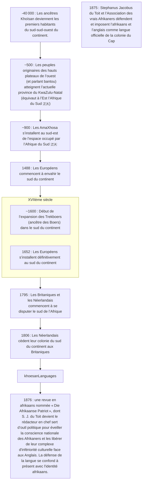

***Afrikaans*** est le nom d’une langue leuco-africaine issue du `Yovodah`. « Afrikaans » se traduit par « africain » en `néerlandais`.
Cette langue a été crée dans le sud du continent. Elle est issue du dialecte hollandais de la Hollande-Méridionale qui a été parlé par les `envahisseurs néerlandais`. L’***afrikaans*** a évolué avec les ancêtres des `boers` présents au sud du continent. Étant à l’écart des Pays-Bas, la langue néerlandaise de ces `envahisseurs` s’est transformé jusqu’à devenir une nouvelle langue. À présent, l’***afrikaans*** est un mélange de français, d’allemand et de néerlandais. L’***afrikaans*** est dérivé de la langue néerlandaise (dialecte hollandais de la Hollande-Méridionale).
L’***afrikaans*** est parlée en Afrique du Sud, en Namibie, au Botswana et au Zimbabwe. Cette langue est parlée par les Afrikaners mais aussi par d’autres peuples colonisés comme les `Xrikuana`.[^12][^15]

L’***afrikaans*** est la langue nationale de la Namibie et la langue officielle de l’Afrique du Sud.
Parmi les 15M de personnes parlant l’***afrikaans***, 7,2M l’utilisent comme langue maternelle. À l’inverse, les langues des ***Khoïsans*** sont en voit d’extinction avec, pour certaines, une dizaine de locutrices ou locuteurs. Ci-dessous une liste de peuples parlant ***Afrikaans***[^1][^15] :

- les `Afrikaners`,
- les `Xiriqua`,
- les `métis du Cape`,
- les `Malais du Cape`,
- les `Basters de Rehoboth`.

La frise suivante présente de façon succincte l’histoire de la langue ***afrikaans***.[^15]

[^1]: [Peuples de langue afrikaans](https://fr.wikipedia.org/wiki/Peuples_de_langue_afrikaans). In [Wikipédia](https://wikipedia.org) [en ligne]. Fondation Wikimedia, `2003`, mis à jour le `13` `Juillet` `2019` [consulté le `13` `Septembre` `2020`] (calendrier grégorien). Dispnible sur : https://fr.wikipedia.org/wiki/Peuples_de_langue_afrikaans

[^12]: Don Killian. [Khoemana and the Griqua: Identity at the Heart of Phonological Attrition](https://helda.helsinki.fi//bitstream/handle/10138/229407/Khoemana_and_the_Griqua.pdf) [e-book]. Requirements for the degree of MASTER OF PHILOSOPHY (Phonetics) of the University of Helsinki, `Mars` `2009`, [consulté le `12` `Septembre` `2020`] (calendrier grégorien). Disponible sur : https://helda.helsinki.fi//bitstream/handle/10138/229407/Khoemana_and_the_Griqua.pdf

[^15]: [Afrikaans](https://fr.wikipedia.org/wiki/Afrikaans). In [Wikipédia](https://wikipedia.org) [en ligne]. Fondation Wikimedia, `2003`, mis à jour le `10` `Septembre` `2020` [consulté le `13` `Septembre` `2020`] (calendrier grégorien). Dispnible sur : https://fr.wikipedia.org/wiki/Afrikaans
