{.align-abstopright}

> Les dates contenues dans ce document se basent sur le `calendrier grégorien`.
{.is-info}

***!kweiten ta ||ken*** (alias ***Rachel***) est une `!nussa !e`. Elle est originaire des montagnes de Katkope qui sont situées au nord de Calvinia (`Afrique du Sud 🇿🇦`). Elle est la sœur de `Dia!kwain` et la femme de `≠kasin`. Ces deux derniers sont connus pour avoir divulgué des informations sur les `!nussa !e` aux familles `Bleek` et `Lloyd`. Son histoire est racontée dans la [Lloyd and Bleek collection](http://lloydbleekcollection.cs.uct.ac.za).[^1]

Ci-dessous un dessin de `Dia!kwain` qui représente une `Whai |aityi` (femelle `gazelle à poche`).

<figure class="image image_resized" style="width: 100%;">
   
   <figcaption>
      Whai |aityi (femelle gazelle à poche) coloriée au crayon ou au charbon par <i>Dia!kwain</i> (Mars 1875)
   </figcaption>
</figure>

La frise suivante relate des faits historiques liés à ***!kweiten ta ||ken***.[^4][^5][^6][^3][^7][^8][^9][^1][^2]

```mermaid
flowchart TB
   
   Khoïsan["-40 000 : Les Sans (ancêtres des !nussa !e) deviennent les premiers habitants
      du sud-sud-ouest du continent."]
   
   grassland["~500 : Les peuples originaires des hauts plateaux de l’ouest
      (et parlant bantou) atteignent l’actuelle province du KwaZulu-Natal
      (équivaut à l’Est l’Afrique du Sud 🇿🇦)"]
   
   amaXhosa["~900 : Les AmaXhosa s’installent au sud-est
      de l’espace occupé par l’Afrique du Sud 🇿🇦"]
   
   europeanInvasion["1488 : Les Européens commencent à envahir le sud du continent"]
   
   subgraph 17thCentury["XVIIème siècle"]
      boersExpantion["~1600 : Début de l’expansion des Trekboers
         (ancêtre des Boers) dans le sud du continent"]
      
      europeanInvasionNextStep["1652 : Les Européens s’installent définitivement au sud du continent"]
   end
   
   boersArrive["1770 : Premier contact entre les Boers (franco-néerlandais) et
      les peuples originaires des hauts plateaux de l’ouest"]
   
   boersConflict["1779 : Début des relations conflictuelles entre
      les autochtones et les envahisseurs Trekboers"]
      
   europeanFightInZABegin["1795 : Les Britaniques et les Néerlandais
      commencent à se disputer le sud de l’Afrique"]
   

   europeanFightInZAEnd["1806 : Les Néerlandais cèdent leur colonie du sud du continent aux Britaniques"]
               
   wilhelmBleekbirth["8 Mars 1827 : Naissance de Wilhelm Bleek"]
               
   wBleekInZA["1853 : Wilhelm Bleek se rend en Afrique du Sud"]
      
   kweitenTaKenInMowbray["13 Juin 1874 : !kweiten ta ||ken est à Mowbray
      avec Dia!kwain (son frère), ≠kassin (son mari)
      et deux de ses enfants (âgés de six ans et deux ans)"]
               
   kTKOlderSons["25 Oct. 1874 : Les deux grands fils de !kweiten ta ||ken
      rejoignent le reste de la famille à Mowbray"]
   
   kTKInformator["Déc. 1874 − Jan. 1875 : !kweiten ta ||ken rpartage avec les familles Bleek et Lloyd
      des informations sur les !nussa !e
      (|xam coutumes féminines, rituels féminins, expériences féminines,…)"]
      
   kTKLittleFamilyLeaveMowbray["13 Jan. 1875 : !kweiten ta ||ken, ses enfants et son mari ≠kassin
      quittent Mowbray pour Bushmanland"]
   
   Khoïsan --> grassland --> amaXhosa --> europeanInvasion -->
   17thCentury --> boersArrive --> boersConflict --> 
   europeanFightInZABegin --> europeanFightInZAEnd -->
   wilhelmBleekbirth --> wBleekInZA --> kweitenTaKenInMowbray -->
   kTKOlderSons --> kTKInformator --> kTKLittleFamilyLeaveMowbray
   
```

# Travail mémoriel

<figure class="image image-style-align-right"> <figcaption>Portrait de <i><b>!kweiten ta ||ken</b></i></figcaption></figure>

Le `13` `Juin` `1874`, ***!kweiten ta ||ken***  arrive à Mowbray. Elle est accompagnée de `Dia!kwain`, de `≠kassin` et de ses deux enfants agés de six et deux ans. C’est la deuxième fois que `Dia!kwain` et `≠kassin` se rendent à Mowbray. Le `25` `Octobre` `1874`, les deux grands fils de ***!kweiten ta ||ken*** rejoignent la famille à `Mowbray`. Ils viennent de `Wellington`. À ce moment là, les familles `Lloyd` et `Bleek` ont quelques difficultés financières pour loger et nourrir tout le monde. Néanmoins, `Lucy Catherine Lloyd` est ravie de pouvoir interroger ***!kweiten ta ||ken*** qui partage avec elle des informations sur[^1] :

- le `|xam` (plus exactement la variante de Katkop d’après `Wilhelm Bleek`),
- les coutumes féminines,
- les rituels féminins,
- les expériences féminines.

De `Décembre` `1874` à `Janvier` `1875`, ***!kweiten ta ||ken*** transmet des informations.
N’appréciant pas son séjour à `Cap`, le `13` `Janvier` `1875`, ***!kweiten ta ||ken*** quitte Mowbray pour Bushmanland. Elle est accompagnée de son mari `≠kasin` et de ses enfants. Son frère `Dia!kwain` reste dans le quartier de Mowbray.[^1]

> ***Le saviez-vous ?***[^1]
> 
> Les informations divulguées par ***!kweiten ta ||ken*** sont dans la [Lloyd and Bleek collection](http://lloydbleekcollection.cs.uct.ac.za). Deux cahiers de la collection portent sur les sujets abordés par ***!kweiten ta ||ken***.
> On y trouve des informations sur les jeunes filles, les activités féminines et les rituels `!nussa !e`. Parmi ces rituels, ***!kweiten ta ||ken*** parle de l’hématite rouge que son peupele a utilisé pour peindre les jeunes hommes.
{.is-info}

[^1]: [|xam contributors](http://lloydbleekcollection.cs.uct.ac.za/xam.html). In [The Digital Bleek & Lloyd](http://lloydbleekcollection.cs.uct.ac.za). [The Digital Bleek & Lloyd](http://lloydbleekcollection.cs.uct.ac.za) [en ligne]. [The Digital Bleek & Lloyd](http://lloydbleekcollection.cs.uct.ac.za) [consulté le `30` `Juillet` `2020`]. Disponible sur : http://lloydbleekcollection.cs.uct.ac.za/xam.html

[^2]: [Lloyd and Bleek Collection](https://www.aluka.org/heritage/collection/LBC). In [World Heritage Sites](https://www.aluka.org/heritage). [World Heritage Sites](https://www.aluka.org/heritage) [en ligne]. [World Heritage Sites](https://www.aluka.org/heritage) [consulté le `30` `Juillet` `2020`]. Disponible sur : https://www.aluka.org/heritage/collection/LBC

[^3]: [Wilhelm Heinrich Immanuel Bleek](https://fr.wikipedia.org/wiki/Wilhelm_Heinrich_Immanuel_Bleek). In [Wikipédia](https://wikipedia.org) [en ligne]. Fondation Wikimedia, `2003`, mis à jour le `7` `Mai` `2019` [consulté le `28` `Juillet` `2020` (`calendirer grégorien`)]. Dispnible sur : https://fr.wikipedia.org/wiki/Wilhelm_Heinrich_Immanuel_Bleek

[^4]: [Afrique du Sud](https://fr.wikipedia.org/wiki/Afrique_du_Sud#Histoire). In [Wikipédia](https://wikipedia.org) [en ligne]. Fondation Wikimedia, `2003`, mis à jour le `25` `Juillet` `2020` [consulté le `28` `Juillet` `2020` (`calendirer grégorien`)]. Dispnible sur : https://fr.wikipedia.org/wiki/Afrique_du_Sud#Histoire

[^5]: [KwaZulu-Natal](https://fr.wikipedia.org/wiki/KwaZulu-Natal). In [Wikipédia](https://wikipedia.org) [en ligne]. Fondation Wikimedia, `2003`, mis à jour le `13` `Juin` `2020` [consulté le `28` `Juillet` `2020` (`calendirer grégorien`)]. Dispnible sur : https://fr.wikipedia.org/wiki/KwaZulu-Natal

[^6]: [Guerres cafres](https://fr.wikipedia.org/wiki/Guerres_cafres#Les_trois_premi%C3%A8res_guerres_cafres_(1780,_1793,_1803)). In [Wikipédia](https://wikipedia.org) [en ligne]. Fondation Wikimedia, `2003`, mis à jour le `17` `Janvier` `2020` [consulté le `29` `Juillet` `2020` (`calendirer grégorien`)]. Dispnible sur : https://fr.wikipedia.org/wiki/Guerres_cafres#Les_trois_premi%C3%A8res_guerres_cafres_(1780,_1793,_1803)

[^7]: [Moabli Makasi](https://www.youtube.com/channel/UCjj4wUCAsYWITZQv4DbtPNw). [NEGRO MESSIANISME les juifs Bantus une arnaque historique PRT1#](https://www.youtube.com/watch?v=XV3WIpZQrv8&t=443s) [vidéo en ligne]. YouTube, `31` `mai` `2019` [consulté le `27` `juillet` `2020`]. 1 vidéo, 57min. 07s. https://www.youtube.com/watch?v=XV3WIpZQrv8&t=443s

[^8]: [Le Cap](https://fr.wikipedia.org/wiki/Le_Cap). In [Wikipédia](https://wikipedia.org) [en ligne]. Fondation Wikimedia, `2003`, mis à jour le `16` `Juillet` `2020` [consulté le `28` `Juillet` `2020` (`calendirer grégorien`)]. Dispnible sur : https://fr.wikipedia.org/wiki/Le_Cap

[^9]: [Trekboers](https://fr.wikipedia.org/wiki/Trekboer). In [Wikipédia](https://wikipedia.org) [en ligne]. Fondation Wikimedia, `2003`, mis à jour le `17` `Novembre` `2019` [consulté le `30` `Juillet` `2020` (`calendirer grégorien`)]. Dispnible sur : https://fr.wikipedia.org/wiki/Trekboer

[^10]: [Huguenot](https://fr.wikipedia.org/wiki/Huguenot). In [Wikipédia](https://wikipedia.org) [en ligne]. Fondation Wikimedia, `2003`, mis à jour le `26` `Mai` `2020` [consulté le `30` `Juillet` `2020` (`calendirer grégorien`)]. Dispnible sur : https://fr.wikipedia.org/wiki/Huguenot