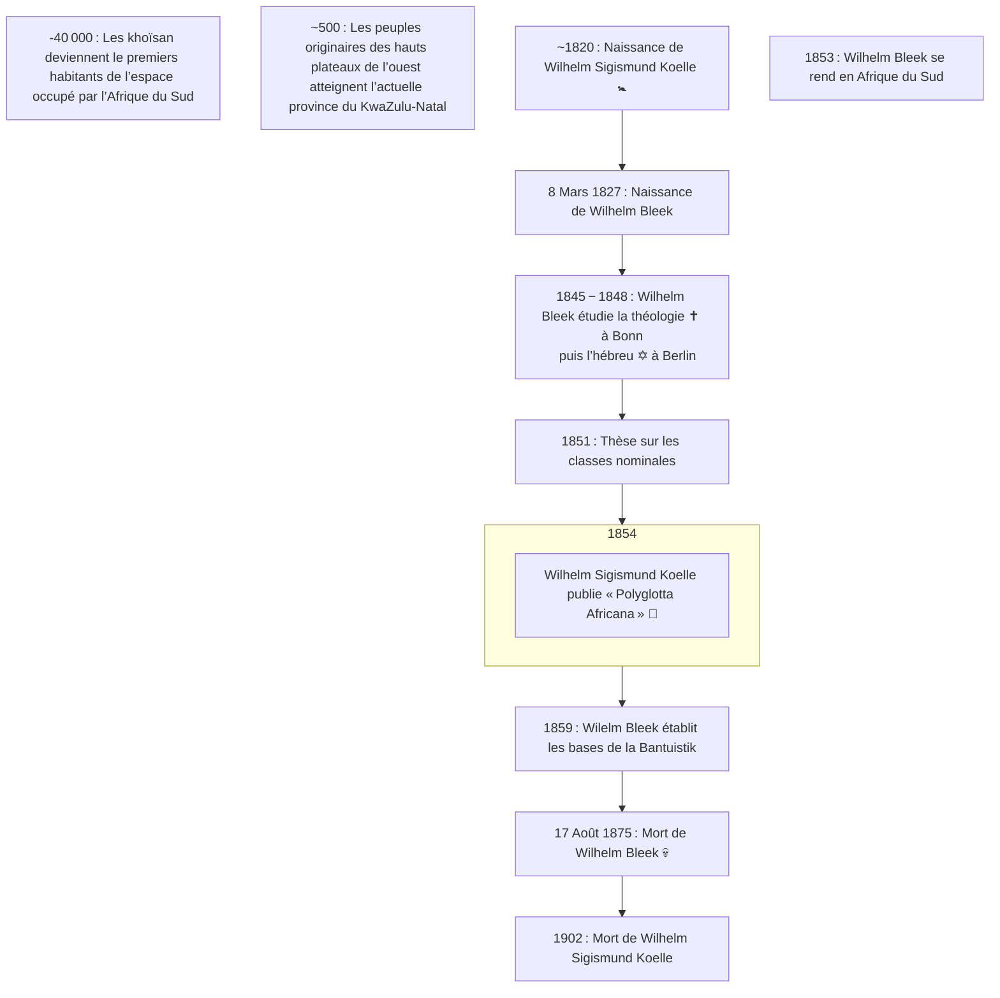

> Les dates contenues dans ce document se basent sur le `calendrier grégorien`.
{.is-info}

***Wilhelm Bleek*** est un allemand né le `8` `Mars` `1827` à `Berlin` (`royaume de Prusse`) et mort le `17` `Août` `1875` au `Cap` (`colonie du Cap`). Il est un linguiste et `folkloriste` qui s’est spécialisé dans les langues sud-africaines. Il est le fondateur du `comparatisme linguistique en Afrique`. De plus, lui et `Wilhelm Sigismund Koelle` sont les premiers à regrouper les langues de l’ouest du continent.
En `1859`, ***Wilhelm Bleek*** établit les bases de la `Bantuistik` (science des langues bantoues) modernes dans le cadre de l’analyse comparée des langues des régions australe et centrale d’Afrique, auxquelles il donne le nom « bantous ».
L’œuvre majeure de ***Wilhelm Bleek*** porte sur la grammaire comparée des langues sud-africaines.[^1][^2][^3]

La frise chronologique suivante présente des faits historiques liés à ***Wilhelm Bleek***.[^1][^2][^3][^4]

En `1853`, ***Wilhelm Bleek*** va en `Afrique du Sud` et y occupe le poste de chercheur en linguistique.

[^1]: [Moabli Makasi](https://www.youtube.com/channel/UCjj4wUCAsYWITZQv4DbtPNw). [NEGRO MESSIANISME les juifs Bantus une arnaque historique PRT1#](https://www.youtube.com/watch?v=XV3WIpZQrv8&t=443s) [vidéo en ligne]. YouTube, `31` `mai` `2019` [consulté le `27` `juillet` `2020`]. 1 vidéo, 57min. 07s. https://www.youtube.com/watch?v=XV3WIpZQrv8&t=443s
[^2]: [Le Cap](https://fr.wikipedia.org/wiki/Le_Cap). In [Wikipédia](https://wikipedia.org) [en ligne]. Fondation Wikimedia, `2003`, mis à jour le `16` `Juillet` `2020` [consulté le `28` `Juillet` `2020` (`calendirer grégorien`)]. Dispnible sur : https://fr.wikipedia.org/wiki/Le_Cap
[^3]: [Wilhelm Heinrich Immanuel Bleek](https://fr.wikipedia.org/wiki/Wilhelm_Heinrich_Immanuel_Bleek). In [Wikipédia](https://wikipedia.org) [en ligne]. Fondation Wikimedia, `2003`, mis à jour le `7` `Mai` `2019` [consulté le `28` `Juillet` `2020` (`calendirer grégorien`)]. Dispnible sur : https://fr.wikipedia.org/wiki/Wilhelm_Heinrich_Immanuel_Bleek
[^4]: [Afrique du Sud](https://fr.wikipedia.org/wiki/Afrique_du_Sud#Histoire). In [Wikipédia](https://wikipedia.org) [en ligne]. Fondation Wikimedia, `2003`, mis à jour le `25` `Juillet` `2020` [consulté le `28` `Juillet` `2020` (`calendirer grégorien`)]. Dispnible sur : https://fr.wikipedia.org/wiki/Afrique_du_Sud#Histoire