> Les dates contenues dans ce document se basent sur le `calendrier grégorien`.
{.is-info}

***Wilhelm Bleek*** est un allemand né le `8` `Mars` `1827` à `Berlin` (`royaume de Prusse`) et mort le `17` `Août` `1875` au `Cap` (`colonie du Cap`). Il est un linguiste et `folkloriste` qui s’est spécialisé dans les langues sud-africaines. Il est le fondateur du `comparatisme linguistique en Afrique`. De plus, lui et `Wilhelm Sigismund Koelle` sont les premiers à regrouper les langues de l’ouest du continent.
En `1859`, ***Wilhelm Bleek*** établit les bases de la `Bantuistik` (science des langues bantoues) modernes dans le cadre de l’analyse comparée des langues des régions australe et centrale d’Afrique, auxquelles il donne le nom « bantous ».
L’œuvre majeure de ***Wilhelm Bleek*** porte sur la grammaire comparée des langues sud-africaines. De plus, il est l'auteur d'une grammaire du zoulou et d’un système de numérotation pour les système phonétique. Ce système de numérotation est utilisé par les linguistes du paradigme européen pour transcrire clicks et sons caractéristiques du `ǀxam`.[^1][^2][^3]

> **Le saviez-vous ?**
> 
> Le `ǀxam` (prononcé *ˈkɑːm*) est une langue morte qui a été parlée par les `ǀXam-ka ǃʼē` jusqu’au XX^ème^ siècle. À l’époque, ce peuple se trouve à l’ouest de l’espace occupé par l’`Afrique du Sud 🇿🇦`.
> La plupart des travaux scientifiques européens réalisés sur le `ǀxam` ont été réalisés par ***Wilhelm Bleek***. Les documents portant sur cette langue viennent de vocabulaires et d’histoires racontées par des personnes parlant `|xam`[^6] :
> 
> -`|a!kunta`,
> - `||kabbo` (alias `|uhi-ddoro`),
> - `≠kasin`,
> - `Dia!kwain`,
> - `!kweiten ta ||ken`,
> - `|han≠kass’o`.
> 
> Ces informations sont accessibles dans le [Lloyd and Bleek Collection](http://lloydbleekcollection.cs.uct.ac.za).[^6]
{.is-info}

La frise chronologique suivante présente des faits historiques liés à ***Wilhelm Bleek***.[^4][^5][^8][^6][^1][^2][^3]

```mermaid
flowchart TB
   
   Khoïsan["-40 000 : Les khoïsan deviennent le premiers habitants
   du sud-sud-oust du continent"]
   
   grassland["~500 : Les peuples originaires des hauts plateaux de l’ouest
   (et parlant bantou) atteignent l’actuelle province du KwaZulu-Natal
   (l’Est de l’Afrique du Sud 🇿🇦)"]
   
   amaXhosa["~900 : Les AmaXhosa s’installent au sud-est
   de l’espace occupé par l’Afrique du Sud 🇿🇦"]
   
   europeanInvasion["1488 : Les Européens commencent à envahir le sud du continent"]
   
   subgraph 17thCentury["XVIIème siècle"]
      boersExpantion["~1600 : Début de l’expansion des Trekboers (ancêtre des Boers) dans le sud du continent"]
      
      europeanInvasionNextStep["1652 : Les Européens s’installent définitivement au sud du continent"]
   end   
   boersArrive["1770 : Premier contact entre les Boers (franco-néerlandais) et
   les peuples originaires des hauts plateaux de l’ouest"]
   
   boersConflict["1779 : Début des relations conflictuelles entre les autochtones et les Boers"]
   
   firstCapWar["1779-1778 : Première des neuf guerres
   AmaXhosas ⚔ autorités coloniales du Cap (Européens)"]
   
   secondCapWar["1793 : Deuxième guerre
   AmaXhosas ⚔ autorités coloniales du Cap (Européens)"]
   
   europeanFightInSouthAfricaBegin["1795 : Les Britaniques et les Néerlandais commencent à se disputer le sud de l’Afrique"]
   
   thirdCapWar["1803 : Troisième guerre
      AmaXhosas ⚔ autorités coloniales du Cap (Européens)"]

   europeanFightInSouthAfricaEnd["1806 : Les Néerlandais cèdent leurs colonies aux Britaniques"]

   fourthCapWar["1811 − 1812 : Quatrième guerre
   AmaXhosas ⚔ autorités coloniales du Cap (Européens)"]
   
   subgraph mfecane["1818 − 1825 : Mfecane"]
      mfecaneBegin["1818 : Chaka Zoulou étend son empire sur l’Est de l’espace occupé par l’Afrique du Sud"]
      
      fifthCapWar["1818 − 1819 : Cinquième guerre
         AmaXhosas ⚔ autorités coloniales du Cap (Européens)"]
         
      mfecaneEnd["1825 : Fin de l’expension de l’empire de Chaka Zoulou"]
   end
   
   wSKoellebirth["~1820 : Naissance de Wilhelm Sigismund Koelle"]
   
   birth["8 Mars 1827 : Naissance de Wilhelm Bleek 🚼"]
      
   sixthCapWar["1834 − 1835 : Sixième guerre
   AmaXhosas ⚔ autorités coloniales du Cap (Européens)"]
   
   seventhCapWar["1846 : Septième guerre 
   AmaXhosas ⚔ autorités coloniales du Cap (Européens)"]
      
   studies["1845 − 1848 : Wilhelm Bleek étudie la théologie ✝ à Bonn
   puis l’hébreu ✡ à Berlin"]
   
   subgraph eighthCapWar["1850 − 1853"]
      eighthCapWarBegining["1850 : Début de la huitième guerre 
      AmaXhosas ⚔ autorités coloniales du Cap (Européens)"]
      
      thesis["1851 : Wilhelm Bleek passe sa thèse sur les classes nominales"]
   
      southAfrica["1853 :
         - Wilhelm Bleek se rend en Afrique du Sud
         - Fin de la huitième guerre 
         AmaXhosas ⚔ utorités coloniales du Cap (Européens)"]
   end
   
   subgraph 1854
      majorStudy["1854 : Wilhelm Sigismund Koelle publie « Polyglotta Africana » 📖"]
   end
   
   bantuistik["1859 : Wilelm Bleek établit les bases de la Bantuistik"]
   
   death["17 Août 1875 : Mort de Wilhelm Bleek 💀"]
   
   ninethCapWar["1877 − 1879 : Neuvième guerre entre
      AmaXhosas ⚔ autorités coloniales du Cap (Européens)"]

   wSKoelledeath["1902 : Mort de Wilhelm Sigismund Koelle"]
      
   Khoïsan --> grassland --> amaXhosa --> europeanInvasion -->
   17thCentury --> boersArrive --> boersConflict --> 
   firstCapWar --> secondCapWar --> 
   europeanFightInSouthAfricaBegin --> thirdCapWar --> 
   europeanFightInSouthAfricaEnd --> fourthCapWar --> mfecane --> 
   wSKoellebirth --> birth --> sixthCapWar --> seventhCapWar --> 
   studies --> eighthCapWar --> 1854 --> bantuistik --> death --> 
   ninethCapWar --> wSKoelledeath
   
```

En `1853`, ***Wilhelm Bleek*** va en `Afrique du Sud` et y occupe le poste de chercheur en linguistique. Il y étudie les différences entre les langues locales, les `langues bantoues` et `xhosa`.[^3]

[^1]: [Moabli Makasi](https://www.youtube.com/channel/UCjj4wUCAsYWITZQv4DbtPNw). [NEGRO MESSIANISME les juifs Bantus une arnaque historique PRT1#](https://www.youtube.com/watch?v=XV3WIpZQrv8&t=443s) [vidéo en ligne]. YouTube, `31` `mai` `2019` [consulté le `27` `juillet` `2020`]. 1 vidéo, 57min. 07s. https://www.youtube.com/watch?v=XV3WIpZQrv8&t=443s

[^2]: [Le Cap](https://fr.wikipedia.org/wiki/Le_Cap). In [Wikipédia](https://wikipedia.org) [en ligne]. Fondation Wikimedia, `2003`, mis à jour le `16` `Juillet` `2020` [consulté le `28` `Juillet` `2020` (`calendirer grégorien`)]. Dispnible sur : https://fr.wikipedia.org/wiki/Le_Cap

[^3]: [Wilhelm Heinrich Immanuel Bleek](https://fr.wikipedia.org/wiki/Wilhelm_Heinrich_Immanuel_Bleek). In [Wikipédia](https://wikipedia.org) [en ligne]. Fondation Wikimedia, `2003`, mis à jour le `7` `Mai` `2019` [consulté le `28` `Juillet` `2020` (`calendirer grégorien`)]. Dispnible sur : https://fr.wikipedia.org/wiki/Wilhelm_Heinrich_Immanuel_Bleek

[^4]: [Afrique du Sud](https://fr.wikipedia.org/wiki/Afrique_du_Sud#Histoire). In [Wikipédia](https://wikipedia.org) [en ligne]. Fondation Wikimedia, `2003`, mis à jour le `25` `Juillet` `2020` [consulté le `28` `Juillet` `2020` (`calendirer grégorien`)]. Dispnible sur : https://fr.wikipedia.org/wiki/Afrique_du_Sud#Histoire

[^5]: [KwaZulu-Natal](https://fr.wikipedia.org/wiki/KwaZulu-Natal). In [Wikipédia](https://wikipedia.org) [en ligne]. Fondation Wikimedia, `2003`, mis à jour le `13` `Juin` `2020` [consulté le `28` `Juillet` `2020` (`calendirer grégorien`)]. Dispnible sur : https://fr.wikipedia.org/wiki/KwaZulu-Natal

[^6]: [Guerres cafres](https://fr.wikipedia.org/wiki/Guerres_cafres#Les_trois_premi%C3%A8res_guerres_cafres_(1780,_1793,_1803)). In [Wikipédia](https://wikipedia.org) [en ligne]. Fondation Wikimedia, `2003`, mis à jour le `17` `Janvier` `2020` [consulté le `29` `Juillet` `2020` (`calendirer grégorien`)]. Dispnible sur : https://fr.wikipedia.org/wiki/Guerres_cafres#Les_trois_premi%C3%A8res_guerres_cafres_(1780,_1793,_1803)

[^7]: [ǀXam language](https://en.wikipedia.org/wiki/%C7%80Xam_language). In [Wikipédia](https://wikipedia.org) [en ligne]. Fondation Wikimedia, `2003`, mis à jour le `8` `Juin` `2020` [consulté le `30` `Juillet` `2020` (`calendirer grégorien`)]. Dispnible sur : https://en.wikipedia.org/wiki/%C7%80Xam_language

[^8]: [Lloyd and Bleek Collection](https://www.aluka.org/heritage/collection/LBC). In [World Heritage Sites](https://www.aluka.org/heritage). [World Heritage Sites](https://www.aluka.org/heritage) [en ligne]. [World Heritage Sites](https://www.aluka.org/heritage) [consulté le `30` `Juillet` `2020`]. Disponible sur : https://www.aluka.org/heritage/collection/LBC