{.align-abstopright}

> Les dates contenues dans ce document se basent sur le `calendrier grégorien`.
{.is-info}

<figure class="image image-style-align-right image_resized" style="width: 33%;">
   
   <figcaption>
      !khwa ka xoro 
      dessiné au crayon bleu  
      <i>Dia!kwain</i> (Mai 1875)
   </figcaption>
</figure>

***Dia!kwain*** (alias ***Hussar*** ou ***Huzar***) est un `!nussa !e`. Il est originaire des montagnes Katkop (nord de Calvinia) et parle ce que les `Lloyd` et les `Bleek` identifient comme le `|xam` de `Katkop`.
***Dia!kwain*** est le frère de `!kweiten ta ||ken`, l’informatrice des familles `Bleek` et `Llloyd`.
Le père de ***Dia!kwain*** est réputé pour ses peintures corporelles et ses gravures. Il a été initié à la sorcellerie et à la magie ancestrale négro-africaine.[^1]

L’image ci-contre est un `!khwa ka xoro` (taureau d’eau). Cet animal aquatique mystique peut être capturé par les sorciers. Ces derniers l’emmènent ensuite là où ils veulent pour y faire tomber la pluie.[^3]

> **Le saviez-vous ?**
>
> Le `|xam` est une langue `kémit` parlée par les `Khoïsan`.
{.is-info}

# Emprisonnement

<figure class="image image-style-align-right image_resized" style="width: 33%;">
   
   <figcaption>
      !khwa ka xoro 
      dessiné au crayon bleu  
      <i>Dia!kwain</i> (Mai 1875)
   </figcaption>
</figure>

Vers ses 25 ans, ***Dia!kwain*** est jugé pour l’assassinat d’un fermier qui a menacé de tuer sa famille. Il est donc condamné à cinq ans de prison à la `Breakwater Convict Station` avec son beau-frère `≠kasin`. Le numéro de ***Dia!kwain*** est le 4434.
Sur les cinq ans de prison, ***Dia!kwain*** en purge quatre. En `1873`, il rejoint `≠kasin` à `Mowbray`.[^1]

# Travail de mémoire

<figure class="image image-style-align-right image_resized" style="width: 33%;">
   
   <figcaption>
      Oiseau kwa-kkwara gwai 
      dessiné au charbon ou au crayon 
      <i>Dia!kwain</i> (Mars 1875)
   </figcaption>
</figure>

***Dia!kwain*** permet aux `Bleek` et aux `Lloyd` de recenser plus de deux mille pages de récits et de dessins portant sur les `!nussa !e`.[^1]

***Dia!kwain*** effectue deux séjours auprès des familles `Bleek` et `Lloyd`. Le premier commence le `25` `Décembre` `1873` et se termine en `Mars` `1874`. Son second séjour commence le `13` `Juin` `1874`. Il accompagne sa sœur `!kweiten ta ||ken`, son beau-frère `≠kasin` et les deux plus jeuns enfants de ce couple.
Le `13` `Janvier` `1875`, ***Dia!kwain*** reste à `Mowbray` alors que sa famille quitte le quartier pour aller à « `Bushmanland` ».[^1]

> **Le saviez-vous ?**[^10][^1][^2]
> 
> Il existe deux **Bushmanland** (une région et un bantoustan).
>
> - Bushmanland, au nord de Cap : région [la plus] aride d’Afrique du Sud. Elle est située au nord de Cap. Le sol y est infertile et les eaux hautement salées.
> - Bushmanland: le `bantoustan` créé en `1964` pour parquer les `San` pendant l’`appartheid`.
>
> ***|han≠kass’o*** se rend dans le Bushmanland situé au nord de Cap.
{.is-info}

Le `7` `Mars` `1876`, ***Dia!kwain*** quitte Mowbray pour se rendre à `Calvinia`. Il y travaille pour le `Dr H Meyer` pendant un certain temps. Pendant son séjour, il a hâte de rendre visite à ses parents et de prendre des nouvelles de ses enfants. Au bout d’un moment, il finit par rendre visite à l’une de ses sœurs, laissant temporairement une partie de son salaire au `Dr Meyer`. Il quitte `Calvinia` dans l’idée d’y revenir avant d’aller à `Mowbray`. Néanmoins, jusqu’à ce jour, nous n’avons plus aucune trace de lui. Deux rumeurs planent au-dessus da sa disparition.[^1]

- Selon `Jan Plat`, après être sorti de `Calvinia` avec Dia!kwain, ce dernier a accompagné un fermier nommé `Louw`. ***Dia!kwain*** s’est déjà occupé des moutons de cet homme. Par la suite, ils sont allés à `Kenhardt` puis à `Free State`. Peut-être que ***Dia!kwain*** retrouve son fils qu’il pense être dans cette région…
- Selon `Janette Deacon`, ***Dia!kwain*** a été tué par les amis du fermier qu’il a lui-même tué par légitime défense quelques années plus tôt.

La frise suivante relate des faits historiques liés à ***!kweiten ta ||ken***.[^4][^5][^6][^3][^7][^8][^9][^1][^2]

```mermaid
flowchart TB
   
   Khoïsan["-40 000 : Les Sans (ancêtres des !nussa !e) deviennent les premiers habitants
      du sud-sud-ouest du continent."]
   
   grassland["~500 : Les peuples originaires des hauts plateaux de l’ouest
      (et parlant bantou) atteignent l’actuelle province du KwaZulu-Natal
      (équivaut à l’Est l’Afrique du Sud 🇿🇦)"]
   
   amaXhosa["~900 : Les AmaXhosa s’installent au sud-est
      de l’espace occupé par l’Afrique du Sud 🇿🇦"]
   
   europeanInvasion["1488 : Les Européens commencent à envahir le sud du continent"]
   
   subgraph 17thCentury["XVIIème siècle"]
      boersExpantion["~1600 : Début de l’expansion des Trekboers
         (ancêtre des Boers) dans le sud du continent"]
      
      europeanInvasionNextStep["1652 : Les Européens s’installent définitivement au sud du continent"]
   end
   
   boersArrive["1770 : Premier contact entre les Boers (franco-néerlandais) et
      les peuples originaires des hauts plateaux de l’ouest"]
   
   boersConflict["1779 : Début des relations conflictuelles entre
      les autochtones et les envahisseurs Trekboers"]
      
   europeanFightInZABegin["1795 : Les Britaniques et les Néerlandais
      commencent à se disputer le sud de l’Afrique"]
   

   europeanFightInZAEnd["1806 : Les Néerlandais cèdent leur colonie du sud du continent aux Britaniques"]
               
   wilhelmBleekbirth["8 Mars 1827 : Naissance de Wilhelm Bleek"]
               
   wBleekInZA["1853 : Wilhelm Bleek se rend en Afrique du Sud"]
      
   kweitenTaKenInMowbray["13 Juin 1874 : !kweiten ta ||ken est à Mowbray
      avec Dia!kwain (son frère), ≠kassin (son mari)
      et deux de ses enfants (âgés de six ans et deux ans)"]
               
   kTKOlderSons["25 Oct. 1874 : Les deux grands fils de !kweiten ta ||ken
      rejoignent le reste de la famille à Mowbray"]
   
   kTKInformator["Déc. 1874 − Jan. 1875 : !kweiten ta ||ken rpartage avec les familles Bleek et Lloyd
      des informations sur les !nussa !e
      (|xam coutumes féminines, rituels féminins, expériences féminines,…)"]
      
   kTKLittleFamilyLeaveMowbray["13 Jan. 1875 : !kweiten ta ||ken, ses enfants et son mari ≠kassin
      quittent Mowbray pour Bushmanland"]
   
   Khoïsan --> grassland --> amaXhosa --> europeanInvasion -->
   17thCentury --> boersArrive --> boersConflict --> 
   europeanFightInZABegin --> europeanFightInZAEnd -->
   wilhelmBleekbirth --> wBleekInZA --> kweitenTaKenInMowbray -->
   kTKOlderSons --> kTKInformator --> kTKLittleFamilyLeaveMowbray
   
```

[^1]: [|xam contributors](http://lloydbleekcollection.cs.uct.ac.za/xam.html). In [The Digital Bleek & Lloyd](http://lloydbleekcollection.cs.uct.ac.za). [The Digital Bleek & Lloyd](http://lloydbleekcollection.cs.uct.ac.za) [en ligne]. [The Digital Bleek & Lloyd](http://lloydbleekcollection.cs.uct.ac.za) [consulté le `30` `Juillet` `2020`]. Disponible sur : http://lloydbleekcollection.cs.uct.ac.za/xam.html

[^2]: `Harriet Jane Deacon`. PREFACE. In [A HISTORY OF THE BREAKWATER PRISON FROM 1859 TO 1905](https://open.uct.ac.za/bitstream/handle/11427/21141/thesis_hum_1989_deacon_harriet.pdf?sequence=1&isAllowed=y). Submitted to the Faculty of Arts, University of Cape Town, in partial fulfillment of the requirements of an Honours Degree in African Studies (Social Anthropology). `1989`. p. 3. [consulté le `30` `Juillet` `2020`]. Disponible sur : https://open.uct.ac.za/bitstream/handle/11427/21141/thesis_hum_1989_deacon_harriet.pdf?sequence=1&isAllowed=y

[^3]: [Drawings, Image: UCTLB_D_Di010](http://lloydbleekcollection.cs.uct.ac.za/drawings/UCTLB_D_Di010.html). In [The Digital Bleek & Lloyd](http://lloydbleekcollection.cs.uct.ac.za). [The Digital Bleek & Lloyd](http://lloydbleekcollection.cs.uct.ac.za) [en ligne]. [The Digital Bleek & Lloyd](http://lloydbleekcollection.cs.uct.ac.za) [consulté le `10` `Août` `2020`]. Disponible sur : http://lloydbleekcollection.cs.uct.ac.za/drawings/UCTLB_D_Di010.html

[^10]: [Bushmanland, Northern Cape](https://en.wikipedia.org/wiki/Bushmanland,_Northern_Cape). In [Wikipédia](https://wikipedia.org) [en ligne]. Fondation Wikimedia, `2003`, mis à jour le `26` `Mai` `2020` [consulté le `30` `Juillet` `2020` (`calendirer grégorien`)]. Dispnible sur : https://en.wikipedia.org/wiki/Bushmanland,_Northern_Cape