{.align-abstopright}

> Les dates contenues dans ce document se basent sur le `calendrier grégorien`.
{.is-info}

***|han≠kass’o*** (alias ***Klein Jantje***) fait partie des `Ss’wa ka !kui` (traduction : « ceux qui appartiennent aux `|xam` et qui vivent dans les plaines »), un peuple éteint. Son père, quant à lui, est un `!kaugen ss'o` (`San` des montagnes). Son beau-père est `||kabbo` et son beau-frère  est `Witbooy Touren`.

La liste suivante relate des événements historiques liés à ***|han≠kass’o***.[^3][^6][^4][^2]

```mermaid
flowchart TB
   khoisanArrive["-40 000 : Les ancêtres des Ss’wa ka !kui deviennent les premiers habitants
   du sud-sud-ouest du continent."]
   
   grassland["~500 : Les peuples originaires des hauts plateaux de l’ouest
   (et parlant bantou) atteignent l’actuelle province du KwaZulu-Natal
   (équivaut à l’Est l’Afrique du Sud 🇿🇦)"]
   
   amaXhosa["~900 : Les AmaXhosa s’installent au sud-est
   de l’espace occupé par l’Afrique du Sud 🇿🇦"]
   
   europeanInvasion["1488 : Les Européens commencent à envahir le sud du continent"]
   
   subgraph 17thCentury["XVIIème siècle"]
      boersExpantion["~1600 : Début de l’expansion des Trekboers
         (ancêtre des Boers) dans le sud du continent"]
      
      europeanInvasionNextStep["1652 : Les Européens s’installent définitivement au sud du continent"]
   end
   
   boersConflict["1779 : Début des relations conflictuelles entre
      les autochtones et les envahisseurs Trekboers"]
      
   euFightInZABegin["1795 : Les Britaniques et les Néerlandais
      commencent à se disputer le sud de l’Afrique"]
   
   euFightInZAEnd["1806 : Les Néerlandais cèdent leur colonie du sud du continent aux Britaniques"]

   wilhelmBleekbirth["8 Mars 1827 : Naissance de Wilhelm Bleek"]
               
   subgraph 1850["~1850"]
      hanKassOBirth["Naissance de |han≠kass’o 🚼"]
      
      southAfrica["1853 : Wilhelm Bleek se rend en Afrique du Sud"]
   end
   
   hKOImprisonned["~1869 : |han≠kass’o est emprisonné pour
      vol de bétail avec ||kabbo (son beau-père)
      et Witbooy Touren (son beau-frère)"]
   
   hanKassOInBCS["1870 : |han≠kass’o est emprisonné à Breakwater Convict Station"]
   
   hanKassOInBushmanland["1871 : |han≠kass’o et sa femme Suobba-||kein sont à Bushmanland"]
   
   kabboDeath["1876 : Mort de ||kabbo, le père de Suobba-||kein"]
   
   subgraph 1877
     huHunWithFriends["Avril 1877 : À Vanwyksvlei, Suobba-||kein et |han≠kass’o
        confient leurs plus grand fils !hu !hun à des amis
        pour qu’ils puissent se rendre chez les Lloyd, au Cap."]
     
     suobbaKeinNBabyDeath["Décembre 1877 : Suobba-||kein succombe à ses blessures
        suite aux coups graves qu’elle a reçue d’un policier.
        Leur bébé n’a pas survécu à l'attaque."]
   end
   
   hKOInformBegin["10 Janvier 1878 : |han≠kass’o arrive à Mowbray seul et commence
      à fournir divers informations sur les Ss’wa ka !kui
      aux familles Lloyd et Bleek"]
  
   hKOInformEnd["Décembre 1879 : |han≠kass’o cesse de
      donner des informations sur son peuple
      afin rejoindre son fils qui est forcé de travailler dans une ferme"]
      
   khoisanArrive --> grassland --> amaXhosa -->
   europeanInvasion --> 17thCentury --> boersConflict -->
   euFightInZABegin --> euFightInZAEnd --> wilhelmBleekbirth -->
   1850 --> hKOImprisonned --> hanKassOInBCS -->
   hanKassOInBushmanland --> kabboDeath --> 1877 -->
   hKOInformBegin --> hKOInformEnd
   
```

# Emprisonnement

De `1869` à `1871`, ***|han≠kass’o*** est emprisonné ainsi que son beau-père et son beau-frère, pour « vol de bétail » ».[^1][^2]

> **Le saviez-vous ?**
> 
> À l’époque de ***|han≠kass’o***, les `Trekoers`ont décimé les `Ss’wa ka !kui`. De nos jours, les `Ss’wa ka !kui` n’existent plus et leur langue (le `|xam`) est une langue morte.[^5]
{.is-info}

En `1870`, ***|han≠kass’o*** se retrouve dans la prison `Breakwater Convict Station`. Son numéro de prisonnier est 4630. En `1871`, avant d'être choisi comme informateur, ***|han≠kass’o*** est expulsé à Bushmanland avec sa femme `Suobba-||kein`.[^1][^2] 

> **Le saviez-vous ?**[^10][^1][^2]
> 
> Il existe deux **Bushmanland** (une région et un bantoustan).
>
> - Bushmanland, au nord de Cap : région [la plus] aride d’Afrique du Sud. Elle est située au nord de Cap. Le sol y est infertile et les eaux hautement salées.
> - Bushmanland: le `bantoustan` créé en `1964` pour parquer les `San` pendant l’`appartheid`.
>
> ***|han≠kass’o*** se rend dans le Bushmanland situé au nord de Cap.
{.is-info}

# Travail mémoriel

À sa sortie de prison en `1871`, ***|han≠kass’o*** accompagné de sa femme `Suobba-||kein` vont à Bushmanland. Néanmoins, après la mort de son beau-père `||kabbo` en `1876`, ***|han≠kass’o*** est utilisé comme informateur pour remplacer `||kabbo`. Ainsi, de `Jan.` `1878` à `Déc.` `1879`, ***|han≠kass’o*** fournit des informations linguistiques et historiques à `L.C. Lloyd` et aux `Bleek`.

<figure class="image image-style-align-right"> <figcaption>Portrait de  <i><b>|han≠kass’o</b></i></figcaption></figure>

Par conséquent, ***|han≠kass’o*** et sa femme `Suobba-||kein` ne sont plus à Bushmanland. En `Avril` `1877`, ils se rendent donc chez les Lloyd (Cap) en passant par Vanwyksvlei (près de Kenhardt) avec leur bébé. Leur autre enfant `!hu !hun` reste à Vanwyksvlei avec des amis.
Alors que la famille fait route vers Cap, un policier frappe sévèrement `Suobba-||kein`. Leur bébé décède au cours de l'aggression. `Suobba-||kein` , quant à elle,a été si sévèrement battue qu’elle ne peut pas reprendre la route. Elle et son mari sont contraints de rester à Beaufort West. En `Décembre` `1877`, `Suobba-||kein` succombe à son tour. Le `10` `Janvier` `1878`, ***|han≠kass’o*** arrive seul à Mowbray ; il a alors une trentaine d’année.
`Lucy Lloyd` a essayé sans succès de faire venir `!hu !hun`, le dernier fils de ***|han≠kass’o***. En `Décembre` `1879`, ***|han≠kass’o*** retourne donc à Bushmanland où son fils a un contrat qui l’oblige à travailler dans une ferme. `Lucy C. Lloyd` et sa famille ont regretté le départ de ***|han≠kass’o***. Il faut dire que ***|han≠kass’o*** a été leur meilleur narrateur. De plus, il a aidé les familles `Bleek` et `Lloyd` dans certains travaux comme les tâches ménagères.[^1]

Durant son séjour, ***|han≠kass’o*** rêve de parler dans sa propre langue avec son peuple. `Lucy C. Lloyd` a donc tenté de répondre à cette requête. Elle fait venir une autre personne supplémentaire afin de mettre en scène une « famille de personnes parlant `|xam` ». Malheureusement, c’est une personne `!Ora` qui a été <u>envoyée</u> à la place.[^1]

Durant ce séjour, ***|han≠kass’o***[^1] :

- communique les idées et les croyances de son peuple (les `Ss’wa ka !kui`),
- partage la richesse des divers pratiques de son peuple,
- transmet des informations sur la langue `|xam`,
- contribue au second plus grand nombre de récits et de cahiers du [Lloyd and Bleek Collection](http://lloydbleekcollection.cs.uct.ac.za), dont 32 sont au nom de `Lucy C. Lloyd`.

[^1]: [|xam contributors](http://lloydbleekcollection.cs.uct.ac.za/xam.html). In [The Digital Bleek & Lloyd](http://lloydbleekcollection.cs.uct.ac.za). [The Digital Bleek & Lloyd](http://lloydbleekcollection.cs.uct.ac.za) [en ligne]. [The Digital Bleek & Lloyd](http://lloydbleekcollection.cs.uct.ac.za) [consulté le `30` `Juillet` `2020`]. Disponible sur : http://lloydbleekcollection.cs.uct.ac.za/xam.html

[^2]: `Harriet Jane Deacon`. PREFACE. In [A HISTORY OF THE BREAKWATER PRISON FROM 1859 TO 1905](https://open.uct.ac.za/bitstream/handle/11427/21141/thesis_hum_1989_deacon_harriet.pdf?sequence=1&isAllowed=y). Submitted to the Faculty of Arts, University of Cape Town, in partial fulfillment of the requirements of an Honours Degree in African Studies (Social Anthropology). `1989`. p. 3. [consulté le `30` `Juillet` `2020`]. Disponible sur : https://open.uct.ac.za/bitstream/handle/11427/21141/thesis_hum_1989_deacon_harriet.pdf?sequence=1&isAllowed=y

[^3]: [Moabli Makasi](https://www.youtube.com/channel/UCjj4wUCAsYWITZQv4DbtPNw). [NEGRO MESSIANISME les juifs Bantus une arnaque historique PRT1#](https://www.youtube.com/watch?v=XV3WIpZQrv8&t=443s) [vidéo en ligne]. YouTube, `31` `mai` `2019` [consulté le `27` `juillet` `2020`]. 1 vidéo, 57min. 07s. https://www.youtube.com/watch?v=XV3WIpZQrv8&t=443s

[^4]: [Lloyd and Bleek Collection](https://www.aluka.org/heritage/collection/LBC). In [World Heritage Sites](https://www.aluka.org/heritage). [World Heritage Sites](https://www.aluka.org/heritage) [en ligne]. [World Heritage Sites](https://www.aluka.org/heritage) [consulté le `30` `Juillet` `2020`]. Disponible sur : https://www.aluka.org/heritage/collection/LBC

[^6]: [Wilhelm Heinrich Immanuel Bleek](https://fr.wikipedia.org/wiki/Wilhelm_Heinrich_Immanuel_Bleek). In [Wikipédia](https://wikipedia.org) [en ligne]. Fondation Wikimedia, `2003`, mis à jour le `7` `Mai` `2019` [consulté le `28` `Juillet` `2020` (`calendirer grégorien`)]. Dispnible sur : https://fr.wikipedia.org/wiki/Wilhelm_Heinrich_Immanuel_Bleek

[^10]: [Bushmanland, Northern Cape](https://en.wikipedia.org/wiki/Bushmanland,_Northern_Cape). In [Wikipédia](https://wikipedia.org) [en ligne]. Fondation Wikimedia, `2003`, mis à jour le `26` `Mai` `2020` [consulté le `30` `Juillet` `2020` (`calendirer grégorien`)]. Dispnible sur : https://en.wikipedia.org/wiki/Bushmanland,_Northern_Cape