> Les dates contenues dans ce document se basent sur le `calendrier grégorien`.
{.is-info}

Les ***Trekboers*** sont des `envahisseurs Européens` qui se sont installés au sud du continent à partir du XVII^ème^ siècle.
***Trekboers*** signifie « Paysans voyageurs » en `Afrikaans`. Ce sont les descendants des `envahisseurs` `néerlandais`, `protestants allemands` et `huguenots français`.[^4][^9]

> **Le saviez-vous ?**
> 
> Les `huguenots` sont des `protestants` du `Royaume de France` et du `Royaume de Navarre`. Ils sont appelés ainsi durant la seconde moitié du XVI^ème^ siècle.
> Au XVII^ème^ siècle, les `huguenots` sont appelés `religionnaires`.[^10]
{.is-info}

Jusqu’au XX^ème^ siècle, les ***Trekboers*** sont identifiés comme appartenant à la classe socio-économique de pasteurs nomades. Ils sont à présent concidérés comme les ancêtres[^1][^2][^9] :

- des `Grensboere`, alias `Boers` (paysans `néerlandais`),
- de la population de `Buysplaas` alias `Buysville`,
- des `Afrikaners`.

La frise suivante relate d’événements historiques liés aux ***Trekboers***.[^3][^5][^6][^7][^8][^2]

```mermaid
flowchart TB
   khoisanArrive["-40 000 : Les Khoïsan deviennent les premiers habitants
      du sud-sud-ouest du continent."]
   
   grassland["~500 : Les peuples originaires des hauts plateaux de l’ouest
      (et parlant bantou) atteignent l’actuelle province du KwaZulu-Natal
      (équivaut à l’Est l’Afrique du Sud 🇿🇦)"]
   
   amaXhosa["~900 : Les AmaXhosa s’installent au sud-est
      de l’espace occupé par l’Afrique du Sud 🇿🇦"]
   
   europeanInvasion["1488 : Les Européens commencent à envahir le sud du continent"]
   
   subgraph 17thCentury["XVIIème siècle"]
      boersExpantion["~1600 : Début de l’expansion des Trekboers
         (ancêtre des Boers) dans le sud du continent"]
      
      europeanInvasionNextStep["1652 : Les Européens s’installent définitivement au sud du continent"]
   end
   
   boersArrive["1770 : Premier contact entre les Boers (franco-néerlandais) et
      les peuples originaires des hauts plateaux de l’ouest"]
   
   boersConflict["1779 : Début des relations conflictuelles entre
      les autochtones et les envahisseurs Trekboers"]
         
   europeanFightInSouthAfricaBegin["1795 : Les Britaniques et les Néerlandais
      commencent à se disputer le sud de l’Afrique"]
   
   europeanFightInSouthAfricaEnd["1806 : Les Néerlandais cèdent leur colonie du sud du continent aux Britaniques"]
   
   mfecaneBegin["1818 : Chaka Zoulou étend son empire
      sur l’Est de l’espace occupé par l’Afrique du Sud"]
               
   mfecaneEnd["1825 : Fin de l’expension de l’empire de Chaka Zoulou"]
      
   khoisanArrive --> grassland --> amaXhosa -->
   europeanInvasion --> 17thCentury --> boersArrive -->
   boersConflict --> europeanFightInSouthAfricaBegin -->
   europeanFightInSouthAfricaEnd --> mfecaneBegin --> mfecaneEnd
   
```

# Histoire de leur invasion

En `500`, les peules originaires des hauts plateaux de l’ouest s’installent au sud du continent.
Au XVII^ème^ siècle, les ***Trekboers*** commencent à envahir le sud du continent. En `1779`, les conflits commencent entre les autochtones et les ***Trekboers***.
Les ***Trekboers*** sont connus pour avoir[^4][^9][^1][^2] :

- volé les terres `San (pour y mettre leurs propres fermes),
- chassé du gibier des `San` (pour pratiquer du « sport » ou s’alimenter),
- traqué, tué et enlevé les `San`,
- mis au travail forcé les `San`,
- affamé volontairement les `San`.

En réponse à la menace ***Trekboer***, les `San` ont formé des gangs qui les ont tués avec leurs bétails.[^2]

> **Le saviez-vous ?**
> 
> Voici quelques gibiers que les `Trekboers` ont chassés par milliers pour s’alimenter ou pour le « sport »[^1] :
> 
> - le couagga,
> - les autruches, 
> - l’oryx gazelle,
> - les bubales,
> - éland,
> - springbok.
> 
> Certaines espèces comme le couagga sont à présent éteintes.
{.is-info}

[^1]: [|xam contributors](http://lloydbleekcollection.cs.uct.ac.za/xam.html). In [The Digital Bleek & Lloyd](http://lloydbleekcollection.cs.uct.ac.za). [The Digital Bleek & Lloyd](http://lloydbleekcollection.cs.uct.ac.za) [en ligne]. [The Digital Bleek & Lloyd](http://lloydbleekcollection.cs.uct.ac.za) [consulté le `30` `Juillet` `2020`]. Disponible sur : http://lloydbleekcollection.cs.uct.ac.za/xam.html

[^2]: [Lloyd and Bleek Collection](https://www.aluka.org/heritage/collection/LBC). In [World Heritage Sites](https://www.aluka.org/heritage). [World Heritage Sites](https://www.aluka.org/heritage) [en ligne]. [World Heritage Sites](https://www.aluka.org/heritage) [consulté le `30` `Juillet` `2020`]. Disponible sur : https://www.aluka.org/heritage/collection/LBC

[^3]: [Moabli Makasi](https://www.youtube.com/channel/UCjj4wUCAsYWITZQv4DbtPNw). [NEGRO MESSIANISME les juifs Bantus une arnaque historique PRT1#](https://www.youtube.com/watch?v=XV3WIpZQrv8&t=443s) [vidéo en ligne]. YouTube, `31` `mai` `2019` [consulté le `27` `juillet` `2020`]. 1 vidéo, 57min. 07s. https://www.youtube.com/watch?v=XV3WIpZQrv8&t=443s

[^4]: [Afrique du Sud](https://fr.wikipedia.org/wiki/Afrique_du_Sud#Histoire). In [Wikipédia](https://wikipedia.org) [en ligne]. Fondation Wikimedia, `2003`, mis à jour le `25` `Juillet` `2020` [consulté le `28` `Juillet` `2020` (`calendirer grégorien`)]. Dispnible sur : https://fr.wikipedia.org/wiki/Afrique_du_Sud#Histoire

[^5]: [Le Cap](https://fr.wikipedia.org/wiki/Le_Cap). In [Wikipédia](https://wikipedia.org) [en ligne]. Fondation Wikimedia, `2003`, mis à jour le `16` `Juillet` `2020` [consulté le `28` `Juillet` `2020` (`calendirer grégorien`)]. Dispnible sur : https://fr.wikipedia.org/wiki/Le_Cap

[^6]: [Wilhelm Heinrich Immanuel Bleek](https://fr.wikipedia.org/wiki/Wilhelm_Heinrich_Immanuel_Bleek). In [Wikipédia](https://wikipedia.org) [en ligne]. Fondation Wikimedia, `2003`, mis à jour le `7` `Mai` `2019` [consulté le `28` `Juillet` `2020` (`calendirer grégorien`)]. Dispnible sur : https://fr.wikipedia.org/wiki/Wilhelm_Heinrich_Immanuel_Bleek

[^7]: [KwaZulu-Natal](https://fr.wikipedia.org/wiki/KwaZulu-Natal). In [Wikipédia](https://wikipedia.org) [en ligne]. Fondation Wikimedia, `2003`, mis à jour le `13` `Juin` `2020` [consulté le `28` `Juillet` `2020` (`calendirer grégorien`)]. Dispnible sur : https://fr.wikipedia.org/wiki/KwaZulu-Natal

[^8]: [Guerres cafres](https://fr.wikipedia.org/wiki/Guerres_cafres#Les_trois_premi%C3%A8res_guerres_cafres_(1780,_1793,_1803)). In [Wikipédia](https://wikipedia.org) [en ligne]. Fondation Wikimedia, `2003`, mis à jour le `17` `Janvier` `2020` [consulté le `29` `Juillet` `2020` (`calendirer grégorien`)]. Dispnible sur : https://fr.wikipedia.org/wiki/Guerres_cafres#Les_trois_premi%C3%A8res_guerres_cafres_(1780,_1793,_1803)

[^9]: [Trekboers](https://fr.wikipedia.org/wiki/Trekboer). In [Wikipédia](https://wikipedia.org) [en ligne]. Fondation Wikimedia, `2003`, mis à jour le `17` `Novembre` `2019` [consulté le `30` `Juillet` `2020` (`calendirer grégorien`)]. Dispnible sur : https://fr.wikipedia.org/wiki/Trekboer

[^10]: [Huguenot](https://fr.wikipedia.org/wiki/Huguenot). In [Wikipédia](https://wikipedia.org) [en ligne]. Fondation Wikimedia, `2003`, mis à jour le `26` `Mai` `2020` [consulté le `30` `Juillet` `2020` (`calendirer grégorien`)]. Dispnible sur : https://fr.wikipedia.org/wiki/Huguenot