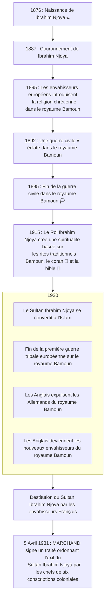

{.align-abstopright}

<figure class="image image-style-align-right image_resized" style="width: 50%;">
   
   <figcaption>
      Palais des sultans Bamoun 
      Construit sous le règne de Ibrahim Njoya
   </figcaption>
</figure>

Le *roi Ibrahim Njoya* (ou *Sultant Ibrahim Njoya*) est le XVIIème représentant du peuple `Bamoun`. Il appartient à la `dynastie Nchare Yen`. Ce *roi* règne de `1887` à `1933` (`calendrier grégorien`). Il est déifié par son peuple suite aux miracles qu'il a accompli.[^1][^2]

Le *Roi Ibrahim Njoya* né en `1876` (`calendrier grégorien`) de `Na Njapdnunke`, `sa mère`.[^1]
Il se marie avec plus de six cent femmes dans le but de rassembler tous les critères de beauté féminins.[^2]

La frise ci-dessous retrace les faits historiques liées au  *Sultan Ibrahim Njoya*.

# Spiritualité et religions

En `1915` (`calendrier grégorien`), le *Sultan Ibrahim NJOYA* souhaite renforcer la puissance de `son royaume`. Pour se faire, il crée une spiritualité basée sur les rites traditionnels Bamoun. Il y rajoute des éléments religieux provenant du `Coran` et de la `Bible`. Par la suite, en `1920`, le *Sultan* adhère à l'`Islam`.[^1][^2]

# Monuments

Durant son règne, le *Sultan Ibrahim Njoya* construit le `palais des sultans Bamoun`. Celui-ci se trouve à Foumban, au Cameroun 🇨🇲. Le palais est classé patrimoine mondial par l'UNESCO.[^1]

# Sciences

Avant `1895` (`calendrier grégorien`), le `royaume Bamoun` dispose d’une écriture difficile à maitriser par le peuple. Pour pallier cela, le *Sultan Ibrahim Njoya* décide de la simplifier. Dès lors, suite à la `guerre civile` qui ravage le royaume (`1892 − 1895` du `calendrier grégorien`), le Sultan crée le `shu-mom`. Cette nouvelle écriture est un tremplin à l’amélioration du système administratif du `royaume Bamoun` (fiscalité, justice, archives, etc.).[^1][^2]

# Invasion du royaume Bamoun

## Invasion allemande

Les `Allemands` sont les premiers envahisseurs européens que rencontre le *Roi Ibrahim Njoya*. Il les acceuille avec respect et les laisse découvrir le `royaume`.
Les `Bamoun` surprennent les `Allemands` par leur avancée civilisationnelle. Les apprioris des `Allemands` se dissipent et le royaume en vient à envisager d'effectuer des échanges avec les Allemands.
Entre `1885` et  `1916`, les envahisseurs allemands introduisent la religion `chrétienne` et démantèlent les structures politiques établies du `royaume Bamoun`.[^2][^1]

## Invasion anglaise

En `1895` (`calendrier grégorien`), les Bamoun sortent d’une guerre civile. Cette guerre ravage le `royaume Bamoun`.
Moins de vingt ans plus tard, les `Européens` décident de faire la guerre entre eux ; c’est la `première guerre tribale européenne`. Ils contraignent les `Kémyout` du continent et de la diaspora à subir cette guerre par la même occasion. C’est un nouveau ravage qui s’abat sur le royaume.
À cette époque, le `royaume Bamoun` est envahi par les `Allemands`. Par conséquent, des combats armés entre `Allemands` et `Anglais` éclatent sur le territoire Bamoun.
En `1920` (`calendrier grégorien`), les `Allemands` capitulent. Pour les Bamoun, cette année est celle de la fin de la seconde guerre tribale européenne.[^1][^2]

Suite à la défaite des `Allemands` sur le `royaume Bamoun`, les `Anglais` deviennent les nouveaux envahisseurs. L'entente entre le *Roi Ibrahim Njoya* et les `Anglais` reste tout autant « respectueuse et harmonieuse » qu'avec les `Allemands`.[^2]

## Invasion française

<figure class="image image-style-align-right image_resized" style="width: 50%;">
   
   <figcaption>
      Shu-mom (écriture syllabique)
   </figcaption>
</figure>

Les `Français` prennent la succession des `Anglais` dans la colonisation du `royaume Bamoun`. Une opposition `Bamoun` prend place contre l'invasion des Français dans le royaume.
Durant le règne du *Sultan Ibrahim Njoya*, le `royaume Bamoun` fait face à une `guerre civile` puis à la `première guerre tribale européenne`. Par conséquent, pour que son peuple ne subisse pas une nouvelle effusion de sang, le Sultan décide de faire la paix avec les `Français`.
Peu après cette trève, les `Français` et quelques `Bamoun` trahissent le traité de paix en complotant contre le *Sultan Ibrahim Njoya*.[^2]

À l'aide d'accusations fausses[^2], les Français :

* interdisent l'enseignement du `shu-mom` ;
* interdisent le `Ngouon` (fête `Bamoun`) ;
* divisent le royaume en chefferies supérieures ;
* construisent une route principale passant à l'intérieur du `palais du *Sultan Ibrahim Njoya*`.

<figure class="image image-style-align-right image_resized" style="width: 30%;">
   
   <figcaption>
      Le roi Ibrahim Njoya 
      en tenue traditionnelle
   </figcaption>
</figure>

Par peur d'une révolte populaire et pour démanteler le pouvoir du *Sultan Ibrahim Njoya*, les envahisseurs français manigancent une destitution. Ils enrôlent donc des traitres `Bamoun` et d’autres `Kémyout` avides de pouvoir. La destitution se concrétise suite à la création d’une liste de « reproches » faits au Sultan et à la signature d’un traité signé par MARCHAND. À l’époque, MARCHAND est `gouverneur des colonies`, `commisaire de la république française du Cameroun` et commandeur de la légion d’honneur.[^2]

Voici la liste des « reproches » faits au *Sultan Ibrahim Njoya* par les `Français` pour soutenir le démantèlement du `royaume`.[^2]

1. Le *Sultan Ibrahim Njoya* a plusieurs épouses (plus de six cent) et trop d'enfants.
2. Le *Sultan Ibrahim Njoya* vit dans un grand palais.
3. Le *Sultan Ibrahim Njoya* asservit son peuple.
4. Le *Sultan Ibrahim Njoya* possède toutes les terres et cultures du royaume.
5. Le *Sultan Ibrahim Njoya* possède le droit de mort et de vie sur les `Bamoun`.
6. Le *Sultan Ibrahim Njoya* refuse d'être auxilliaire de l'administration française.

Voici quelques faits historiques qui mettent en exergue le manque de cohérence entre ces accusations et la justice appliquée dans la « `métropole` ».

1. Le `15` `Déc.` `1904` (`calendrier grégorien`), les `Français` suppriment l'interdiction de mariage entre les personnes ayant pratiqué l'adultère. Cela montre qu’au moment de l’accusation, faute de légaliser la polygamie, un homme possédant plusieurs femmes n'est pas un problème en `France`.[^3]
2. Le président de la république française réside à l'Élysée, soit dans 11 179 m², ce qui est un grand palais.[^4]
3. Les `Kamyout` vivent dans une situation d'asservissement dans toutes les colonies françaises, malgré l'`abolition officielle du Yovodah`.[^5]
4. La `France` prend possession des terres et du travail agricole de toutes ses colonies pour son propre profit.[^6]
5. Le *Sultan Ibrahim Njoya* a renoncé à son droit de vie ou de mort sur son peuple lorsqu'il est devenu Sultan, donc avant l'arrivée des `Français`. Néanmoins, au moment des accusations, la peine de mort n'est pas encore abolie en `France`.[^2][^7]
6. Pour assurer son égémonie, la `France` oblige tous les royaumes et tous les empires présents sur ses « `colonies` » à être annexés. Le `royaume Bamoun` en est l'exemple.

La destitution du *Sultan Ibrahim Njoya* se déroule un matin. Lors de son embarquement, d'un côté se trouvent les `Bamoun` et de l'autre les `Français`. Les `Bamoun` sont désarmés tandis que les `Français` menacent les `Bamoun` avec leurs kalashnikovs.[^2]

Quelques jours après son embarquement, les guerriers `Bamoun` font circuler la rumeur d'une libération du *Sultan ibrahim Njoya*. Par peur, les `Français` envisagent d'exiler le Sultan au `Congo` avec la complicité de `Kémyout` corrompus. En définitive, l'opposant franco-africain décide d'exiler le roi à `Yaoundé` (`Cameroun`) à la demande de Tanashangana.[^2]

> * Article 1 : Le nommé *NJOYA* ex-sultant de `Fumban` sera interné pendant une période de cinq années avec résidence obligatoire à `Yaoundé`. Les biens seront plassés sous séquestre pendant la durée de l'internement.
> * Article 2 : Les chefs des six conscriptions […] de `Yaoundé` sont chargés de l'exécution du présent arrêté qui sera enregistré et communiqué partout ou besoin sera et notifié à l'intéressé.
> 
> 
Arrêté signé par MARCHAND, 5 Avril 1931

# Fin du reigne
Lors de son exil à [Yaoundé](/geographie/ville/afrique/centre/cameroun/yaounde), le *Sultan Ibrahim NJOYA* réussit à créer un lien avec le peuple de Yaoundé.[^2]
*Le Sultan* reçoit le peuple, lui donne à manger, dessine et peint avec lui, lui enseigne sa langue et son écriture (le [shu-mom](/ecriture/shu-mom)), etc.[^2]
En remerciement, le peuple aide le *Roi NJOYA* dans ses travaux de construction.[^2]

Cet exil engendre une amitié entre *le Sultan* et Shala Tangana, un africain nommé chef du [Yaoundé](/geographie/ville/afrique/centre/cameroun/yaounde) par les envahisseurs français. Tel un invité de Tanashangana, *le Roi* est convié aux défilés de l'armée française sur les terres Africaines, au [Yaoundé](/geographie/ville/afrique/centre/cameroun/yaounde).[^2]
*le Sultan Ibrahim NJOYA* apprécie tant Tangana qu'il en vient à donner son nom à son fils qui né à [Yaoundé](/geographie/ville/afrique/centre/cameroun/yaounde).[^2]

Malgré cette amitié avec Shala Tangana, le *Sultan NJOYA* sait pertinemment que Tangana est du côté des français et qu'il a pour mission de le surveiller.[^2]

Prenant conscience du fait que son frère a été nommé « Sultan par intérime » par les colons et que Shala Tangana le surveille pour les français, le *Roi NJOYA* commence à s'isoler. *NJOYA* en arrive à rester enfermé dans sa chambre et n'accepter que la compagnie de sa femme.[^2]
Petit à petit, sa santé s'agrave ; sa respiration diminue. Il va à l'hôpital puis il retourne à son domicile. À l'arrivée de la nuit, le *Sultan NJOYA* agonise.[^2]

Le [30](/histoire/date/calendrier-gregorien/par-jour/30) [Mai](/histoire/date/calendrier-gregorien/par-mois/mai) [1933](/histoire/date/calendrier-gregorien/par-annee/1933), vers 2h du matin, le *Roi NJOYA* succombe.[^2]

Dans un premier temps, les français décident d'énumer feu le *Sultan* à [Yaoundé](/geographie/ville/afrique/centre/cameroun/yaounde) mais après une négociation menée par les Africains, les français en viennent à accepter d'enterrer le *Roi Ibrahim NJOYA* près des siens, sur les [terres bamouns](/geographie/royaume/afrique/nord-ouest/bamoun), à [Foumban](/geographie/ville/afrique/nord-ouest/cameroun/foumban).[^2]

Le 31 Mai 1933, la dépouille du *Roi NJOYA* est ramenée à [Foumban](/geographie/ville/afrique/nord-ouest/cameroun/foumban). Les Atémengé voient *NJOYA*, l'homme qui leur a donné de son temps, de son savoir et de son amour, pour la dernière fois.[^2]
Le cortège est couvert par des pleurs et des désolations.[^2]

Une fois à [Foumban](/geographie/ville/afrique/nord-ouest/cameroun/foumban), les français veulent enterrer le *Roi NJOYA* dans la forêt ; néanmoins, les frères de *NJOYA* et le [peuple Bamoun](/peuple/afrique/a-situer/bamoun) refusent catégoriquement. Ainsi, grâce à eux, le corps du *Roi NJOYA* peut reposer auprès de celui de ses ancêtres.[^2]

Le *Sultan NJOYA* meurt le [30](/histoire/date/calendrier-gregorien/par-jour/30) [Mai](/histoire/date/calendrier-gregorien/par-mois/mai) [1933](/histoire/date/calendrier-gregorien/par-annee/1933), vers 2h du matin, à [Yaoundé](/geographie/ville/afrique/centre/cameroun/yaounde), suite à son exil dans cette ville par les envahisseurs français, avec la complicité de quelques Africains avides.[^1][^2]

[^1]: [Ibrahim Njoya](https://fr.wikipedia.org/wiki/Ibrahim_Njoya). In [Wikipédia](https://fr.wikipedia.org/) [en ligne]. Fondation Wikimedia, 2003 [consulté le `10` `Juin` `2018` (`calendrier grégorien`)]. https://fr.wikipedia.org/wiki/Ibrahim_Njoya
[^2]: [PanAfrican Dream Media](https://www.youtube.com/channel/UCu0a1M4ANVmdvF4Zj7c4HIA). [Ibrahim Njoya le roi des Bamoun](https://www.youtube.com/watch?v=bNeYOM_qFjg) [Vidéo en ligne]. [YouTube](https://www.youtube.com/), `27` `févr.` `2017` [consulté le `14` `Juillet` `2018`]. 1 vidéo, 27min 5s. https://www.youtube.com/watch?v=bNeYOM_qFjg
[^3]: [Adultère − XIXème siècle en France](https://fr.wikipedia.org/wiki/Adult%C3%A8re#XIXe_si%C3%A8cle_en_France). In [Wikipedia, l'encyclopédie libre](http://fr.wikipedia.org) [en ligne]. Fondation Wikimedia, 2003 [consulté le `13` `Août` `2018`]. https://fr.wikipedia.org/wiki/Adult%C3%A8re#XIXe_si%C3%A8cle_en_France
[^4]: [Palais de l'Élysée − Le palais de l'Élysée en chiffres](https://fr.wikipedia.org/wiki/Palais_de_l%27%C3%89lys%C3%A9e#Le_palais_de_l'%C3%89lys%C3%A9e_en_chiffres). In [Wikipedia, l'encyclopédie libre](http://fr.wikipedia.org) [en ligne]. Fondation Wikimedia, 2003 [consulté le `13` `Août` `2018`]. https://fr.wikipedia.org/wiki/Palais_de_l%27%C3%89lys%C3%A9e#Le_palais_de_l'%C3%89lys%C3%A9e_en_chiffres
[^5]: `Doumbi-Fakoly`. `Marcus Garvey expliqué aux adolescents`. Édition `MENAIBUC` ; 2ème trimestre `2009`. 91 p. ISBN : 978-2-35349-102-5.
[^6]: `Guy CABORT-MASSON`. `Les puissances d'argent de la martinique − La caste des Békés`. 3ème édition. La V.d.P. 339 p..
[^7]: [Peine de mort en France − Opinion française](https://fr.wikipedia.org/wiki/Peine_de_mort_en_France#Opinion_fran%C3%A7aise). In [Wikipédia, l'encyclopédie libre](https://fr.wikipedia.org) [en ligne]. Fondation Wikimedia, 2003 [consulté le `18` `Juillet` `2018`]. https://fr.wikipedia.org/wiki/Peine_de_mort_en_France#Opinion_fran%C3%A7aise
