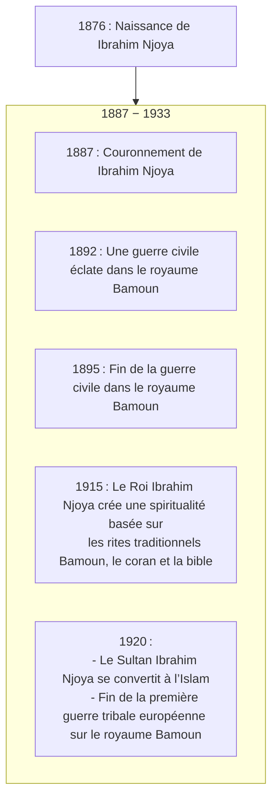

{.align-abstopright}

<figure class="image image-style-align-right image_resized" style="width: 50%;">
   
   <figcaption>
      Palais des sultans Bamoun 
      Construit sous le règne de Ibrahim Njoya
   </figcaption>
</figure>

Le *roi Ibrahim Njoya* (ou *Sultant Ibrahim Njoya*) est le XVIIème représentant du peuple `Bamoun`. Il appartient à la `dynastie Nchare Yen`. Ce *roi* règne de `1887` à `1933` (`calendrier grégorien`). Il est déifié par son peuple suite aux miracles qu'il a accompli.[^1][^2]

Le *Roi Ibrahim Njoya* né en `1876` (`calendrier grégorien`) de `Na Njapdnunke`, `sa mère`.[^1]
Il se marie avec plus de six cent femmes dans le but de rassembler tous les critères de beauté féminins.[^2]

La frise ci-dessous retrace les faits historiques liées au  *Sultan Ibrahim Njoya*.

```mermaid
flowchart TB

   birth["1876 : Naissance de Ibrahim Njoya"]
   
   subgraph reign["1887 − 1933"]
      coronation["1887 : Couronnement de Ibrahim Njoya"]
      
      civilWarBegining["1892 : Une guerre civile éclate dans le royaume Bamoun"]
      civilWarEnd["1895 : Fin de la guerre civile dans le royaume Bamoun"]
      
      spirituality["1915 : Le Roi Ibrahim Njoya crée une spiritualité basée sur
      les rites traditionnels Bamoun, le coran et la bible"]
      
      conversion["1920 :
      - Le Sultan Ibrahim Njoya se convertit à l’Islam
      - Fin de la première guerre tribale européenne sur le royaume Bamoun"]
   end
   
   birth --> reign
   
```

# Spiritualité et religions

En `1915` (`calendrier grégorien`), le *Sultan Ibrahim NJOYA* souhaite renforcer la puissance de `son royaume`. Pour se faire, il crée une spiritualité basée sur les rites traditionnels Bamoun. Il y rajoute des éléments religieux provenant du `Coran` et de la `Bible`. Par la suite, en `1920`, le *Sultan* adhère à l'`Islam`.[^1][^2]

# Monuments

Durant son règne, le *Sultan Ibrahim Njoya* construit le `palais des sultans Bamoun`. Celui-ci se trouve à Foumban, au Cameroun 🇨🇲. Le palais est classé patrimoine mondial par l'UNESCO.[^1]

# Sciences

Avant `1895` (`calendrier grégorien`), le `royaume Bamoun` dispose d’une écriture difficile à maitriser par le peuple. Pour pallier cela, le *Sultan Ibrahim Njoya* décide de la simplifier. Dès lors, suite à la `guerre civile` qui ravage le royaume (`1892 − 1895` du `calendrier grégorien`), le Sultan crée le `shu-mom`. Cette nouvelle écriture est un tremplin à l’amélioration du système administratif du `royaume Bamoun` (fiscalité, justice, archives, etc.).[^1][^2]

# 1^ère^ guerre tribale européenne

En `1895` (`calendrier grégorien`), les Bamoun sortent d’une guerre civile. Cette guerre ravage le `royaume Bamoun`.
Moins de vingt ans plus tard, les `Européens` décident de faire la guerre entre eux. Ils contraignent les `Kémyout` du continent et de la diaspora à subir cette guerre par la même occasion. C’est un nouveau ravage qui s’abat sur le royaume.
À cette époque, le `royaume Bamoun` est envahi par les `Allemands`. Par conséquent, des combats armés entre `Allemands` et `Anglais` éclatent sur le territoire Bamoun. En `1920` (`calendrier grégorien`), les `Allemands` capitulent. Pour les Bamoun, cette année est celle de la fin de la seconde guerre tribale européenne.[^1][^2]

# Invasion européenne

## Invasion allemande

Les `Allemands` sont les premiers envahisseurs européens que rencontre le *Roi Ibrahim Njoya*. Il les acceuille avec respect et les laisse découvrir le `royaume`.

Les `Bamoun` surprennent les `Allemands` par leur avancée civilisationnelle. Les apprioris des `Allemands` se dissipent et le royaume en vient à envisager d'effectuer des échanges avec les Allemands.[^2]

## Invasion anglaise
Suite à la défaite des Allemands sur les [terres bamouns](/geographie/royaume/afrique/nord-ouest/bamoun), les Anglais deviennent les nouveaux colons du [royaume](/geographie/royaume/afrique/nord-ouest/bamoun).[^2]
L'entente entre le roi et les Anglais reste tout autant « respectueuse et harmonieuse » qu'avec les Allemands, avant la [première guerre tribale européenne](/histoire/periode/epoque-moderne/europe/partout/confrontation/premiere-guerre-tribale-europeenne).[^2]

## Invasion française
Les Français prennent la succession des Anglais dans la colonisation du [royaume Bamoun](/geographie/royaume/afrique/nord-ouest/bamoun).[^2]

## Annexion du royaume

<figure class="image image-style-align-right image_resized" style="width: 30%;">
   
   <figcaption>
      Le roi Ibrahim Njoya 
      en tenue traditionnelle
   </figcaption>
</figure>
Entre [1885](/histoire/date/calendrier-gregorien/par-annee/1885) et [1916](/histoire/date/calendrier-gregorien/par-annee/1916), les colons européens introduisent la religion [chrétienne](/religion/confession/christianisme) dans le [royaume](/geographie/royaume/afrique/nord-ouest/bamoun) et, par la même occasion, démantèlent les structures politiques établies. [^1]

Quand vient « le tour » de la colonisation française, une opposition [Bamoun](/peuple/afrique/a-situer/bamoun) prend place contre l'installation des Français dans le [royaume](/geographie/royaume/afrique/nord-ouest/bamoun).[^2]
Pour éviter les effusions de sang, *le Sultan NJOYA* décide de faire la paix avec les Français. Cet acte, *NJOYA* l'a fait par intérêt pour son [peuple](/peuple/afrique/a-situer/bamoun), afin que celui-ci ne se voit pas de nouveau en guerre.[^2]
Peu après, les Français et quelques [Bamouns](/peuple/afrique/a-situer/bamoun) trahissent le traité de paix en complotant contre le *Roi*.[^2]

À l'aide d'accusations fausses[^2], les Français :
* interdisent l'enseignement du [Shu-Mom](/ecriture/shu-mom) ;
* interdisent le Ngouon ;
* divisent le royaume en chefferies supérieures ;
* construisent une route principale passant à l'intérieur du [palais d'*Ibrahim*](/monument/afrique/a-situer/palais-des-sultants-bamouns).

## L'exil

Par peur d'une révolte populaire, les Français décident d'exiler le *Sultan NJOYA* à [Yaoundé](/geographie/ville/afrique/centre/cameroun/yaounde), dans le but de démanteler son pouvoir.[^2]

À l'aide d'un arrêté signé par [MARCHAND](/personnalite/homme/colon/europe/ouest/pays/france/marchand) et d'une liste de « reproches » faits au *roi*, les français accompagnés de [Bamouns](/peuple/afrique/a-situer/bamoun) et d'autres Africains avides de pouvoir et de commandement réussissent à destituer *le Sultan NJOYA*.[^2]

Voici la liste des « reproches » faits à *NJOYA* par les français pour soutenir le démantèlement du [royaume](/geographie/royaume/afrique/nord-ouest/bamoun) [^2] :

<figure class="image image-style-align-right image_resized" style="width: 50%;">
   
   <figcaption>
      Shu-mom (écriture syllabique)
   </figcaption>
</figure>

* il a plusieurs épouses (plus de six cent) et trop d'enfants ;
* il vit dans un grand palais ;
* il asservit son peuple ;
* il possède toutes les terres et cultures du royaume ;
* il possède le droit de mort et de vie sur les [Bamouns](/peuple/afrique/a-situer/bamoun) ;
* il refuse d'être auxilliaire de l'administration française.

Pour comprendre la fourberie, il faut se rappeler que :
* à défaut de légaliser la polygamie, le [15](/histoire/date/calendrier-gregorien/par-jour/15) [Décembre](/histoire/date/calendrier-gregorien/par-mois/decembre) [1904](/histoire/date/calendrier-gregorien/par-annee/1904), les français suppriment l'interdiction de mariage entre les personnes ayant pratiqué l'adultère, ce qui montre que le fait qu'un homme possède plusieurs femmes n'est pas un « problème » dans ce pays[^3] ;
* le président de la république réside à l'Élysée, soit dans 11 179 m²[^4] ;
* les [Kamtyu](/terminologie/mdw-ntr/kamit) de la diaspora vivent dans une situation d'asservissement dans toutes les colonies françaises, malgré l'[abolition officielle de l'esclavage](/histoire/periode/yovodah/abolition-de-lesclavage)[^5] ;
* la [France](/geographie/pays/europe/ouest/france) prend possession des terres et du travail agricole de toutes ses colonies pour son propre profit[^6] ;
* *le Roi Ibrahim NJOYA* a renoncé à son droit de vie ou de mort sur son peuple, lors qu'il est devenu *Roi, par conséquent avant l'arrivée des français[^2] ;
* la peine de mort n'est pas abolie en [France](/geographie/pays/europe/ouest/france), à cette époque[^7] ;
* pour assurer son égémonie, la [France](/geographie/pays/europe/ouest/france) oblige tous les royaumes présents sur le territoire de ses dites colonies françaises à être annexées (le [royaume Bamoun](/geographie/royaume/afrique/nord-ouest/bamoun) en est l'exemple).

La destitution de *NJOYA* se déroule un matin, lors de son embarquement ; d'un côté les [Bamouns](/peuple/afrique/a-situer/bamoun) désarmés et de l'autre les français menaçant le [peuple](/peuple/afrique/a-situer/bamoun) avec des kalashnikovs.[^2]

Quelques jours après son embarquement, les guerriers [Bamouns](/peuple/afrique/a-situer/bamoun) font circuler la rumeur d'une libération du *Sultan NJOYA*.[^2]
Par peur d'une libération du *roi* par les guerriers [Bamouns](/peuple/afrique/a-situer/bamoun), les français envisagent d'exiler le *roi* au [Congo](/geographie/pays/afrique/centre/congo) avec la complicité d'Africains corrompus. En définitive, l'opposant franco-africain décide d'exiler le roi au [Yaoundé](/geographie/ville/afrique/centre/cameroun/yaounde), à la demande de Tanashangana.[^2]

Le [5](/histoire/date/calendrier-gregorien/par-jour/5) [Avril](/histoire/date/calendrier-gregorien/par-mois/avril) [1931](/histoire/date/calendrier-gregorien/par-annee/1931), un arrêté signé par [MARCHAND](/personnalite/homme/colon/europe/ouest/pays/france/marchand) (le gouvereneur des colonies, commissaire de la république française du [Cameroun](/geographie/pays/afrique/nord-ouest/cameroun) et commandeur de la légion d'honneur) stipule ceci[^2] :
* Article 1 : Le nommé *NJOYA* ex-sultant de [Fumban](/geographie/ville/afrique/nord-ouest/cameroun/foumban) sera interné pendant une période de cinq années avec résidence obligatoire à [Yaoundé](/geographie/ville/afrique/centre/cameroun/yaounde). Les biens seront plassés sous séquestre pendant la durée de l'internement.
* Article 2 : Les chefs de des six conscriptions […] de [Yaoundé](/geographie/ville/afrique/centre/cameroun/yaounde) sont chargés de l'exécution du présent arrêté qui sera enregistré et communiqué partout ou besoin sera et notifié à l'intéressé.

# Fin du reigne
Lors de son exil à [Yaoundé](/geographie/ville/afrique/centre/cameroun/yaounde), le *Sultan Ibrahim NJOYA* réussit à créer un lien avec le peuple de Yaoundé.[^2]
*Le Sultan* reçoit le peuple, lui donne à manger, dessine et peint avec lui, lui enseigne sa langue et son écriture (le [shu-mom](/ecriture/shu-mom)), etc.[^2]
En remerciement, le peuple aide le *Roi NJOYA* dans ses travaux de construction.[^2]

Cet exil engendre une amitié entre *le Sultan* et Shala Tangana, un africain nommé chef du [Yaoundé](/geographie/ville/afrique/centre/cameroun/yaounde) par les envahisseurs français. Tel un invité de Tanashangana, *le Roi* est convié aux défilés de l'armée française sur les terres Africaines, au [Yaoundé](/geographie/ville/afrique/centre/cameroun/yaounde).[^2]
*le Sultan Ibrahim NJOYA* apprécie tant Tangana qu'il en vient à donner son nom à son fils qui né à [Yaoundé](/geographie/ville/afrique/centre/cameroun/yaounde).[^2]

Malgré cette amitié avec Shala Tangana, le *Sultan NJOYA* sait pertinemment que Tangana est du côté des français et qu'il a pour mission de le surveiller.[^2]

Prenant conscience du fait que son frère a été nommé « Sultan par intérime » par les colons et que Shala Tangana le surveille pour les français, le *Roi NJOYA* commence à s'isoler. *NJOYA* en arrive à rester enfermé dans sa chambre et n'accepter que la compagnie de sa femme.[^2]
Petit à petit, sa santé s'agrave ; sa respiration diminue. Il va à l'hôpital puis il retourne à son domicile. À l'arrivée de la nuit, le *Sultan NJOYA* agonise.[^2]

Le [30](/histoire/date/calendrier-gregorien/par-jour/30) [Mai](/histoire/date/calendrier-gregorien/par-mois/mai) [1933](/histoire/date/calendrier-gregorien/par-annee/1933), vers 2h du matin, le *Roi NJOYA* succombe.[^2]

Dans un premier temps, les français décident d'énumer feu le *Sultan* à [Yaoundé](/geographie/ville/afrique/centre/cameroun/yaounde) mais après une négociation menée par les Africains, les français en viennent à accepter d'enterrer le *Roi Ibrahim NJOYA* près des siens, sur les [terres bamouns](/geographie/royaume/afrique/nord-ouest/bamoun), à [Foumban](/geographie/ville/afrique/nord-ouest/cameroun/foumban).[^2]

Le 31 Mai 1933, la dépouille du *Roi NJOYA* est ramenée à [Foumban](/geographie/ville/afrique/nord-ouest/cameroun/foumban). Les Atémengé voient *NJOYA*, l'homme qui leur a donné de son temps, de son savoir et de son amour, pour la dernière fois.[^2]
Le cortège est couvert par des pleurs et des désolations.[^2]

Une fois à [Foumban](/geographie/ville/afrique/nord-ouest/cameroun/foumban), les français veulent enterrer le *Roi NJOYA* dans la forêt ; néanmoins, les frères de *NJOYA* et le [peuple Bamoun](/peuple/afrique/a-situer/bamoun) refusent catégoriquement. Ainsi, grâce à eux, le corps du *Roi NJOYA* peut reposer auprès de celui de ses ancêtres.[^2]

Le *Sultan NJOYA* meurt le [30](/histoire/date/calendrier-gregorien/par-jour/30) [Mai](/histoire/date/calendrier-gregorien/par-mois/mai) [1933](/histoire/date/calendrier-gregorien/par-annee/1933), vers 2h du matin, à [Yaoundé](/geographie/ville/afrique/centre/cameroun/yaounde), suite à son exil dans cette ville par les envahisseurs français, avec la complicité de quelques Africains avides.[^1][^2]

[^1]: [Ibrahim Njoya](https://fr.wikipedia.org/wiki/Ibrahim_Njoya). In [Wikipédia](https://fr.wikipedia.org/) [en ligne]. Fondation Wikimedia, 2003 [consulté le `10` `Juin` `2018` (`calendrier grégorien`)]. https://fr.wikipedia.org/wiki/Ibrahim_Njoya
[^2]: [PanAfrican Dream Media](https://www.youtube.com/channel/UCu0a1M4ANVmdvF4Zj7c4HIA). [Ibrahim Njoya le roi des Bamoun](https://www.youtube.com/watch?v=bNeYOM_qFjg) [Vidéo en ligne]. [YouTube](https://www.youtube.com/), `27` `févr.` `2017` [consulté le `14` `Juillet` `2018`]. 1 vidéo, 27min 5s. https://www.youtube.com/watch?v=bNeYOM_qFjg
[^3]: [Adultère − XIXème siècle en France](https://fr.wikipedia.org/wiki/Adult%C3%A8re#XIXe_si%C3%A8cle_en_France). In [Wikipedia, l'encyclopédie libre](http://fr.wikipedia.org) [en ligne]. Fondation Wikimedia, 2003 [consulté le `13` `Août` `2018`]. https://fr.wikipedia.org/wiki/Adult%C3%A8re#XIXe_si%C3%A8cle_en_France
[^4]: [Palais de l'Élysée − Le palais de l'Élysée en chiffres](https://fr.wikipedia.org/wiki/Palais_de_l%27%C3%89lys%C3%A9e#Le_palais_de_l'%C3%89lys%C3%A9e_en_chiffres). In [Wikipedia, l'encyclopédie libre](http://fr.wikipedia.org) [en ligne]. Fondation Wikimedia, 2003 [consulté le `13` `Août` `2018`]. https://fr.wikipedia.org/wiki/Palais_de_l%27%C3%89lys%C3%A9e#Le_palais_de_l'%C3%89lys%C3%A9e_en_chiffres
[^5]: `Doumbi-Fakoly`. `Marcus Garvey expliqué aux adolescents`. Édition `MENAIBUC` ; 2ème trimestre `2009`. 91 p. ISBN : 978-2-35349-102-5.
[^6]: `Guy CABORT-MASSON`. `Les puissances d'argent de la martinique − La caste des Békés`. 3ème édition. La V.d.P. 339 p..
[^7]: [Peine de mort en France − Opinion française](https://fr.wikipedia.org/wiki/Peine_de_mort_en_France#Opinion_fran%C3%A7aise). In [Wikipédia, l'encyclopédie libre](https://fr.wikipedia.org) [en ligne]. Fondation Wikimedia, 2003 [consulté le `18` `Juillet` `2018`]. https://fr.wikipedia.org/wiki/Peine_de_mort_en_France#Opinion_fran%C3%A7aise
