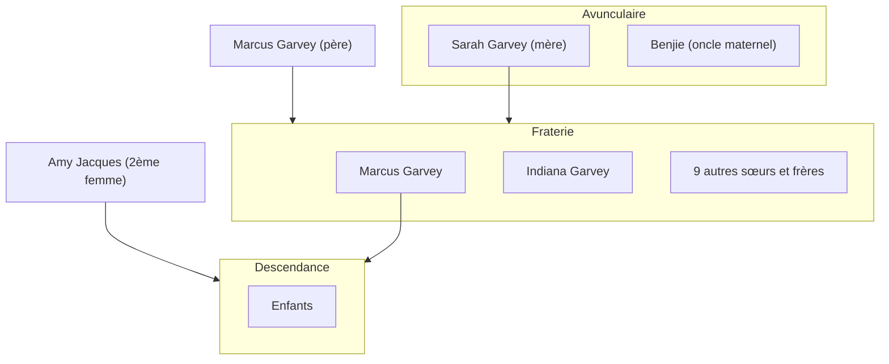
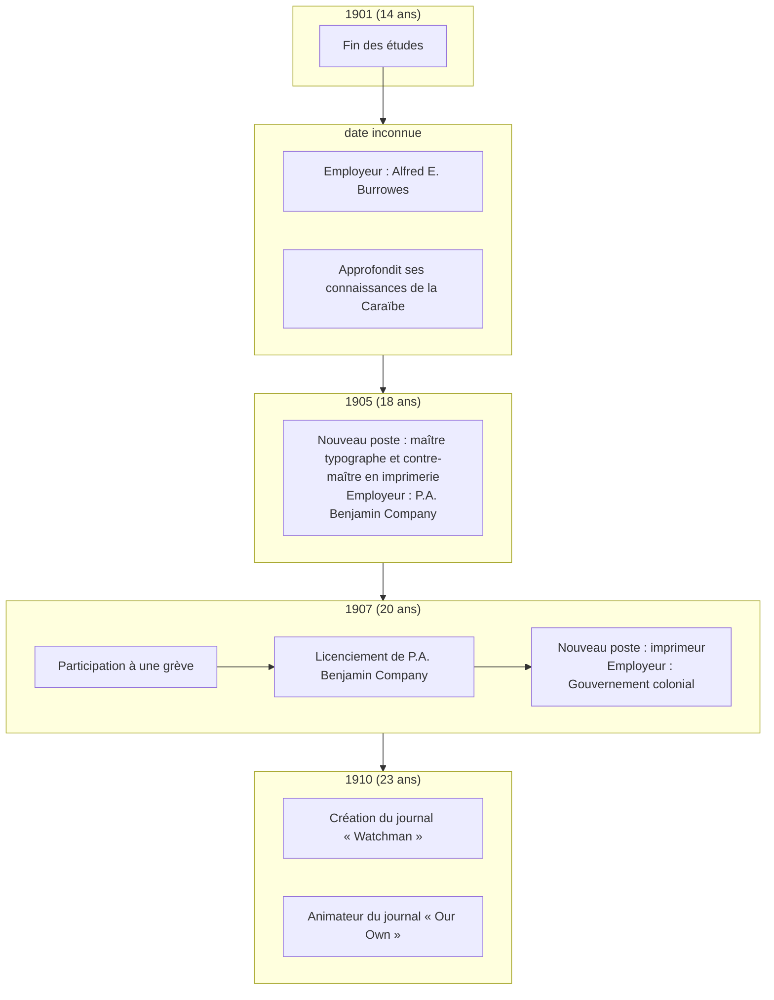
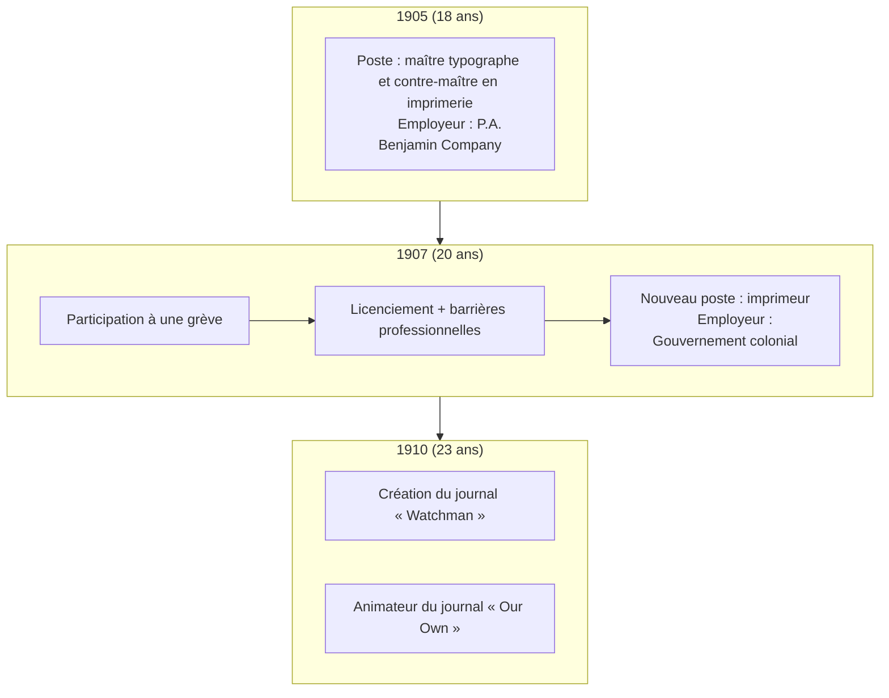

{.align-abstopright}

*Marcus Garvey* a reçu plusieurs prénoms : *Manasseh*, *Moses*, *Aurelius* et *Moziah*[^1]. Il nait dans un village côtier nommé `Saint Ann's Park`, le `18 Août 1887` (`calendrier grégorien`).[^1] *Marcus* est donc un Africain de `Xamayca` (nom originel de la `Jamaïque` 🇯🇲).
À cette époque, l'ile est une colonie britanique :gb:. L'`esclavage` a été aboli il y a 53 ans (`1834` du `calendrier grégorien`).[^1] Les grands-parents de *Marcus Garvey* ont donc connu le `Yovodah`

> **Définition**
> *Yovodah* est un terme `Fon` utilisé pour désigner l'esclavage. Ce terme définit l'esclavage par "le désastre blanc".
{.is-info}

*Marcus Garvey* n'est jamais allé en Afrique[^1]. Néanmoins, il a eu l'ambition de[^1] :
* restaurer la grandeur et la dignité des kamyout (le peuple Noir) ;
* inciter les kamyout à retourner en Afrique ;
* prendre possession de terres africaines pour la communauté.

> **Le saviez-vous ?**
> À l'époque, le continent est colonisé sauf `Éthiopie 🇪🇹` et `Libéria 🇱🇷`.
{.is-info}

# Famille

Ci-dessous une brève généalogie de Marcus Garvey.

Le père de *Marcus Garvey* s'appelle lui aussi `Marcus`. Il est maçon et intellectuel. Marcus père a su transmettre son amour de la lecture à son fils.[^2][^1]

`Sarah`, la mère de *Marcus Garvey*, est une agricultrice. Elle pratique sur un terrain qu'elle partage avec son frère `Benjie`. Ce terrain se trouve à `Chalky Hill`.
*Marcus* se met lui aussi à l'agriculture. Cela lui permet de gagner de l'argent de poche lui permettant d'acheter ses premiers livres. [^1]

Enfin, concernant sa fraterie, *Marcus Garvey* est le plus jeune. Sur ses onze frères et sœurs, deux ne sont pas morts en bas âge. Il s'agit de sa sœur `Indiana` et *lui*.[^1]

# Apprentissage
## Scolarité
*Marcus Garvey* a grandi à Saint Ann's (`Xamayca`). Il y effectue ses études primaires et secondaires. Pour assurer sa réussite scolaire, sa mère lui paye des cours particuliers.[^1]

Néanmoins, `le père` de *Marcus Garvey* est son premier formateur. Il lui raconte des histoires sur les `Nègres marrons` et lui enseigne la lecture.[^1]

À l'âge de neuf ans, *Marcus* décide d'acheter des livres. Pour se faire, il décide se faire de l'argent de poche. en travaillant la terre avec `son oncle Benji` et `sa mère Sarah`.[^1]

À terme, ses parents ne peuvent plus payer ses études. *Marcus Garvey* décide donc de s'auto-former. Son but est d'assouvir son désir de servir son peuple.[^1]
 
## Parcours professionnel

Ci-dessous une frise chronologique du parcours professionnel de *Marcus Garvey*.

À quatorze ans, *Marcus Garvey* arrête les études. Ses parents ne peuvent plus assurer le financement. Dès lors, il se forme seul pour réussir à servir son peuple.

<figure class="image image-style-align-left"> <figcaption>Un penny jamaicain, monnaie contemporaine de <i>Marcus Garvey</i></figcaption></figure>

Tout d'abord, *Marcus* est typographe. Il travaille dans l'imprimerie d'`Alfred E. Burrowes`. Cette imprimerie se trouve à `Saint Ann's Bay`, à `Xamayca`. Ce poste permet à *Marcus Garvey* d'accéder au monde de l'imprimerie. De plus, il en profite pour continuer de s'instruire. Il lit des ouvrages sur des modèles de la Caraïbe, comme[^1] :
- le `général Cudjo`,
- `Tacky`,
- `Sam Sharpe`,
- `Quaco`,
- `Paul Bogle`.

*Marcus Garvey* est sérieux et passionné par son métier d'imprimeur. Il apprend donc vite et bien. Ainsi, à 18 ans, il travaille pour `P.A. Benjamin Company`. C'est l'une des plus grandes imprimeries de Kingston (`Xamayca`). Il a le poste de maître typographe et contre-maître.[^1]

En `1907` (20 ans), *Marcus Garvey* participe à une grêve. Il se voit licencié de son poste de maître typographe et contre-maître.
Il devient imprimeur pour le gouvernement colonial.

Par la suite, en `1910` (23 ans), il crée son premier journal (`Watchman`). De plus, il anime le journal `Our Own`.

> `Our Own` est le journal du parti politique `National Club`.
{.is-info}

## Politique

Ci-dessous une frise chronologique du parcours politique de *Marcus Garvey*.

*Marcus Garvey* débute sa carière politique par des luttes syndicales. Celles-ci se déroulent à `Xamayca`.

En `1907`, un tremblement de terre dévaste l'île. Cette catastrophe engendre pénurie et baisse du pouvoir d'achat. Cela aboutit à une grêve déclenchée par `La Printer's Union`. *Marcus Garvey* se joint au mouvement déclenché par l'imprimerie. Cette décision est en inadéquation avec son poste de contre-maître. Normalement, le contre-maître est toujours du côté des patrons.

> **Le saviez-vous ?**
> Malgré les promesses du patronat, *Marcus Garvey* est resté solidaire en grêvant **avec son peuple** ! En retour, le patronat a :
> - licencié *Marcus*,
> - radié ce dernier de la liste des imprimeurs,
> - condamné *Marcus* à changer de profession.
> 
> Cependant, il a quand-même réussi à obtenir un poste d'imprimeur au sein du gouvernement colonial.
{.is-info}

En `1910`, *Garvey* adhère au `National Club`. C'est un parti politique reconnu au niveau national puisque deux de ses membres ont été élus au conseil législatif. Cette adhésion permet à *Marcus* de découvrir la politique par la pratique. Par exemple, l'année de son adhésion, il obtient l'un des trois postes de secrétaire adjoint du parti. De plus, jusqu'à son départ en Amérique Centrale en fin d'année, *Marcus* est chargé d'animer `Our Own`, le journal du parti.[^1]

## Voyages
### L'Amérique Centrale et la Caraïbe

{.align-right}

Dans le but d'en apprendre plus sur la condition de ses frères de [Xamayca](/geographie/ile/caraibes/midi/xamayca) mais aussi d'autres pays de l'Amérique Centrale, *Marcus Garvey* entreprend de voyager.[^1]
Dès lors, il se trouve, de la fin de l'année [1910](/histoire/date/calendrier-gregorien/par-annee/1910) jusqu'en début [1911](/histoire/date/calendrier-gregorien/par-annee/1911), à travailler dans des plantations de divers pays[^1] :
* Porto Rico, où réside un frère de sa mère ;
* Panama ;
* Equateur ;
* Nicaragua ;
* Honduras ;
* Colombie ;
* Venezuela.

Tout ce que *Marcus* voit n'est que misère sociale extrème, malnutrition et taudis. Pour dénoncer cela, il créé et anime les journaux [Nacionale]() et [Prensa]() respectivement à Porto Rico et au Panama. L'édition de ces deux journaux ne dure pas longtemps étant donné la pression des régimes en place et le manque d'intérêt des populations. [^1] Ce dernier étant potentiellement dû à la mal nutrition dont les [kamtyu](/terminologie/mdw-ntr/kamit) souffrent à cette époque.[^1]

L'illustration ci-contre est un certificat d'une grande firme capitaliste transnationale, [United Fruit Company (UFC)](/organisme/firme-capitaliste-transnationale/ufc).

### L'Europe et les États-Unis d'Amérique

{.align-right}

Suite à son séjour en Amérique Centrale, *Marcus Garvey* décide de voyager en Europe et aux États-Unis d'Amérique pour observer et étudier les mouvements intellectuels [Kamit](/terminologie/mdw-ntr/kamit). Ainsi, *Marcus* entre en contact avec l'intelligentsia Noire en [1912]() en Angleterre puis en [1916](). Grâce à cela, il réussit à comprendre les luttes menées. [^1]

#### L'Europe

Quand il arrive à Londres, lieu de résidence de sa sœur [Indiana](/personnalite/femme/a-classer/indiana-garvey), *Marcus* réussit à trouver du travail en tant que docker aux ports de Liverpool et de Cardiff.[^1]

En visitant la France, l'Italie, l'Espagne, l'Allemagne, l'Autriche et la Hongrie, *Garvey* y identifie une faible activité intellectuelle [Kamit](/terminologie/mdw-ntr/kamit). Cela vient des [politiques coloniales](/ideologie/colonisation) appliquées par ces pays. Il en découle donc qu'il rencontre l'intelligentsia Noire principalement où se pratique l'administration coloniale indirecte (en [Angleterre](/geographie/pays/europe/ouest/angleterre) et aux [États-Unis d'Amérique](/geographie/pays/tamara/nord/etats-unis-d-amerique)).[^1]

*Marcus* rencontre donc [Mohamed Ali Duse](/personnalite/homme/polymathe/afrique/nord-est/egypte/duse-mohamed-ali) à Londres.[^1]
Cette rencontre permet à *Marcus* de parfaire son expérience dans la publication et la presse tout en étant en contact physique ou par écrit avec des nationalites [Kamtyu](/terminologie/mdw-ntr/kamit).

# Prise de conscience
*Marcus Garvey* a remarqué que le clivage social de [Xamayca](/geographie/ile/caraibes/midi/xamayca) était l'exact reflet de sa configuration raciale ; c'est-à-dire que seuls les Blancs accompagnés de quelques rares Métis, se trouvaient en haut de l'échelle sociale alors qu'au plus bas étaient tous les Noirs, formant une masse d'ouvriers agricoles dans les plantations de bananes et de tabac, d'ouvriers du bâtiment et des chemins de fer, de mineurs, de terrassiers, etc..[^1]

Ceci étant, l'événement le plus marquant et le plus décisif pour *Marcus* a été le racisme d'un homme d'église blanc auquel il a dû faire face.[^1]
Un jour, une camarade blanche du même quartier que celui de *Marcus* a été envoyée en Écosse pour continuer sa scolarité. Le père de cette jeune fille, un pasteur méthodiste, lui a ordonné de n'entretenir aucune correspondance avec *Marcus* du fait de l'appartenance de ce dernier à la race nègre. Cette information, une fois arrivée aux oreilles de *Marcus*, lui a permis de réaliser que ce racisme était omniprésent.[^1]
Cette prise de conscience a allumé en lui une flamme révolutionnaire inextinguible.[^1]
Il estimait que le devoir de révolte et de combat s'imposait à toute personne prenant conscience de l'ampleur des injustices que subit son peuple.[^1]

« Je compris qu'il existait des ségrégations dans l'humanité et qu'il y avait plusieurs races, chacune ayant une place bien précise dans la société. »[^3][^4]
« J'ai toujours désiréé de toute mon âme, travailler au progrès de ma race. »[^4]

# Réalisations
## Gouvernement

L'image suivante représente Marcus Garvey lors de l'évènement qu'il a organisé aux États-Unis d'Amérique en [1922](/histoire/date/calendrier-gregorien/par-annee/1922). Il porte les apparats de chef du gouvernement qu'il a fondé.

{.align-center}

## Armée

## Entreprises
### Journaux de presse
Pendant son voyage en Amérique et aux Caraïbes ([1910](/histoire/date/calendrier-gregorien/par-annee/1910)-[1911](/histoire/date/calendrier-gregorien/par-annee/1911)), *Marcus Garvey* crée le journaux [Nacionale]() à Porto Rico et [Prensa]() au Panama.

Le régime politique en place et le manque d'intérêt des populations engendrent le déclin de ces journaux. Les problèmes de nutrition des Portoricain.e.s semblent être la raison de ce « désintéressement ».[^1]

### The Watchman
En [1910](/histoire/date/calendrier-gregorien/par-annee/1910), *Marcus Garvey* crée le journal [Watchman](/organisme/journal/watchman) afin de critiquer la ploitique sociale du gouvernement colonial.[^1]

### Compagnie maritime
{.align-right}

Marcus Garvey a créé une compagnie maritime dans le but de fournir un moyen de retour en Afrique aux Africains de la diaspora. Celle-ci s'appelle *Black Star Line*.[^1]
# Hommages
## Livres
Voici une liste de livres rendant hommage à Marcus GARVEY :
* [Marcus Garvey, expliqué aux adolescents](/ouvrage/documentaire/marcus-garvey-explique-aux-adolescents), un documentaire ayant pour but de présenter le héros qu'est Marcus Garvey aux jeunes mais aussi aux moins jeunes ;
* [Marcus Garvey, Père de l'Unité Africaine des Peuples](/ouvrage/a-classer/marcus-garvey-pere-de-l-unite-africaine-des-peuples) de [Têtêvi Godwin Tété-Adjalogo](/personnalite/homme/ecrivain/a-situer/tetevi-godwin-tete-adjalogo) ;
* [Philosophy and Opinions of Marcus Garvey](/ouvrage/a-classer/philosophy-and-opinions-of-marcus-garvey) de [Amy Jacques Garvey](/personnalite/femme/ecrivaine/a-situer/amy-jacques-garvey).
## Forum
Voici une liste de sujet de discussion créés dans des forum sur l'Internet :
* [Sir Marcus Mosiah Garvey His beliefs deeply influenced the Rastafari, who took his statements as a prophecy](http://join.clubme.net/t26-sir-marcus-mosiah-garvey-his-beliefs-deeply-influenced-the-rastafari-who-took-his-statements-as-a-prophecy#26) créé par l'utilisateur « Admin ».

[^1]: [Doumbi-Fakoly](/personnalite/homme/polymathe/afrique/nord-ouest/pays/mali/doumbi-fakoli). [Marcus Garvey expliqué aux adolescents](/ouvrage/documentaire/marcus-garvey-explique-aux-adolescents). Édition [MENAIBUC](/organisme/editeur/menaibuc) ; 2ème trimestre [2009](/histoire/date/calendrier-gregorien/par-annee/2009). 91 p. ISBN : 978-2-35349-102-5.
[^2]: Admin. [Sir Marcus Mosiah Garvey His beliefs deeply influenced the Rastafari, who took his statements as a prophecy](http://join.clubme.net/t26-sir-marcus-mosiah-garvey-his-beliefs-deeply-influenced-the-rastafari-who-took-his-statements-as-a-prophecy#26). Forum sur [Internet](http://join.clubme.net). [Jeu.](/histoire/date/calendrier-gregorien/par-jour-de-la-semaine/jeudi) [13](/histoire/date/calendrier-gregorien/par-jour/13) [Jan.](/histoire/date/calendrier-gregorien/par-mois/janvier) [2011](/histoire/date/calendrier-gregorien/par-annee/2011) ; 12:50 (lu le [25](/histoire/date/calendrier-gregorien/par-jour/25) [Avril](/histoire/date/calendrier-gregorien/par-mois/avril) [2018](https://partage.leremsesh.com/histoire/date/calendrier-gregorien/par-annee/2018)).
[^3]: [Amy Jacques Garvey](/personnalite/femme/ecrivaine/a-situer/amy-jacques-garvey). [Philosophy and Opinions of Marcus Garvey](/ouvrage/a-classer/philosophy-and-opinions-of-marcus-garvey). Vol. 2. Cité par Têtêvi Godwin Tété-Adjalogo.
[^4]: [Têtêvi Godwin Tété-Adjalogo](/personnalite/homme/ecrivain/a-situer/tetevi-godwin-tete-adjalogo). [Marcus Garvey, Père de l'Unité Africaine des Peuples](/ouvrage/a-classer/marcus-garvey-pere-de-l-unite-africaine-des-peuples). Tome 1. Ed. L'Harmattan ; [Paris](/geographie/ville/europe/ouest/paris) ; [1995](/histoire/date/calendrier-gregorien/par-annee/1995).
