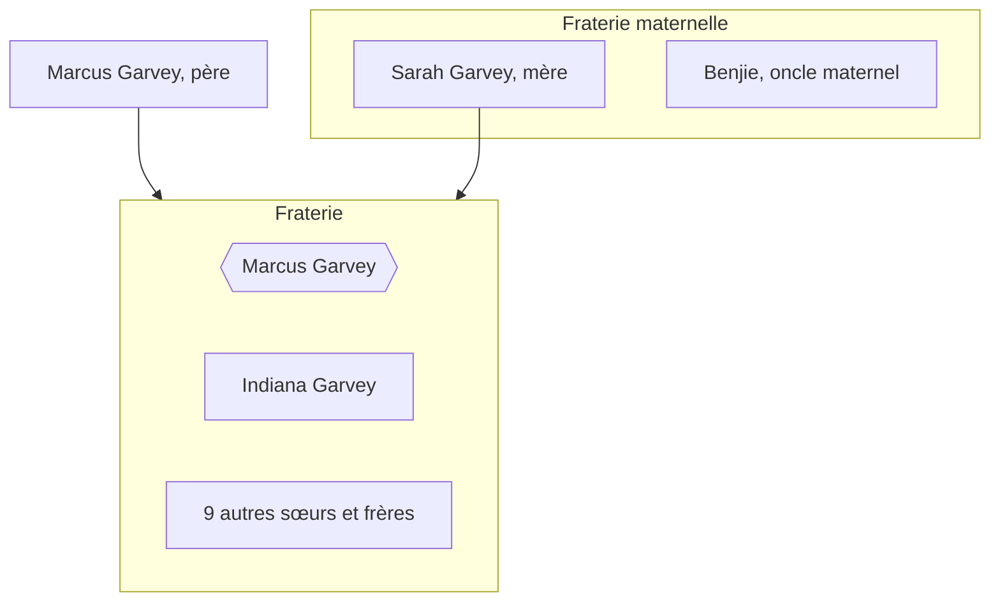

{.align-abstopright}

{.align-left}

*Marcus Garvey* a reçu plusieurs prénoms : *Manasseh*, *Moses*, *Aurelius* et *Moziah*[^1]. Il nait le `18 Août 1887` dans un village côtier nommé `Saint Ann's Park`.[^1] *Marcus* est donc un Africain de `Xamayca` (nom originel de la `Jamaïque` 🇯🇲).
À cette époque, l'ile est une colonie britanique :gb:. L'`esclavage` a été aboli il y a 53 ans (`1834`).[^1] Les grands-parents de *Marcus Garvey* ont donc connu le `Yovodah`

> **Définition**
> *Yovodah* est un terme `Fon` utilisé pour désigner l'esclavage. Ce terme définit l'esclavage par "le désastre blanc".
{.is-info}

*Marcus Garvey* n'est jamais allé en Afrique[^1]. Néanmoins, il a eu l'ambition de[^1] :
* restaurer la grandeur et la dignité des kamyout (le peuple Noir) ;
* inciter les kamyout à retourner en Afrique ;
* prendre possession de terres africaines pour la communauté.

> **Le saviez-vous ?**
> À l'époque, le continent est colonisé sauf `Éthiopie 🇪🇹` et `Libéria 🇱🇷`.
{.is-info}

# Famille

Ci-dessous une brève généalogie de Marcus Garvey.

    
Le père de *Marcus Garvey*, s'appelle lui aussi `Marcus`. Il est maçon et intellectuel. Marcus père a su transmettre son amour de la lecture à son fils.[^2][^1]

`Sarah`, la mère de *Marcus Garvey*, est une agricultrice. Elle pratique sur un terrain qu'elle partage avec son frère `Benjie`. Ce terrain se trouve à `Chalky Hill`.
*Marcus* se met lui aussi à l'agriculture. Cela lui permet de gagner de l'argent de poche. Amoureux de lecture, il en vient à acheter ses premiers livres. [^1]

Enfin, concernant sa fraterie, *Marcus Garvey* est le plus jeune. Sur ses onze frères et sœurs, deux ne sont pas morts en bas âge. Il s'agit de sa sœur `Indiana` et lui.[^1]

# Mariages

{.align-right}

La photo suivante illustre Marcus GARVEY et sa seconde femme, Amy Jacques Garvey. Photo prise en [1922](/histoire/date/calendrier-gregorien/par-annee/1922).

# Apprentissage
## Scolarité
Le père de *Marcus Garvey* a été son premier formateur. Il lui enseignait la lecture et lui racontait des histoires portant sur ses ancêtres, tel quel les [Nègres marrons](/personnalite/titre/negre-marron).[^1]

*Marcus Garvey* grandit à Saint Ann's ([Xamayca](/geographie/ile/caraibes/midi/xamayca)) où il effectue ses études primaires et secondaires.[^1]
Afin d'assurer sa réussite scolaire, sa mère, Sarah, lui prend des cours particuliers.[^1]

À l'âge de neuf ans, *Marcus Garvey* a pris la décision d'acheter des livres à l'aide de l'argent de poche que son oncle *Benji* lui donnait lorsqu'il l'assistait dans ses travaux agricoles.[^1]
Quand vient le moment où ses parents n'ont plus les moyens de payer ses études, *Marcus* décide de s'auto-former dans le but d'assouvir son désir de servir son peuple.[^1]
 
## Parcours professionnel
À quatorze ans, *Marcus Garvey* s'est vu contraint d'arrêter les études par manque de moyens financiers ; il est donc embauché dans l'imprimerie d'*Alfred E. Burrowes* située à *Saint Ann's Bay* en tant que typographe.[^1]
Ce premier métier lui a ouvert les portes du monde de l'imprimerie et lui a permi d'augmenter sa culture grâce à la lecture de nombreux ouvrages portant sur des figures historiques de la Caraïbe (ex. : [général Cudjo](/personnalite/homme/militaire/caraibes/a-situer/general-cudjo), [Tacky](/personnalite/homme/a-classer/caraibes/a-situer/tacky), [Sam Sharpe](/personnalite/homme/a-classer/caraibes/a-situer/sam-sharpe), [Quaco](/personnalite/homme/a-classer/caraibes/a-situer/quaco) et [Paul Bogle](/personnalite/homme/a-classer/caraibes/a-situer/paul-bogle)).[^1]

Étant sérieux et passionné par le métier d'imprimeur, *Marcus Garvey* a appris vite et si bien qu'à l'âge de dix-huit ans, il est devenu maître typographe et contre-maître à *P.A. Benjamin Company*, l'une des plus grandes imprimeries de Kingston (capitale de [Xamayca](/geographie/ile/caraibes/midi/xamayca)).[^1]

Suite à sa participation à la grêve de [1907](/histoire/date/calendrier-gregorien/par-annee/1907), *Marcus* est licencié ; ce qui l'a amené à trouver un autre poste d'imprimeur au gouvernement colonial.

Par la suite, en [1910](/histoire/date/calendrier-gregorien/par-annee/1910) il en est venu à[^1] :
* créer son premier journal : [Watchman](/organisme/journal/watchman) ;
* animer [Our Own](/organisme/journal/our-own), le journal du parti politique [National Club](/organisme/parti-politique/national-club).

## Politique
Ses parents n'ayant plus les moyens, *Marcus Garvey* décide de s'auto-former.
Pour commencer, il s'invite dans des luttes syndicales à [Xamayca](/geographie/ile/caraibes/midi/xamayca).

En [1907](/histoire/date/calendrier-gregorien/par-annee/1907), un tremblement de terre a dévasté son île. Cette catastrophe naturelle a engendré[^1] :
* une pénurie des denrées alimentaires ;
* une baisse des salaires ;
* une flambée des prix.
En réponse à cela, les habitants de l'île ont effectué une longue grêve qui fut déclenchée par l'imprimerie *La Printer's Union*.[^1]
*Marcus Garvey* s'est joint au mouvement alors qu'en principe, étant contre-maître, il se devait d'être du côté des patrons. D'ailleurs, malgré les promesses qui lui ont fait le patronat, *Marcus Garvey* s'est tenu de rester solidaire de son peuple. En retour, suite à la grêve, le patronat[^1] :
* lui a fait perdre son poste ;
* l'a radié de la liste des imprimeurs ;
* l'a condamné à changer de profession.
Malgré cela, *Marcus* a réussi à être embauché en tant qu'imprimeur au sein du gouvernement colonial.

En [1910](/histoire/date/calendrier-gregorien/par-annee/1910), *Marcus Garvey* a adhéré au parti politique [National Club](/organisme/parti-politique/national-club), ce qui lui a permi de découvrir la politique par la pratique. [National Club](/organisme/parti-politique/national-club) était reconnu au niveau national étant donné que deux de ses membres ont réussi à se faire élire au conseil législatif avant l'arrivé de *Marcus*.[^1]
La même année, il y a réussi à obtenir l'un des trois postes de secrétaire adjoint du parti.[^1]
Enfin, pendant la même année et jusqu'à son départ en Amérique Centrale (en fin d'année), *Marcus* participe à l'animation de [Our Own](/organisme/journal/our-own), le journal du parti.[^1]

## Voyages
### L'Amérique Centrale et la Caraïbe
Dans le but d'en apprendre plus sur la condition de ses frères de [Xamayca](/geographie/ile/caraibes/midi/xamayca) mais aussi d'autres pays de l'Amérique Centrale, *Marcus Garvey* entreprend de voyager.[^1]
Dès lors, il se trouve, de la fin de l'année [1910](/histoire/date/calendrier-gregorien/par-annee/1910) jusqu'en début [1911](/histoire/date/calendrier-gregorien/par-annee/1911), à travailler dans des plantations de divers pays[^1] :
* Porto Rico, où réside un frère de sa mère ;
* Panama ;
* Equateur ;
* Nicaragua ;
* Honduras ;
* Colombie ;
* Venezuela.

Tout ce que *Marcus* voit n'est que misère sociale extrème, malnutrition et taudis. Pour dénoncer cela, il créé et anime les journaux [Nacionale]() et [Prensa]() respectivement à Porto Rico et au Panama. L'édition de ces deux journaux ne dure pas longtemps étant donné la pression des régimes en place et le manque d'intérêt des populations. [^1] Ce dernier étant potentiellement dû à la mal nutrition dont les [kamtyu](/terminologie/mdw-ntr/kamit) souffrent à cette époque.[^1]

L'illustration ci-contre est un certificat d'une grande firme capitaliste transnationale, [United Fruit Company (UFC)](/organisme/firme-capitaliste-transnationale/ufc).

{.align-center}

### L'Europe et les États-Unis d'Amérique
Suite à son séjour en Amérique Centrale, *Marcus Garvey* décide de voyager en Europe et aux États-Unis d'Amérique pour observer et étudier les mouvements intellectuels [Kamit](/terminologie/mdw-ntr/kamit). Ainsi, *Marcus* entre en contact avec l'intelligentsia Noire en [1912]() en Angleterre puis en [1916](). Grâce à cela, il réussit à comprendre les luttes menées. [^1]

#### L'Europe
Quand il arrive à Londres, lieu de résidence de sa sœur [Indiana](/personnalite/femme/a-classer/indiana-garvey), *Marcus* réussit à trouver du travail en tant que docker aux ports de Liverpool et de Cardiff.[^1]

En visitant la France, l'Italie, l'Espagne, l'Allemagne, l'Autriche et la Hongrie, *Garvey* y identifie une faible activité intellectuelle [Kamit](/terminologie/mdw-ntr/kamit). Cela vient des [politiques coloniales](/ideologie/colonisation) appliquées par ces pays. Il en découle donc qu'il rencontre l'intelligentsia Noire principalement où se pratique l'administration coloniale indirecte (en [Angleterre](/geographie/pays/europe/ouest/angleterre) et aux [États-Unis d'Amérique](/geographie/pays/tamara/nord/etats-unis-d-amerique)).[^1]

*Marcus* rencontre donc [Mohamed Ali Duse](/personnalite/homme/polymathe/afrique/nord-est/egypte/duse-mohamed-ali) à Londres.[^1]
Cette rencontre permet à *Marcus* de parfaire son expérience dans la publication et la presse tout en étant en contact physique ou par écrit avec des nationalites [Kamtyu](/terminologie/mdw-ntr/kamit).

# Prise de conscience
*Marcus Garvey* a remarqué que le clivage social de [Xamayca](/geographie/ile/caraibes/midi/xamayca) était l'exact reflet de sa configuration raciale ; c'est-à-dire que seuls les Blancs accompagnés de quelques rares Métis, se trouvaient en haut de l'échelle sociale alors qu'au plus bas étaient tous les Noirs, formant une masse d'ouvriers agricoles dans les plantations de bananes et de tabac, d'ouvriers du bâtiment et des chemins de fer, de mineurs, de terrassiers, etc..[^1]

Ceci étant, l'événement le plus marquant et le plus décisif pour *Marcus* a été le racisme d'un homme d'église blanc auquel il a dû faire face.[^1]
Un jour, une camarade blanche du même quartier que celui de *Marcus* a été envoyée en Écosse pour continuer sa scolarité. Le père de cette jeune fille, un pasteur méthodiste, lui a ordonné de n'entretenir aucune correspondance avec *Marcus* du fait de l'appartenance de ce dernier à la race nègre. Cette information, une fois arrivée aux oreilles de *Marcus*, lui a permis de réaliser que ce racisme était omniprésent.[^1]
Cette prise de conscience a allumé en lui une flamme révolutionnaire inextinguible.[^1]
Il estimait que le devoir de révolte et de combat s'imposait à toute personne prenant conscience de l'ampleur des injustices que subit son peuple.[^1]

« Je compris qu'il existait des ségrégations dans l'humanité et qu'il y avait plusieurs races, chacune ayant une place bien précise dans la société. »[^3][^4]
« J'ai toujours désiréé de toute mon âme, travailler au progrès de ma race. »[^4]

# Réalisations
## Gouvernement

L'image suivante représente Marcus Garvey lors de l'évènement qu'il a organisé aux États-Unis d'Amérique en [1922](/histoire/date/calendrier-gregorien/par-annee/1922). Il porte les apparats de chef du gouvernement qu'il a fondé.

{.align-center}

## Armée

## Entreprises
### Journaux de presse
Pendant son voyage en Amérique et aux Caraïbes ([1910](/histoire/date/calendrier-gregorien/par-annee/1910)-[1911](/histoire/date/calendrier-gregorien/par-annee/1911)), *Marcus Garvey* crée le journaux [Nacionale]() à Porto Rico et [Prensa]() au Panama.

Le régime politique en place et le manque d'intérêt des populations engendrent le déclin de ces journaux. Les problèmes de nutrition des Portoricain.e.s semblent être la raison de ce « désintéressement ».[^1]

### The Watchman
En [1910](/histoire/date/calendrier-gregorien/par-annee/1910), *Marcus Garvey* crée le journal [Watchman](/organisme/journal/watchman) afin de critiquer la ploitique sociale du gouvernement colonial.[^1]

### Compagnie maritime
{.align-right}

Marcus Garvey a créé une compagnie maritime dans le but de fournir un moyen de retour en Afrique aux Africains de la diaspora. Celle-ci s'appelle *Black Star Line*.[^1]
# Hommages
## Livres
Voici une liste de livres rendant hommage à Marcus GARVEY :
* [Marcus Garvey, expliqué aux adolescents](/ouvrage/documentaire/marcus-garvey-explique-aux-adolescents), un documentaire ayant pour but de présenter le héros qu'est Marcus Garvey aux jeunes mais aussi aux moins jeunes ;
* [Marcus Garvey, Père de l'Unité Africaine des Peuples](/ouvrage/a-classer/marcus-garvey-pere-de-l-unite-africaine-des-peuples) de [Têtêvi Godwin Tété-Adjalogo](/personnalite/homme/ecrivain/a-situer/tetevi-godwin-tete-adjalogo) ;
* [Philosophy and Opinions of Marcus Garvey](/ouvrage/a-classer/philosophy-and-opinions-of-marcus-garvey) de [Amy Jacques Garvey](/personnalite/femme/ecrivaine/a-situer/amy-jacques-garvey).
## Forum
Voici une liste de sujet de discussion créés dans des forum sur l'Internet :
* [Sir Marcus Mosiah Garvey His beliefs deeply influenced the Rastafari, who took his statements as a prophecy](http://join.clubme.net/t26-sir-marcus-mosiah-garvey-his-beliefs-deeply-influenced-the-rastafari-who-took-his-statements-as-a-prophecy#26) créé par l'utilisateur « Admin ».

[^1]: [Doumbi-Fakoly](/personnalite/homme/polymathe/afrique/nord-ouest/pays/mali/doumbi-fakoli). [Marcus Garvey expliqué aux adolescents](/ouvrage/documentaire/marcus-garvey-explique-aux-adolescents). Édition [MENAIBUC](/organisme/editeur/menaibuc) ; 2ème trimestre [2009](/histoire/date/calendrier-gregorien/par-annee/2009). 91 p. ISBN : 978-2-35349-102-5.
[^2]: Admin. [Sir Marcus Mosiah Garvey His beliefs deeply influenced the Rastafari, who took his statements as a prophecy](http://join.clubme.net/t26-sir-marcus-mosiah-garvey-his-beliefs-deeply-influenced-the-rastafari-who-took-his-statements-as-a-prophecy#26). Forum sur [Internet](http://join.clubme.net). [Jeu.](/histoire/date/calendrier-gregorien/par-jour-de-la-semaine/jeudi) [13](/histoire/date/calendrier-gregorien/par-jour/13) [Jan.](/histoire/date/calendrier-gregorien/par-mois/janvier) [2011](/histoire/date/calendrier-gregorien/par-annee/2011) ; 12:50 (lu le [25](/histoire/date/calendrier-gregorien/par-jour/25) [Avril](/histoire/date/calendrier-gregorien/par-mois/avril) [2018](https://partage.leremsesh.com/histoire/date/calendrier-gregorien/par-annee/2018)).
[^3]: [Amy Jacques Garvey](/personnalite/femme/ecrivaine/a-situer/amy-jacques-garvey). [Philosophy and Opinions of Marcus Garvey](/ouvrage/a-classer/philosophy-and-opinions-of-marcus-garvey). Vol. 2. Cité par Têtêvi Godwin Tété-Adjalogo.
[^4]: [Têtêvi Godwin Tété-Adjalogo](/personnalite/homme/ecrivain/a-situer/tetevi-godwin-tete-adjalogo). [Marcus Garvey, Père de l'Unité Africaine des Peuples](/ouvrage/a-classer/marcus-garvey-pere-de-l-unite-africaine-des-peuples). Tome 1. Ed. L'Harmattan ; [Paris](/geographie/ville/europe/ouest/paris) ; [1995](/histoire/date/calendrier-gregorien/par-annee/1995).
