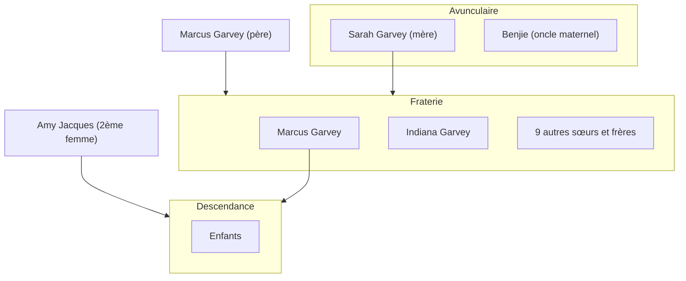

{.align-abstopright}

*Marcus Garvey* a reçu plusieurs prénoms : *Manasseh*, *Moses*, *Aurelius* et *Moziah*[^1]. Il nait dans un village côtier nommé `Saint Ann's Park`, le `18 Août 1887` (`calendrier grégorien`).[^1] *Marcus* est donc un Africain de `Xamayca` (nom originel de la `Jamaïque` 🇯🇲).
À cette époque, l'ile est une colonie britanique :gb:. L'`esclavage` a été aboli il y a 53 ans (`1834` du `calendrier grégorien`).[^1] Les grands-parents de *Marcus Garvey* ont donc connu le `Yovodah`

> **Définition**
> *Yovodah* est un terme `Fon` utilisé pour désigner l'esclavage. Ce terme définit l'esclavage par "le désastre blanc".
{.is-info}

*Marcus Garvey* n'est jamais allé en Afrique[^1]. Néanmoins, il a eu l'ambition de[^1] :
* restaurer la grandeur et la dignité des kamyout (le peuple Noir) ;
* inciter les kamyout à retourner en Afrique ;
* prendre possession de terres africaines pour la communauté.

> **Le saviez-vous ?**
> À l'époque, le continent est colonisé sauf `Éthiopie 🇪🇹` et `Libéria 🇱🇷`.
{.is-info}

Ci-dessous une frise chronologique retraçant la vie de *Marcus GARVEY*.[^1]

> **Vous voulez en savoir plus ?**
> La communauté <a href="/" style="font-family:'Yatra One';color:gold;" >Ba-Moun𓅝Save</a> vous invite à lire la biographie. Elle se trouve juste après la frise suivante. Nous serons ravis de lire vos commentaires tout en bas de la page.  :heart::green_heart::black_heart:
{.is-info}

```mermaid
flowchart TB

   subgraph id23["1834"]
      id24["Abolition officielle de l'esclavage sur l'île de Xamayca 🇯🇲"]
   end
   
   subgraph id22["1887 (naissance)"]
      id20["Marcus GARVEY vient au monde 🚼"]
   end
   
   subgraph id27["1896 (9 ans)"]
      id28["Premier achat de livres avec son argent de poche 📚"]
   end
   
   subgraph id21["1901 (14 ans)"]
      id0["Marcus GARVEY arrête les études par manque de moyens 💸"]
   end
   
   subgraph id2["date inconnue"]
      id1["NOUVEAU POSTE 📃
      Employeur : Alfred E. Burrowes (imprimeur)"]
      id3["Marcus GARVEY approfondit de ses connaissances de la Caraïbe 
      à l'aide des ouvrages imprimés"]
   end
   
   subgraph id4["1905 (18 ans)"]
      id5["Nouveau poste : Maître typographe et contre-maître en imprimerie 📃
      Employeur : P.A. Benjamin Company"]
   end
   
   subgraph id7["1907 (20 ans)"]
      id13["1° Tremblement de terre à Xamayca 🇯🇲"]
      id14["2° Pénurie alimentaire & baisse du pouvoir d'achat
      dans dans tout le pays"]
      id6["3° Marcus GARVEY débute sa carrière politique
      Il participe à une grève déclenchée par La Printer's Union"]
      id8["4° Marcus GARVEY est licencié pour avoir grèvé 🔥
      L'ancien employeur tente d'arrêter la carrière de Marcus GARVEY"]
      id9["5° Nouveau poste : Imprimeur 📃
      Employeur : Gouvernement colonial"]
   end
   
   subgraph id10["1910 - 1911 (23/24 ans)"]
      id11["1° Marcus GARVEY crée le journal « Watchman » 📰"]
      id25["2° Marcus GARVEY adhère au parti politique « National Club »"]
      id26["3° Marcus GARVEY est promu secrétaire adjoint du parti politique"]
      id12["4° Marcus GARVEY est chargé de
      l'animation du journal du parti 📰"]
      id29["5° Marcus GARVEY enchaîne les postes 🥥🥕🌶
      dans des plantations de différents pays 🍠🥭🍍"]
      id30["6° Marcus GARVEY fonde et anime Nacionale à Porto Rico"]
      id31["7° Marcus GARVEY fonde Prensa au Panama"]
   end
   
   subgraph id34["1912 (25 ans)"]
      id32["Premier contact avec l'intelligentsia kamit (Noire), en Angleterre"]
   end
   
   subgraph id35["1916 (28 ans)"]
      id33["Second contact avec l'intelligentsia kamit (Noire)"]
   end
   
   
   id21 --> id2
   id2 --> id4
   id4 --> id7
   id7 --> id10
   id22 --> id27
   id27 --> id21
   id23 --> id22
   id10 --> id34
   id34 --> id35

```

# Famille

Ci-dessous une brève généalogie de Marcus Garvey.

Le père de *Marcus Garvey* s'appelle lui aussi `Marcus`. Il est maçon et intellectuel. Marcus père a su transmettre son amour de la lecture à son fils.[^2][^1]

`Sarah`, la mère de *Marcus Garvey*, est une agricultrice. Elle pratique sur un terrain qu'elle partage avec son frère `Benjie`. Ce terrain se trouve à `Chalky Hill`.
*Marcus* se met lui aussi à l'agriculture. Cela lui permet de gagner de l'argent de poche lui permettant d'acheter ses premiers livres. [^1]

Enfin, concernant sa fraterie, *Marcus Garvey* est le plus jeune. Sur ses onze frères et sœurs, deux ne sont pas morts en bas âge. Il s'agit de sa sœur `Indiana` et *lui*.[^1]

# Apprentissage
## Scolarité
`Le père` de *Marcus Garvey* est son premier formateur. Il raconte à son fils des histoires sur les `Nègres marrons` et lui enseigne la lecture.
Ayant grandi à Saint Ann's (`Xamayca` 🇯🇲), *Marcus GARVEY* y effectue ses études primaires et secondaires. Pour assurer sa réussite scolaire, sa mère lui paye des cours particuliers.[^1]

À l'âge de neuf ans, *Marcus* décide d'acheter des livres. Pour se faire, il travaille la terre avec `sa mère Sarah` et `son oncle Benji` afin de gagner de l'argent de poche.[^1]

À terme, ses parents ne peuvent plus payer ses études. *Marcus GARVEY* décide donc de s'auto-former dans le but d'assouvir son désir de servir son peuple.[^1]
 
## Parcours professionnel

À quatorze ans, en `1901`, *Marcus GARVEY* arrête les études. Ses parents ne peuvent plus assurer le financement. Dès lors, il se forme seul pour assouvir son souhait de servir son peuple.

<figure class="image image-style-align-right"> <figcaption>Un penny jamaicain, monnaie contemporaine de <i>Marcus GARVEY</i></figcaption></figure>

Tout d'abord, il obtient un poste de typographe dans l'imprimerie d'`Alfred E. Burrowes`. Cette imprimerie se trouve à `Saint Ann's Bay`, `Xamayca` (la Jamaïque 🇯🇲). Ce poste permet à *Marcus GARVEY* d'entrer dans le monde de l'imprimerie.
Ce travail lui permet d'approfondir ses connaissances. Il en profite pour lire les impressions portant sur de grandes figures de la Caraïbe[^1] :

- le `général Cudjo`,
- `Tacky`,
- `Sam Sharpe`,
- `Quaco`,
- `Paul Bogle`.

*Marcus GARVEY* est sérieux et passionné par son métier d'imprimeur. Il apprend donc vite et bien. Ainsi, à 18 ans, il travaille pour `P.A. Benjamin Company`, l'une des plus grandes imprimeries de Kingston (`Xamayca` 🇯🇲). Il obtient le poste de maître typographe et de contre-maître.[^1]

À ses 20 ans, en `1907` un , *Marcus GARVEY* participe à une grêve. Son employeur décide donc de le licencier et forcé d'abandonner le métieur d'imprimeur. Il devient imprimeur pour le gouvernement colonial.

Par la suite, en `1910` (23 ans), il crée son premier journal (`Watchman`) et devient animateur de `Our Own`.

> `Our Own` est le journal du parti politique `National Club`.
{.is-info}

## Politique

*Marcus GARVEY* débute sa carière politique par des luttes syndicales. Celles-ci se déroulent à `Xamayca` (l'île de la Jamaïque 🇯🇲).

En `1907`, un tremblement de terre dévaste l'île. Cette catastrophe engendre pénurie alimentaire, baisse des salaires et hausse des prix. Le pays entre donc dans une grêve générale déclenchée par l'imprimerie `La Printer's Union`. Par solidarité, *Marcus GARVEY* se joint au mouvement ; malgré les propositions de corruption que lui fait le patronat. Cette décision est en inadéquation avec son poste de contre-maître. Normalement, le contre-maître est toujours du côté des patrons.

> **Le saviez-vous ?**
> En réponse à la solidarité de *Marcus GARVEY*, le patronat a :
> - licencié *Marcus*,
> - radié ce dernier de la liste des imprimeurs,
> - condamné *Marcus* à changer de profession.
> 
> *Marcus GARVEY* a quand-même réussi à obtenir un poste d'imprimeur au sein du gouvernement colonial, nonobstant ces obstacles.  :sunglasses:
{.is-info}

En `1910`, *GARVEY* adhère au `National Club`. C'est un parti politique reconnu au niveau national puisque deux de ses membres ont été élus au conseil législatif. Cette adhésion permet à *Marcus* de découvrir la politique par la pratique. Par exemple, l'année de son adhésion, il obtient l'un des trois postes de secrétaire adjoint du parti. De plus, jusqu'à son départ en Amérique Centrale en fin d'année, *Marcus* est chargé d'animer `Our Own`, le journal du parti.[^1]

## Voyages

*Marcus Garvey* entreprend de voyager dans le but d'en apprendre plus sur la condition de ses cotemporains Kamyout (Noirs).[^1]

### L'Amérique Centrale et la Caraïbe

De fin `1910` à début `1911` (calendrier grégorien), *Marcus GARVEY* travaille dans les plantations de différents pays.[^1] 🍠🥭🍍🥥🥕🌶

<figure class="image image-style-align-right"> <figcaption>Certificat de la United Fruit Company (UFC), une firme capitaliste transnationale</figcaption></figure>

* `Borikén` (`Porto Rico 🇵🇷`), où réside un de ses oncles maternels,
* `Panama 🇵🇦`,
* `Equateur 🇪🇨`,
* `Nicaragua 🇳🇮`,
* `Honduras 🇭🇳`,
* `Colombie 🇨🇴`,
* `Venezuela 🇻🇪`.

Tout ce que *Marcus* voit n'est que misère sociale extrème, malnutrition et taudis. Pour dénoncer cela, il créé et anime les journaux `Nacionale` et `Prensa` respectivement à `Borikén` (`Porto Rico 🇵🇷`) et au `Panama 🇵🇦`. L'édition de ces deux journaux ne dure pas longtemps étant donné la pression des régimes en place et le manque d'intérêt de ses lecteurs. Ce dernier provient sûrement des problèmes de mal nutrition dont ils souffrent. En effet, avant de penser à remplir sa tête, l'être humain a besoin de remplir son ventre.[^1]

### L'Europe et les États-Unis d'Amérique

Suite à son séjour en Amérique Centrale, *Marcus GARVEY* décide de voyager en Europe 🇪🇺 et aux États-Unis d'Amérique 🇺🇸. Il souhaite observer et étudier les mouvements intellectuels `Kamyout` (Noirs). Grâce à cela, il réussira à comprendre les luttes menées par la communauté.

Il s'avère que *Marcus GARVEY* rencontre l'intelligentsia Noire principalement où se pratique l'administration coloniale indirecte. Il s'agit en l'occurence du `Royaume-Uni 🇬🇧` et des `États-Unis d'Amérique 🇺🇸`. Des lors, à `Londres`, *Marcus* entame une carrière de docker aux ports :anchor: de Liverpool et de Cardiff. Il s'avère justement que sa sœur `Indiana` réside dans la même ville.
Ainsi, en Angleterre, en `1912` puis en `1916` (`calendrier grégorien`), il entre en contact avec l'intelligentsia `Kamit`.
À l'inverse, *Marcus GARVEY* identifie une faible activité intellectuelle `Kamit` dans les autres pays européens qu'il visite. Les `politiques coloniales` appliquées par ces pays en sont certainement la cause.[^1]

> **Le saviez-vous ?**
> 
> *Marcus* a été dans tous les pays suivants pour progresser intellectuellement et découvrir les conditions de vie de la communauté.
> 
> - la France :fr:,
> - l'Italie :it:,
> - l'Espagne :es:,
> - l'Allemagne :de:,
> - l'Autriche 🇦🇹,
> - le Royaume-Uni :uk:,
> - les États-Unis d'Amérique :us:,
> - le Panama 🇵🇦,
> - Borikén (Porto Rico 🇵🇷).
> - Equateur 🇪🇨,
> - Nicaragua 🇳🇮,
> - Honduras 🇭🇳,
> - Colombie 🇨🇴,
> - Venezuela 🇻🇪.
> 
> N'oublions pas qu'en plus, il est né et a grandi sur l'île de Xamayca (la Jamaïque 🇯🇲).
{.is-info}

Son séjour à Londres permet à *Marcus GARVEY* de[^1] :

- parfaire son expérience dans la publication
- parfaire son savoir-faire dans la presse.
- communiquer par écrit avec des nationalistes `Kamyout`,
- être en contact physique avec des nationalites `Kamyout, comme `Mohamed Ali Duse.

# Prise de conscience

*Marcus GARVEY* a remarqué que le clivage social de `Xamayca` est l'exact reflet de sa configuration raciale. Seuls les `Leucodermes` (Blancs) accompagnés de quelques rares « Métis » se trouvent en haut de l'échelle sociale. À l'inverse, les Noirs, qui sont au plus bas de l'échelle, forment une masse[^1] :

<figure class="image image-style-align-right"> <figcaption><i>GARVEY</i></figcaption></figure>

- d'ouvriers agricoles dans les plantations de bananes :banana: et de tabac :smoking:.,
- d'ouvriers du bâtiment et des chemins de fer,
- de mineurs,
- de terrassiers,
- etc.

> **Le saviez-vous ?**
> 
> À l'époque de *Marcus GARVEY*, la `communauté Kamit` est divisée en fonction de sa quantité de mélanine. Il existe :
> 
> - les `Nègres`,
> - les `Quarterons`,
> - les `Quinterons`,
> - les `Chabins`,
> - …
> 
> Ces appellations servent à définir la quantité de mélanine d'un individu. En des termes moins scientifiques, ces groupes ethniques servent à distinguer le degré de Noir et/ou de Blanc d'une personne `Kamit`.
> Des personnes de la `communauté Kamit` se sont identifiées à ce standard défini par les colonisateurs leucodermes. L'objectif de cette distinction est de diviser la `communauté Kamit` afin d'assurer la soumission de la population. Par endroits, la communauté représente une majorité écrasante.
> Par exemple, *Marcus GARVEY* se définit comme `Nègre` et il s'identifit uniquement à ce groupe. Cela vient du fait qu'il remarque qu'un trop grand nombre de `Métis` (Quarteron, Chabin, …) opressent activement les `Nègres`. En réponse à cela, il exhorte les `Nègres` d'agir pour eux et par eux-mêmes.
>
> À présent, cette distinction a évoluée et est appelée le colorisme.
{.is-info}

Ceci étant, un événement raciste a été des plus marquant et des plus décisifs pour *Marcus GARVEY*.[^1]
Durant ses études sur l'île de `Xamayca ` (la `Jamaïque 🇯🇲`), *Marcus* se fait une camarade de classe. Le père de cette jeune fille, un pasteur méthodiste `Leucoderme`, refuse cette camaraderie parce que *Marcus GARVEY* est un `Nègre`. Ce pasteur en vient donc à envoyer son enfant en `Écosse` et lui ordonne de rompre à jamais cette camaraderie. [^1]
Une fois cette information arrivée à ses oreilles, *Marcus* prend conscience de  l'omniprésence du racisme. Cela allume en lui une flamme révolutionnaire inextinguible ! Dès lors, il estime que le devoir de révolte et de combat s'impose à toute personne prenant conscience de l'ampleur des injustices que subissent les `Nègres`.[^1]

> Je compris qu'il existait des ségrégations dans l'humanité et qu'il y avait plusieurs races, chacune ayant une place bien précise dans la société.[^3][^4]
> *Marcus Garvey*

> J'ai toujours désiréé de toute mon âme, travailler au progrès de ma race.[^4]
> *Marcus Garvey*

# Réalisations
## Gouvernement

L'image suivante représente *Marcus GARVEY* lors de l'évènement qu'il a organisé aux États-Unis d'Amérique en [1922](/histoire/date/calendrier-gregorien/par-annee/1922). Il porte les apparats de chef du gouvernement qu'il a fondé.

{.align-center}

## Armée

## Entreprises
### Journaux de presse
Pendant son voyage en Amérique et aux Caraïbes ([1910](/histoire/date/calendrier-gregorien/par-annee/1910)-[1911](/histoire/date/calendrier-gregorien/par-annee/1911)), *Marcus GARVEY* crée le journaux [Nacionale]() à Porto Rico et [Prensa]() au Panama.

Le régime politique en place et le manque d'intérêt des populations engendrent le déclin de ces journaux. Les problèmes de nutrition des Portoricain.e.s semblent être la raison de ce « désintéressement ».[^1]

### The Watchman
En [1910](/histoire/date/calendrier-gregorien/par-annee/1910), *Marcus GARVEY* crée le journal [Watchman](/organisme/journal/watchman) afin de critiquer la ploitique sociale du gouvernement colonial.[^1]

### Compagnie maritime
{.align-right}

*Marcus GARVEY* a créé une compagnie maritime dans le but de fournir un moyen de retour en Afrique aux Africains de la diaspora. Celle-ci s'appelle *Black Star Line*.[^1]
# Hommages
## Livres
Voici une liste de livres rendant hommage à *Marcus GARVEY* :
* [Marcus Garvey, expliqué aux adolescents](/ouvrage/documentaire/marcus-garvey-explique-aux-adolescents), un documentaire ayant pour but de présenter le héros qu'est *Marcus GARVEY* aux jeunes mais aussi aux moins jeunes ;
* [Marcus Garvey, Père de l'Unité Africaine des Peuples](/ouvrage/a-classer/marcus-garvey-pere-de-l-unite-africaine-des-peuples) de [Têtêvi Godwin Tété-Adjalogo](/personnalite/homme/ecrivain/a-situer/tetevi-godwin-tete-adjalogo) ;
* [Philosophy and Opinions of Marcus Garvey](/ouvrage/a-classer/philosophy-and-opinions-of-marcus-garvey) de [Amy Jacques GARVEY](/personnalite/femme/ecrivaine/a-situer/amy-jacques-garvey).
## Forum
Voici une liste de sujet de discussion créés dans des forum sur l'Internet :
* [Sir Marcus Mosiah Garvey His beliefs deeply influenced the Rastafari, who took his statements as a prophecy](http://join.clubme.net/t26-sir-marcus-mosiah-garvey-his-beliefs-deeply-influenced-the-rastafari-who-took-his-statements-as-a-prophecy#26) créé par l'utilisateur « Admin ».

[^1]: [Doumbi-Fakoly](/personnalite/homme/polymathe/afrique/nord-ouest/pays/mali/doumbi-fakoli). [Marcus Garvey expliqué aux adolescents](/ouvrage/documentaire/marcus-garvey-explique-aux-adolescents). Édition [MENAIBUC](/organisme/editeur/menaibuc) ; 2ème trimestre [2009](/histoire/date/calendrier-gregorien/par-annee/2009). 91 p. ISBN : 978-2-35349-102-5.
[^2]: Admin. [Sir Marcus Mosiah Garvey His beliefs deeply influenced the Rastafari, who took his statements as a prophecy](http://join.clubme.net/t26-sir-marcus-mosiah-garvey-his-beliefs-deeply-influenced-the-rastafari-who-took-his-statements-as-a-prophecy#26). Forum sur [Internet](http://join.clubme.net). [Jeu.](/histoire/date/calendrier-gregorien/par-jour-de-la-semaine/jeudi) [13](/histoire/date/calendrier-gregorien/par-jour/13) [Jan.](/histoire/date/calendrier-gregorien/par-mois/janvier) [2011](/histoire/date/calendrier-gregorien/par-annee/2011) ; 12:50 (lu le [25](/histoire/date/calendrier-gregorien/par-jour/25) [Avril](/histoire/date/calendrier-gregorien/par-mois/avril) [2018](https://partage.leremsesh.com/histoire/date/calendrier-gregorien/par-annee/2018)).
[^3]: [Amy Jacques Garvey](/personnalite/femme/ecrivaine/a-situer/amy-jacques-garvey). [Philosophy and Opinions of Marcus Garvey](/ouvrage/a-classer/philosophy-and-opinions-of-marcus-garvey). Vol. 2. Cité par Têtêvi Godwin Tété-Adjalogo.
[^4]: [Têtêvi Godwin Tété-Adjalogo](/personnalite/homme/ecrivain/a-situer/tetevi-godwin-tete-adjalogo). [Marcus Garvey, Père de l'Unité Africaine des Peuples](/ouvrage/a-classer/marcus-garvey-pere-de-l-unite-africaine-des-peuples). Tome 1. Ed. L'Harmattan ; [Paris](/geographie/ville/europe/ouest/paris) ; [1995](/histoire/date/calendrier-gregorien/par-annee/1995).
