{.align-abstopright}

> Les dates contenues dans ce document se basent sur le `calendrier grégorien`.
{.is-info}

<figure class="image image-style-align-right image_resized" style="width: 33%;">
   
   <figcaption>
      Kwa kkwara |aityi 
      dessiné au crayon bleu 
      <i>Dia!kwain</i> (Mars 1875)
   </figcaption>
</figure>

***Khoïsan*** est un nom donné à un peuple vieux d’environ 40 000 ans. Ce peuple regroupe les ***Sans*** et les ***Khoikhoi***. Les ***Sans*** sont des chasseurs-cueilleurs appelés péjorativement ***bochiman*** (***bushmen*** en anglais). Ce peuple a survécu au `Yovodah` pratiqué en `Afrique du Sud`, en `Namibie` et au `Botswana`. À présent, les `Sans` vivent dans le `désert du Kaglagadi`, où ils préservent leur culture et leur mode de vie.
Les ***Khoikhoi*** sont des éleveurs ***Hottentots***.[^4][^15]

L’image ci-contre est un oiseau `Kwa kkwara |aityi`. Cette illustration est faite au crayon bleu par `Dia!kwain` en `Mai` `1875`.
`Dia!kwain` fait parti des `!nussa !e` (membre des khoïsan des plaines) dont le père est un initié réputé pour ses peintures corporelles et ses gravures. `Dia!kwain` a communiqué des récits et des dessins portant sur son peuple aux familles `Lloyd` et `Bleek`. Ces informations représentent plusieurs milliers de pages de la `collection Bleek and Lloyd`.[^1][^11]

La frise suivante relate d’événements historiques liés aux ***Khoïsan***.[^1][^2][^3][^4][^6][^7][^9]

```mermaid
flowchart TB
   khoisanArrive["-40 000 : Les ancêtres Khoïsan deviennent les premiers habitants
   du sud-sud-ouest du continent."]
   
   thelargestPopulation["-20 400 : Les Khoïsans représentent la population la plus grande du monde."]
   
   grassland["~500 : Les peuples originaires des hauts plateaux de l’ouest
   (dénommés bantou) atteignent l’actuelle province du KwaZulu-Natal
   (Est de l’Afrique du Sud 🇿🇦)"]
   
   amaXhosa["~900 : Les AmaXhosa s’installent au sud-est
   de l’espace occupé par l’Afrique du Sud 🇿🇦"]
   
   europeanInvasion["1488 : Les Européens commencent à envahir le sud du continent"]
   
   europeanInvasionNextStep["1652 : Les Européens s’installent définitivement au sud du continent,
      avec l’invasion néerlandaise.
      Peu après, les Trekboers commencent à s’étendre dans le sud du continent"]
   
   boersConflict["1779 : Début des relations conflictuelles entre
      les autochtones et les envahisseurs Trekboers"]
      
   europeanFightInSouthAfricaBegin["1795 : Les Britaniques et les Néerlandais
      commencent à se disputer le sud de l’Afrique"]
   
   europeanFightInSouthAfricaEnd["1806 : Les Néerlandais cèdent leur colonie
      du sud du continent aux Britaniques"]
         
   wilhelmBleekbirth["8 Mars 1827 : Naissance de Wilhelm Bleek"]

   subgraph 1850["~1850"]
      hanKassOBirth["Naissance de |han≠kass’o"]
               
      southAfrica["1853 : Wilhelm Bleek se rend en Afrique du Sud"]
   end
   
   hanKassOImprisonned["~1869 : |han≠kass’o est emprisonné pour
      vol de bétail avec ||kabbo (son beau-père)
      et Witbooy Touren (son beau-frère)"]
   
   hanKassOInBCS["1870 : |han≠kass’o est emprisonné à Breakwater Convict Station"]
   
   hanKassOExile["1871 : |han≠kass’o et sa femme Suobba-||kein sont exilés à Bushmanland"]
   
   kweitenTaKenInMowbray["13 Juin 1874 : !kweiten ta ||ken est à Mowbray
      avec Dia!kwain (son frère), ≠kassin (son mari)
      et deux de ses enfants (l’un de 6ans et l’autre de 2 ans)"]

   kTKOlderSons["25 Oct. 1874 : Les deux grands fils de !kweiten ta ||ken
      rejoignent le reste de la famille à Mowbray"]
   
   kTKInformator["Déc. 1874 − Jan. 1875 : !kweiten ta ||ken divulgue aux familles Bleek et Lloyd
      des informations sur les !nussa !e
      (|xam coutumes féminines, rituels féminins, expériences féminines,…)"]
      
   kTKLittleFamilyLeaveMowbray["13 Jan. 1875 : !kweiten ta ||ken, ses enfants et son mari ≠kassin
      quittent Mowbray pour Bushmaland"]
      
   kabboDeath["1876 : Mort de ||kabbo, le père de "]
   
   subgraph 1877
     huHunWithFriends["Avril 1877 : À Vanwyksvlei, Suobba-||kein et |han≠kass’o
        confient leurs plus grand fils !hu !hun à des amis
        pour qu’ils puissent se rendre à chez les Lloyd, au Cap."]
     
     suobbaKeinNBabyDeath["Décembre 1877 : Suobba-||kein succombe
        suite à des coup grave qu’elle a reçue d’un policier.
        Le bébé n’a pas survécu"]
   end
   
   hanKassOInformatorBegin["10 Janvier 1878 : |han≠kass’o arrive à Mowbray et commence
      à fournir divers informations sur les Ss’wa ka !kui aux
      familles Lloyd et Bleek"]
  
   hanKassOInformationEnd["Décembre 1879 : |han≠kass’o cesse de
      donner des informations sur son peuple pour retrouver
      son fils qui est forcé de travailler dans une ferme"]
      
   bushmanlandBantoustan["1964 : Création officiel du bantoustan nommé Bushmanland
      qui a servi à parquer les Khoïsan pendant l’apartheid"]
      
   khoesanLanguages["2009 : Toutes les langues des Khoïsans sont en voie d’extinction"]
      
   khoisanArrive --> thelargestPopulation --> grassland --> amaXhosa --> europeanInvasion -->
   europeanInvasionNextStep --> boersConflict --> 
   europeanFightInSouthAfricaBegin --> europeanFightInSouthAfricaEnd --> wilhelmBleekbirth --> 1850 -->
   hanKassOImprisonned --> hanKassOInBCS --> hanKassOExile --> kweitenTaKenInMowbray --> kTKOlderSons --> kTKInformator -->
   kTKLittleFamilyLeaveMowbray --> kabboDeath --> 1877 --> hanKassOInformatorBegin --> hanKassOInformationEnd -->
   bushmanlandBantoustan --> khoesanLanguages
   
```

# Peuples ***Khoïsans***

## Onglets{.tabset}

### ***Xirikuana***

> Quand une communauté n’est en capacité de gérer ni la vitesse, ni la nature du changement de sa langue, des changement fondamentaux de son institution sociale peut causer son déclin.[…] La perte de la connaissance transmise de génération en génération par des pratiques institutionnelles qui ont participées à la transmission n’est pas du développement mais de l’appauvrissement.
>
> [Khoemana and the Griqua: Identity at the Heart of Phonological Attrition](https://helda.helsinki.fi//bitstream/handle/10138/229407/Khoemana_and_the_Griqua.pdf), de Don Killian.

***Xirikuana*** est le nom endogène des ***Griqua***. Ce peuple fait partie des `Khoïkhoï`.
En `2009` (`calendirer grégorien`), la langue et la culture ***Xirikuana*** est en voie de disparition. La langue qui prédomine est l’Afrikaans (une langue issue du néerlandais, du français et de l’allemand). Seul dix personnes parlent couramment la langue endogène. Une vingtaine d’autres personnent parlent la langue sans respecter ni le lexique, ni la phonétique de la langue.
La langue des ***Xirikuana*** peut être nommée comme suit[^12][^13][^14] :

- Cape khoe,
- Koraqua,
- Khoemana (khoe = être humain & mana = langue),
- Korana (prononcé */kɒˈrɑːnə/*),
- ǃOrakobab,
- ǃOra ou Kora,
- Gri, Xri ou Xiri,
- Xirikwa.

### ***Sans*** des plaines

<figure class="image image-style-align-right image_resized" style="width: 50%;">
   
   <figcaption>
      !khau |aityi (Kochel man en Afrikaans) 
      dessiné au charbon ou au crayon 
      <i>Dia!kwain</i> (Mars 1875)
   </figcaption>
</figure>

***Ss’wa ka !kui*** et ***!nussa !e*** sont les noms endogènes des ***peuples San des plaines***.[^1][^2][^9]

***Ss’wa ka !kui*** se traduit en français par : « celui qui appartient au groupe de `|xam` et qui vit dans les plaines ». Les ***Ss’wa ka !kui*** ont été exterminés par les `Trekboers` au XIX^ème^ siècle.[^1][^2][^9]

Plusiers informations ont été recensées sur ces peuples par les familles `Lloyd` et `Bleek`[^1][^3] :

- leur lague (le `|xam`),
- leur philosophie,
- leur croyance,
- leur pratique.

Ces informations se trouvent dans la [Lloyd and Bleek Collection](http://lloydbleekcollection.cs.uct.ac.za). Les personnes qui ont fourni les informations sont[^1][^3] :

- `|a!kunta`,
- `||kabbo` (alias `|uhi-ddoro`),
- `≠kasin`,
- `Dia!kwain`,
- `!kweiten ta ||ken`,
- `|han≠kass’o`.

<figure class="image image_resized" style="width: 100%;">
   
   <figcaption>
      Trois !khwa ka xoro (taureaux d’eau) dessinés au crayon par <i>Dia!kwain</i> (Mai 1875)
   </figcaption>
</figure>

### ***Ju***

Les ***Ju*** sont des ***Sans***.
La génétique prouve que les ***Ju*** portent les plus anciennes `mitochondries` du `genre humain`, la `clade``L0d2c1c`.[^17]

### ***ǂGonakhoe***

L’invasion européenne est à l’origine de l’extinction ou de la marginalisation de peuples. Elle aboutit à des problèmes identitaires dans les populations colonisées. De plus, l’économie coloniale et les violences physiques sur les autochtones ont poussés ces derniers à abandonner leurs langues, leurs traditions, leurs cultures et leurs valeurs.
Les ***ǂGonakhoe*** sont un mix entre les cultures ***Khoï*** et Xhosa (peuple du sud différent des ***Khoïsans***).[^12]

### Les ***Coloured***[^18]

<figure class="image image-style-align-right image_resized" style="width: 50%;">
   <figcaption>
     Photo du 1er conseil des Basters de Rehoboth (1872). 
      De droite à gauche :Christoffel van Wijk, Hermanus van Wijk, Jacobus Mouton et Paul Diergaardt. 
   </figcaption>
</figure>

Les ***Coloured*** forment une ***race*** reconnue en `Afrique du Sud`, en `Namibie`, en `Zambie`, au `Botswana` et au `Zimbabwe`. En 2019, la race des ***Coloured*** représente 8,8% de la population sud-africaine, soit 5 176 750 personnes.

Cette `race` représente les descendants des `Kémyout`du sud du continent et des `envahisseurs européens`. La génétique démontre que les ***Coloured*** sont majoritairement issus de femmes `Kémyout` et d’hommes `leucodermes`.[^17]

Certaines communautés ***Coloured*** refusent d’être identifiées comme appartenant à la race `Noire`. Il s’agit par exemple, des ***Baasters***. Les ***Baasters*** sont des descendants de femmes `Kémyout` et d’envahisseurs `Néerlandais`de la `Colonie du Cap`. Ci-contre une illustration représentant des ***Baasters de Rehoboth***.

# Culture khoïsan

## Onglets{.tabset}

### Pronostique vital de la culture[^2][^12]

> La langue est importante pour la transmission et la vie de sa / ses cultures associée(s). Par conséquent, la mort d’une langue implique l’effondrement de sa / ses culture(s).
> 
> [Khoemana and the Griqua: Identity at the Heart of Phonological Attrition](https://helda.helsinki.fi//bitstream/handle/10138/229407/Khoemana_and_the_Griqua.pdf), de Don Killian.

<figure class="image image-style-align-right image_resized" style="width: 30%;">
   
   <figcaption>
      !Diakwain, l’un des derniers <i><b>Ss’wa ka !kui</b></i>
   </figcaption>
</figure>

L’invasion européenne crée des problèmes identitaires dans les populations colonisées. De plus, l’économie coloniale et les violences physiques sur ces populations poussent ces dernières à abandonner leurs langues, leurs traditions, leurs cultures et leurs valeurs ancestrales.

- Extinction de commmunautés ***Ss’wa ka !kui*** et ***!nussa !e*** par les `Trekboers`.
- Marginalisation de la culture ***Xirikuana***, avec 10 locuteurs ou locutrices qui parlent la langue endogène et le reste qui parle Afrikaans.
- En 2009, les cultures et les langues ***Khoïsans*** sont en voie d’extinction.
- Naissance de peuples hybrides, comme les ***ǂGonakhoe***. Les ***ǂGonakhoe*** sont issus d’un mélange entre les ***Khoï*** et les Xhosa (peuple du sud différent des ***Khoïsans***).

### Langues[^12]

<figure class="image image-style-align-right image_resized" style="width: 50%;">
   
   <figcaption>
      Trois <i><b>Khoïsans</b></i> qui discutent
   </figcaption>
</figure>

Ci-desosus une liste non exhaustive de langues khoïsans. Toutes ces langues sont soit disparues (D) soit en voie d’extinction (VE).

- `Xũ` (VE).
- `Kxoe` (VE).
- `Nama` (VE).
- `N|uu` (VE) : langue Taa possédant 10 locutrices ou locuteurs en `2009`.
- `|xam` (D) : langue des `Sans des plaines` (`Ss’wa ka !kui`, `!nussa !e`).
- `khoemana` (VE) :
   - langue des `Xirikuana`,
   - la langue peut aussi s’appeler :
      - cape khoe,
      - koraqua,
      - khoemana (khoe = être humain & mana = langue),
      - Korana (prononcé */kɒˈrɑːnə/*),
      - ǃOrakobab,
      - ǃOra ou Kora,
      - Gri, Xri ou Xiri,
      - Xirikwa.

En `2009`, les langues `xũ`, `kxoe` et `nama` font partie des langues ayant le plus de chance de survie.

# Génétique des ***Khoïsans***[^17][^15]

La génétique démontre que les ***Khoïsans*** font partie des plus anciens `êtres humains`.

## Onglets{.tabset}

### Matrilinéarité[^17]

Dans la « généalogie génétique de l’humanité », les `haplogroupes` `L0` et `L1-6` sont deux branches sœurs. Elles permettent de remonter au plus récent ancêtre matrilinéaire commun (mtDNA). Cet haplogroupe est la racine de cinq autres branches : L0a, L0b, L0d, L0d, L0f et L0k.

Ci-dessous quelques informations sur la matrilinéarité de quelques peuples ***Koïsans*** :

- 79% des Namibien (tout particulièrement les ***!Kung***) appartiennent à la `cladeè  `L0`,
- 83% des sud-africains (tout particulièrement les ***Khoï***) appartiennent à la `clade` `L0`,
- 100% des Botswanais (tout particulièrement les ***!Kung***) appartiennent à la `clade` `L0`,

> **Le saviez-vous ?**
>
> En génétique, il n’est possible de connaître la lignée paternelle qu’avec le chromosome Y.
> Par conséquent, pour connaître la lignée paternelle d’une personne de sexe féminin, il faut une personne de sexe masculin. Cette personne doit être de la même lignée paternelle.
Par exemple, il peut s’agir :
>
> - du père,
> - d’un fils du père,
> - d’un fils du grand-père paternel,
> - du fils d’un oncle paternel,
> - etc.
>
> À l’inverse, il est possible de connaître la lignée maternelle avec une mitochondrie. Cela vient du fait qu’une progéniture hérite toujours des mitochondries de sa mère.
> Dès lors, une femme (tout comme un homme) peu faire par elle-même un test ADN pour connaître sa lignée maternelle.
{.is-info}

#### L’haplogroupe `L0d`

À peu près 73% des ***Khoïsans*** appartiennent à la `clade` `L0`. Une forte majorité des ***Khoïsans*** portent l’haplogroupe mitochondriale le plus ancien : le `L0d`.
D’ailleurs, les ***Ju*** sont reconnus pour appartenir à la `clade` `L0d2c1c`.

> **Le saviez-vous ?**
>
> Lors de l’invasion européenne, des `leucodermes` et des `kamyout` ont eu une descendance. Cette descendance a été racisée et nommée `Coloured`.
> Entre 60% et 71% des `Coloured` sont identifiés comme appartenant aux `clades` `L0d`. Cet `haplogroupe` est le même que la plupart de leurs ancêtres ***Coloured***.
{.is-info}

#### L’haplogroupe `L0k`

`L0k` est le second `clade` le plus répendu chez les ***Khoïsans***.

À l’inverse de l’haplogroupe `L0d`, des études n’ont pas pu démontrer la présence du `L0k` chez les ***Coloured***.

### Patrilinéarité
Les `chromosomes Y` des ***Khoïsans*** est des plus variés de l’espèce humaine. Leurs `chromosomes Y` sont répertoriés dans des sous-groupes des `haplogroupes` `A` et `B`. Ces deux `haplogroupes` sont les plus anciens de « l’abre généalogique » du `chromosome Y` humain.

# Histoire des ***Khoïsans***

## Onglets{.tabset}

### Installation ***Khoïsan***

En `-40 000`, les ***Khoïsans*** sont les premiers homo sapiens sapiens du sud-sud-ouest du continent.
Par la suite en `500`, les peules originaires des hauts plateaux de l’ouest s’installent au sud du continent.[^4]

<figure class="image image_resized" style="width: 100%;">
   
   <figcaption>
     Rassemble de <b><i>Khoïsans</i> entrain de manger un œuf d’authruche</b>
   </figcaption>
</figure>

### Invasion Trekboers[^16][^4][^9][^1][^2]

<figure class="image image-style-align-right image_resized" style="width: 50%;">
   
   <figcaption>
      Trekboers en train de monter leur camp 
      Aquatinte de Samuel Daniell (~1804)
   </figcaption>
</figure>

`Trekboers` signifie « Paysans voyageurs » en `Afrikaans`. Ce sont les descendants des `envahisseurs` `néerlandais`, `protestants allemands` et `huguenots français`. Au XVII^ème^ siècle, les ***Trekboers*** commencent à envahir le sud du continent. En `1779`, les conflits commencent entre les autochtones et les ***Trekboers***.
Les `Trekboers` sont connus pour avoir :

- volé les terres `San (pour y mettre leurs propres fermes),
- chassé du gibier des `San` (pour pratiquer du « sport » ou s’alimenter),
- traqué, tué et enlevé les `San`,
- mis au travail forcé les `San`,
- affamé volontairement les `San`.

En réponse à la menace `Trekboers`, les `San` ont formé des gangs et tué des `envahisseurs européens` avec leurs bétails.

> **Le saviez-vous ?**
> 
>
> Voici quelques gibiers que les `Trekboers` ont chassés par milliers pour s’alimenter ou pour le « sport » :
> 
> <figure class="image image-style-align-right image_resized" style="width: 50%;"></figure>
>
> - le couagga,
> - les autruches, 
> - l’oryx gazelle,
> - les bubales,
> - éland,
> - springbok.
> 
> Ci-contre une femelle cougga en captivité au `zoo de Londres`.
> L’espèce s’est éteinte le `12` `Août` `1883`, au `zoo d’Amsterdam`.
{.is-info}

Jusqu’au XX^ème^ siècle, les `Trekboers` sont identifiés comme appartenant à la classe socio-économique de pasteurs nomades. Ils sont à présent concidérés comme les ancêtres :

- des `Grensboere`, alias `Boers` (paysans `néerlandais`),
- de la population de `Buysplaas` alias `Buysville`,
- des `Afrikaners`.

# Territoires ***Khoïsans***

Les `envahisseurs européens` ont spoliés les terres des ***Khoïsans*** du XVII^ème^ au XX^ème^ siècle. Les principaux spoliateurs sont les `Trekboers` et les `autorités coloniales`.
Après l’apartheid et jusqu’en `1998`, le gouvernement d’Afrique du Sud autorise les ***Khoïsan*** à réclamer leurs terres. Toutefois, ces terres peuvent être réclamées, si elles ont été volées après `1913`. D’après Le Commissaire Adjoint d’Afrique du Sud M. Thami Mdontswa, un réforme constitutionnelle est nécessaire. Cette réforme de la constitution doit permettre aux ***Khoïsans*** d’engager des poursuites pour leurs terres volées avant le `9` `Juin` `1913`.[^15][^2]

[^1]: [|xam contributors](http://lloydbleekcollection.cs.uct.ac.za/xam.html). In [The Digital Bleek & Lloyd](http://lloydbleekcollection.cs.uct.ac.za). [The Digital Bleek & Lloyd](http://lloydbleekcollection.cs.uct.ac.za) [en ligne]. [The Digital Bleek & Lloyd](http://lloydbleekcollection.cs.uct.ac.za) [consulté le `30` `Juillet` `2020`]. Disponible sur : http://lloydbleekcollection.cs.uct.ac.za/xam.html

[^2]: [Lloyd and Bleek Collection](https://www.aluka.org/heritage/collection/LBC). In [World Heritage Sites](https://www.aluka.org/heritage). [World Heritage Sites](https://www.aluka.org/heritage) [en ligne]. [World Heritage Sites](https://www.aluka.org/heritage) [consulté le `30` `Juillet` `2020`]. Disponible sur : https://www.aluka.org/heritage/collection/LBC

[^3]: [Wilhelm Heinrich Immanuel Bleek](https://fr.wikipedia.org/wiki/Wilhelm_Heinrich_Immanuel_Bleek). In [Wikipédia](https://wikipedia.org) [en ligne]. Fondation Wikimedia, `2003`, mis à jour le `7` `Mai` `2019` [consulté le `28` `Juillet` `2020` (`calendirer grégorien`)]. Dispnible sur : https://fr.wikipedia.org/wiki/Wilhelm_Heinrich_Immanuel_Bleek

[^4]: [Afrique du Sud](https://fr.wikipedia.org/wiki/Afrique_du_Sud#Histoire). In [Wikipédia](https://wikipedia.org) [en ligne]. Fondation Wikimedia, `2003`, mis à jour le `25` `Juillet` `2020` [consulté le `28` `Juillet` `2020` (`calendirer grégorien`)]. Dispnible sur : https://fr.wikipedia.org/wiki/Afrique_du_Sud#Histoire

[^5]: [KwaZulu-Natal](https://fr.wikipedia.org/wiki/KwaZulu-Natal). In [Wikipédia](https://wikipedia.org) [en ligne]. Fondation Wikimedia, `2003`, mis à jour le `13` `Juin` `2020` [consulté le `28` `Juillet` `2020` (`calendirer grégorien`)]. Dispnible sur : https://fr.wikipedia.org/wiki/KwaZulu-Natal

[^6]: [Guerres cafres](https://fr.wikipedia.org/wiki/Guerres_cafres#Les_trois_premi%C3%A8res_guerres_cafres_(1780,_1793,_1803)). In [Wikipédia](https://wikipedia.org) [en ligne]. Fondation Wikimedia, `2003`, mis à jour le `17` `Janvier` `2020` [consulté le `29` `Juillet` `2020` (`calendirer grégorien`)]. Dispnible sur : https://fr.wikipedia.org/wiki/Guerres_cafres#Les_trois_premi%C3%A8res_guerres_cafres_(1780,_1793,_1803)

[^7]: [Moabli Makasi](https://www.youtube.com/channel/UCjj4wUCAsYWITZQv4DbtPNw). [NEGRO MESSIANISME les juifs Bantus une arnaque historique PRT1#](https://www.youtube.com/watch?v=XV3WIpZQrv8&t=443s) [vidéo en ligne]. YouTube, `31` `mai` `2019` [consulté le `27` `juillet` `2020`]. 1 vidéo, 57min. 07s. https://www.youtube.com/watch?v=XV3WIpZQrv8&t=443s

[^8]: [Le Cap](https://fr.wikipedia.org/wiki/Le_Cap). In [Wikipédia](https://wikipedia.org) [en ligne]. Fondation Wikimedia, `2003`, mis à jour le `16` `Juillet` `2020` [consulté le `28` `Juillet` `2020` (`calendirer grégorien`)]. Dispnible sur : https://fr.wikipedia.org/wiki/Le_Cap

[^9]: [Trekboers](https://fr.wikipedia.org/wiki/Trekboer). In [Wikipédia](https://wikipedia.org) [en ligne]. Fondation Wikimedia, `2003`, mis à jour le `17` `Novembre` `2019` [consulté le `30` `Juillet` `2020` (`calendirer grégorien`)]. Dispnible sur : https://fr.wikipedia.org/wiki/Trekboer

[^10]: [Huguenot](https://fr.wikipedia.org/wiki/Huguenot). In [Wikipédia](https://wikipedia.org) [en ligne]. Fondation Wikimedia, `2003`, mis à jour le `26` `Mai` `2020` [consulté le `30` `Juillet` `2020` (`calendirer grégorien`)]. Dispnible sur : https://fr.wikipedia.org/wiki/Huguenot

[^11]: [Drawings, Image: UCTLB_D_Di007](http://lloydbleekcollection.cs.uct.ac.za/drawings/UCTLB_D_Di007.html). In [The Digital Bleek & Lloyd](http://lloydbleekcollection.cs.uct.ac.za). [The Digital Bleek & Lloyd](http://lloydbleekcollection.cs.uct.ac.za) [en ligne]. [The Digital Bleek & Lloyd](http://lloydbleekcollection.cs.uct.ac.za) [consulté le `10` `Août` `2020`]. Disponible sur : http://lloydbleekcollection.cs.uct.ac.za/drawings/UCTLB_D_Di007.html

[^12]: Don Killian. [Khoemana and the Griqua: Identity at the Heart of Phonological Attrition](https://helda.helsinki.fi//bitstream/handle/10138/229407/Khoemana_and_the_Griqua.pdf) [e-book]. Requirements for the degree of MASTER OF PHILOSOPHY (Phonetics) of the University of Helsinki, `Mars` `2009`, [consulté le `12` `Septembre` `2020`] (calendrier grégorien). Disponible sur : https://helda.helsinki.fi//bitstream/handle/10138/229407/Khoemana_and_the_Griqua.pdf

[^13]: [English – Kora index](https://www.sahistory.org.za/sites/default/files/file%20uploads%20/12_du_plessis_chapter_06_b.pdf) [e-book]. [consulté le `11` `Septembre` `2020` (calendrier grégorien)]. Disponible sur : https://www.sahistory.org.za/sites/default/files/file%20uploads%20/12_du_plessis_chapter_06_b.pdf

[^14]: [Khoemana](https://en.wikipedia.org/wiki/Khoemana). In [Wikipédia](https://wikipedia.org) [en ligne]. Fondation Wikimedia, `2003`, mis à jour le `8` `Mai` `2020` [consulté le `11` `Septembre` `2020`] (calendrier grégorien). Dispnible sur : https://en.wikipedia.org/wiki/Khoemana

[^15]: [Khoïsan](https://fr.wikipedia.org/wiki/Kho%C3%AFsan). In [Wikipédia](https://wikipedia.org) [en ligne]. Fondation Wikimedia, `2003`, mis à jour le `19` `Juin` `2020` [consulté le `13` `Septembre` `2020`] (calendrier grégorien). Dispnible sur : https://fr.wikipedia.org/wiki/Kho%C3%AFsan

[^16]: [DESTINS DE CHASSEURS/CUEILLEURS(1) .LE CHANT DES BUSHMEN /XAM.](https://agoras.typepad.fr/regard_eloigne/2012/06/destins-de-chassseurscueilleurs1-le-chant-des-bushmen-xam.html). In [REGARD ELOIGNE](https://agoras.typepad.fr/) [en ligne]. [REGARD ELOIGNE](https://agoras.typepad.fr/), mis à jour le `04` `Juin` `2012` [consulté le `18` `Août` `2020` (`calendirer grégorien`)]. Dispnible sur : https://agoras.typepad.fr/regard_eloigne/2012/06/destins-de-chassseurscueilleurs1-le-chant-des-bushmen-xam.html

[^17]: [Khoïsan](https://fr.wikipedia.org/wiki/Kho%C3%AFsan). In [Wikipédia](https://wikipedia.org) [en ligne]. Fondation Wikimedia, `2003`, mis à jour le `19` `Juin` `2020` [consulté le `13` `Septembre` `2020`] (calendrier grégorien). Dispnible sur : https://fr.wikipedia.org/wiki/Kho%C3%AFsan

[^18]: Statistics South Africa. [Mid-year population estimates](http://www.statssa.gov.za/publications/P0302/P03022019.pdf) [e-book]. Statistics South Africa, `29` `Juillet` `2019` `10`:`00`, [consulté le `13` `Septembre` `2020`] (calendrier grégorien). Disponible sur : http://www.statssa.gov.za/publications/P0302/P03022019.pdf