> Les dates contenues dans ce document se basent sur le `calendrier grégorien`.
{.is-info}

***Ss’wa ka !kui*** est le nom endogène des ***San des plaines***. ***Ss’wa ka !kui*** se traduit en français par : « celui qui appartient au groupe de `|xam` et qui vit dans les plaines ».[^1][^2][^9]

Les ***Ss’wa ka !kui*** ont été exterminés par les `Trekboers` au XIX^ème^ siècle. `Trekboers` signifie « Paysans voyageurs » en `Afrikaans`. C’est le nom endogène des `envahisseurs Européens`. Ce sont les descendants d’`envahisseurs` `néerlandais`, de `protestants allemands` et `huguenots français`.[^1][^2][^9]

> **Le saviez-vous ?**
> 
> Les `huguenots` sont des `protestants` du `Royaume de France` et du `Royaume de Navarre`. Ils sont appelés ainsi durant la seconde moitié du XVI^ème^ siècle. Au XVII^ème^ siècle, les `huguenots` sont appelés `religionnaires`.
{.is-info}

Les `Trekboers` sont à présent les ancêtres des `Grensboere`, alias `Boers`. `Boers` signifie paysans `néerlandais`.
Les `Trekboers` ont[^1][^2][^9] :

- volé les terres des `San` pour y mettre leurs propres fermes,
- chassé le gibier des `San` pour se nourrir et pour le « sport »,
- traqué, tué et enlevé les `San`,
- mis au travail forcé les `San`,
- affamé volontairement les `San`.

> **Le saviez-vous ?**
> 
> Les `Trekboers` ont aussi traqué, tué et enlevé des `quagga`, `ostriches`, `gemsbok`, `hartebeest`, `eland` et `springbok` par milliers.[^1]
{.is-info}

En réponse à la menace `Trekboers`, les `San` ont formé des gangs et exterminé les `envahisseurs européens` avec leurs bétails.[^2]

Des informations ont été recensées sur le `|xam` (la langue des ***Ss’wa ka !kui***). Ces informations se trouvent dans la [Lloyd and Bleek Collection](http://lloydbleekcollection.cs.uct.ac.za). Les personnes qui ont créé la collection sont `Lucy Catherine Lloyd`, `Wilhelm Bleek` et `Dorothea Francis Bleek`. Les personnes qui ont fourni les informations sont[^1][^3] :

- `|a!kunta`,
- `||kabbo` (alias `|uhi-ddoro`),
- `≠kasin`,
- `Dia!kwain`,
- `!kweiten ta ||ken`,
- `|han≠kass’o`.

La frise ci-dessous retrace des faits historiques liés aux ***Ss’wa ka !kui***.[^4][^5][^6][^3][^7][^8][^9][^1][^2]

```mermaid
flowchart TB
   
   Khoïsan["-40 000 : Les khoïsan (ancêtre des Ss’wa ka !kui) deviennent le premiers habitants
   du sud-sud-ouest du continent."]
   
   grassland["~500 : Les peuples originaires des hauts plateaux de l’ouest
   (et parlant bantou) atteignent l’actuelle province du KwaZulu-Natal
   (équivaut à l’Est l’Afrique du Sud 🇿🇦)"]
   
   amaXhosa["~900 : Les AmaXhosa s’installent au sud-est
   de l’espace occupé par l’Afrique du Sud 🇿🇦"]
   
   europeanInvasion["1488 : Les Européens commencent à envahir le sud du continent"]
   
   subgraph 17thCentury["XVIIème siècle"]
      boersExpantion["~1600 : Début de l’expansion des Trekboers (ancêtre des Boers) dans le sud du continent"]
      
      europeanInvasionNextStep["1652 : Les Européens s’installent définitivement au sud du continent"]
   end
   
   boersArrive["1770 : Premier contact entre les Boers (franco-néerlandais) et
   les peuples originaires des hauts plateaux de l’ouest"]
   
   boersConflict["1779 : Début des relations conflictuelles entre les autochtones et les Boers"]
   
   firstCapWar["1779-1778 : Première des neuf guerres
   AmaXhosas ⚔ autorités coloniales du Cap (Européens)"]
   
   secondCapWar["1793 : Deuxième guerre
   AmaXhosas ⚔ autorités coloniales du Cap (Européens)"]
   
   europeanFightInSouthAfricaBegin["1795 : Les Britaniques et les Néerlandais commencent à se disputer le sud de l’Afrique"]
   
   thirdCapWar["1803 : Troisième guerre
      AmaXhosas ⚔ autorités coloniales du Cap (Européens)"]

   europeanFightInSouthAfricaEnd["1806 : Les Néerlandais cèdent leur colonie du sud du continent aux Britaniques"]

   fourthCapWar["1811 − 1812 : Quatrième guerre
   AmaXhosas ⚔ autorités coloniales du Cap (Européens)"]
   
   subgraph mfecane["1818 − 1825 : Mfecane"]
      mfecaneBegin["1818 : Chaka Zoulou étend son empire sur l’Est de l’espace occupé par l’Afrique du Sud"]
      
      fifthCapWar["1818 − 1819 : Cinquième guerre
         AmaXhosas ⚔ autorités coloniales du Cap (Européens)"]
         
      mfecaneEnd["1825 : Fin de l’expension de l’empire de Chaka Zoulou"]
   end
      
   birth["8 Mars 1827 : Naissance de Wilhelm Bleek"]
      
   sixthCapWar["1834 − 1835 : Sixième guerre
   AmaXhosas ⚔ autorités coloniales du Cap (Européens)"]
   
   seventhCapWar["1846 : Septième guerre 
   AmaXhosas ⚔ autorités coloniales du Cap (Européens)"]
         
   subgraph eighthCapWar["1850 − 1853"]
      eighthCapWarBegining["1850 : Début de la huitième guerre 
      AmaXhosas ⚔ autorités coloniales du Cap (Européens)"]
         
      southAfrica["1853 :
         - Wilhelm Bleek se rend en Afrique du Sud
         - Fin de la huitième guerre 
         AmaXhosas ⚔ autorités coloniales du Cap (Européens)"]
   end
   
   subgraph 1854
      majorStudy["1854 : Wilhelm Sigismund Koelle publie « Polyglotta Africana » 📖"]
   end
      
   ninethCapWar["1877 − 1879 : Neuvième guerre entre
      AmaXhosas ⚔ autorités coloniales du Cap (Européens)"]
   
   wSKoelledeath["1902 : Mort de Wilhelm Sigismund Koelle"]
      
   Khoïsan --> grassland --> amaXhosa --> europeanInvasion -->
   17thCentury --> boersArrive --> boersConflict --> 
   firstCapWar --> secondCapWar --> 
   europeanFightInSouthAfricaBegin --> thirdCapWar --> 
   europeanFightInSouthAfricaEnd --> fourthCapWar --> mfecane --> 
   wSKoellebirth --> birth --> sixthCapWar --> seventhCapWar --> 
   studies --> eighthCapWar --> 1854 --> bantuistik --> death --> 
   ninethCapWar --> wSKoelledeath
   
```

[^1]: [|xam contributors](http://lloydbleekcollection.cs.uct.ac.za/xam.html). In [The Digital Bleek & Lloyd](http://lloydbleekcollection.cs.uct.ac.za). [The Digital Bleek & Lloyd](http://lloydbleekcollection.cs.uct.ac.za) [en ligne]. [The Digital Bleek & Lloyd](http://lloydbleekcollection.cs.uct.ac.za) [consulté le `30` `Juillet` `2020`]. Disponible sur : http://lloydbleekcollection.cs.uct.ac.za/xam.html
[^2]: [Lloyd and Bleek Collection](https://www.aluka.org/heritage/collection/LBC). In [World Heritage Sites](https://www.aluka.org/heritage). [World Heritage Sites](https://www.aluka.org/heritage) [en ligne]. [World Heritage Sites](https://www.aluka.org/heritage) [consulté le `30` `Juillet` `2020`]. Disponible sur : https://www.aluka.org/heritage/collection/LBC
[^3]: [Wilhelm Heinrich Immanuel Bleek](https://fr.wikipedia.org/wiki/Wilhelm_Heinrich_Immanuel_Bleek). In [Wikipédia](https://wikipedia.org) [en ligne]. Fondation Wikimedia, `2003`, mis à jour le `7` `Mai` `2019` [consulté le `28` `Juillet` `2020` (`calendirer grégorien`)]. Dispnible sur : https://fr.wikipedia.org/wiki/Wilhelm_Heinrich_Immanuel_Bleek
[^4]: [Afrique du Sud](https://fr.wikipedia.org/wiki/Afrique_du_Sud#Histoire). In [Wikipédia](https://wikipedia.org) [en ligne]. Fondation Wikimedia, `2003`, mis à jour le `25` `Juillet` `2020` [consulté le `28` `Juillet` `2020` (`calendirer grégorien`)]. Dispnible sur : https://fr.wikipedia.org/wiki/Afrique_du_Sud#Histoire
[^5]: [KwaZulu-Natal](https://fr.wikipedia.org/wiki/KwaZulu-Natal). In [Wikipédia](https://wikipedia.org) [en ligne]. Fondation Wikimedia, `2003`, mis à jour le `13` `Juin` `2020` [consulté le `28` `Juillet` `2020` (`calendirer grégorien`)]. Dispnible sur : https://fr.wikipedia.org/wiki/KwaZulu-Natal
[^6]: [Guerres cafres](https://fr.wikipedia.org/wiki/Guerres_cafres#Les_trois_premi%C3%A8res_guerres_cafres_(1780,_1793,_1803)). In [Wikipédia](https://wikipedia.org) [en ligne]. Fondation Wikimedia, `2003`, mis à jour le `17` `Janvier` `2020` [consulté le `29` `Juillet` `2020` (`calendirer grégorien`)]. Dispnible sur : https://fr.wikipedia.org/wiki/Guerres_cafres#Les_trois_premi%C3%A8res_guerres_cafres_(1780,_1793,_1803)
[^7]: [Moabli Makasi](https://www.youtube.com/channel/UCjj4wUCAsYWITZQv4DbtPNw). [NEGRO MESSIANISME les juifs Bantus une arnaque historique PRT1#](https://www.youtube.com/watch?v=XV3WIpZQrv8&t=443s) [vidéo en ligne]. YouTube, `31` `mai` `2019` [consulté le `27` `juillet` `2020`]. 1 vidéo, 57min. 07s. https://www.youtube.com/watch?v=XV3WIpZQrv8&t=443s
[^8]: [Le Cap](https://fr.wikipedia.org/wiki/Le_Cap). In [Wikipédia](https://wikipedia.org) [en ligne]. Fondation Wikimedia, `2003`, mis à jour le `16` `Juillet` `2020` [consulté le `28` `Juillet` `2020` (`calendirer grégorien`)]. Dispnible sur : https://fr.wikipedia.org/wiki/Le_Cap
[^9]: [Trekboers](https://fr.wikipedia.org/wiki/Trekboer). In [Wikipédia](https://wikipedia.org) [en ligne]. Fondation Wikimedia, `2003`, mis à jour le `17` `Novembre` `2019` [consulté le `30` `Juillet` `2020` (`calendirer grégorien`)]. Dispnible sur : https://fr.wikipedia.org/wiki/Trekboer