{.align-abstopright}

> Les dates contenues dans ce document se basent sur le `calendrier grégorien`.
{.is-info}

<figure class="image image-style-align-right image_resized" style="width: 33%;">
   
   <figcaption>
      Kwa kkwara |aityi 
      dessiné au crayon bleu 
      <i>Dia!kwain</i> (Mars 1875)
   </figcaption>
</figure>

***Khoïsan*** est un nom donné à un peuple vieux d’environ 40 000 ans. Ce peuple est aussi appelé péjorativement `bushman` par les `envahisseurs européens`.

L’image ci-contre est un oiseau `Kwa kkwara |aityi`. Cette illustration est faite au crayon bleu par `Dia!kwain` en `Mai` `1875`.[^11]
`Dia!kwain` fait parti des `!nussa !e` (membre des khoïsan des plaines) dont le père est un initié réputé pour ses peintures corporelles et ses gravures. `Dia!kwain` a communiqué des récits et des dessins portant sur son peuple aux familles `Lloyd` et `Bleek`. Ces informations représentent plusieurs milliers de pages de la `collection Bleek and Lloyd`.[^1]

La photo ci-dessous représente un rassemble de ***Khoïsans***.

<figure class="image image_resized" style="width: 100%;">
   
   <figcaption>
     Rassemble de <b><i>Khoïsans</i> entrain de manger un œuf d’authruche</b>
   </figcaption>
</figure>

La frise suivante relate d’événements historiques liés aux ***Khoïsan***.[^1][^2][^3][^4][^6][^7][^9]

```mermaid
flowchart TB
   khoisanArrive["-40 000 : Les ancêtres Khoïsan deviennent les premiers habitants
   du sud-sud-ouest du continent."]
   
   grassland["~500 : Les peuples originaires des hauts plateaux de l’ouest
   (et parlant bantou) atteignent l’actuelle province du KwaZulu-Natal
   (équivaut à l’Est l’Afrique du Sud 🇿🇦)"]
   
   amaXhosa["~900 : Les AmaXhosa s’installent au sud-est
   de l’espace occupé par l’Afrique du Sud 🇿🇦"]
   
   europeanInvasion["1488 : Les Européens commencent à envahir le sud du continent"]
   
   subgraph 17thCentury["XVIIème siècle"]
      boersExpantion["~1600 : Début de l’expansion des Trekboers
         (ancêtre des Boers) dans le sud du continent"]
      
      europeanInvasionNextStep["1652 : Les Européens s’installent définitivement au sud du continent"]
   end
   
   boersConflict["1779 : Début des relations conflictuelles entre
      les autochtones et les envahisseurs Trekboers"]
      
   europeanFightInSouthAfricaBegin["1795 : Les Britaniques et les Néerlandais
      commencent à se disputer le sud de l’Afrique"]
   
   europeanFightInSouthAfricaEnd["1806 : Les Néerlandais cèdent leur colonie du sud du continent aux Britaniques"]
         
   wilhelmBleekbirth["8 Mars 1827 : Naissance de Wilhelm Bleek"]

   subgraph 1850["~1850"]
      hanKassOBirth["Naissance de |han≠kass’o"]
               
      southAfrica["1853 : Wilhelm Bleek se rend en Afrique du Sud"]
   end
   
   hanKassOImprisonned["~1869 : |han≠kass’o est emprisonné pour
      vol de bétail avec ||kabbo (son beau-père)
      et Witbooy Touren (son beau-frère)"]
   
   hanKassOInBCS["1870 : |han≠kass’o est emprisonné à Breakwater Convict Station"]
   
   hanKassOExile["1871 : |han≠kass’o et sa femme Suobba-||kein sont exilés à Bushmanland"]
   
   kweitenTaKenInMowbray["13 Juin 1874 : !kweiten ta ||ken est à Mowbray
      avec Dia!kwain (son frère), ≠kassin (son mari)
      et deux de ses enfants (l’un de 6ans et l’autre de 2 ans)"]

   kTKOlderSons["25 Oct. 1874 : Les deux grands fils de !kweiten ta ||ken
      rejoignent le reste de la famille à Mowbray"]
   
   kTKInformator["Déc. 1874 − Jan. 1875 : !kweiten ta ||ken divulgue aux familles Bleek et Lloyd
      des informations sur les !nussa !e
      (|xam coutumes féminines, rituels féminins, expériences féminines,…)"]
      
   kTKLittleFamilyLeaveMowbray["13 Jan. 1875 : !kweiten ta ||ken, ses enfants et son mari ≠kassin
      quittent Mowbray pour Bushmaland"]
      
   kabboDeath["1876 : Mort de ||kabbo, le père de "]
   
   subgraph 1877
     huHunWithFriends["Avril 1877 : À Vanwyksvlei, Suobba-||kein et |han≠kass’o
        confient leurs plus grand fils !hu !hun à des amis
        pour qu’ils puissent se rendre à chez les Lloyd, au Cap."]
     
     suobbaKeinNBabyDeath["Décembre 1877 : Suobba-||kein succombe
        suite à des coup grave qu’elle a reçue d’un policier.
        Le bébé n’a pas survécu"]
   end
   
   hanKassOInformatorBegin["10 Janvier 1878 : |han≠kass’o arrive à Mowbray et commence
      à fournir divers informations sur les Ss’wa ka !kui aux
      familles Lloyd et Bleek"]
  
   hanKassOInformationEnd["Décembre 1879 : |han≠kass’o cesse de
      donner des informations sur son peuple pour retrouver
      son fils qui est forcé de travailler dans une ferme"]
      
   bushmanlandBantoustan["1964 : Création officiel du bantoustan nommé Bushmanland
      qui a servi à parquer les Khoïsan pendant l’apartheid"]
      
   khoisanArrive --> grassland --> amaXhosa --> europeanInvasion -->
   17thCentury --> boersConflict --> 
   europeanFightInSouthAfricaBegin --> europeanFightInSouthAfricaEnd --> wilhelmBleekbirth --> 1850 -->
   hanKassOImprisonned --> hanKassOInBCS --> hanKassOExile --> kweitenTaKenInMowbray --> kTKOlderSons --> kTKInformator --> kTKLittleFamilyLeaveMowbray -->
   kabboDeath --> 1877 --> hanKassOInformatorBegin --> hanKassOInformationEnd --> bushmanlandBantoustan
   
```

# Les peuples ***Khoïsans***

## Onglets{.tabset}

### Les ***Xirikuana***

***Xirikuana*** est le nom endogène des ***Griqua***. Ce peuple fait partie des `Khoïkhoï`.
La langue des ***Xirikuana*** est en voie de disparition, avec trente locuteurs ou locutrices en 2009 (`calendirer grégorien`).
Cette langue peut être nommée comme suit[^12][^13][^14] :

- Cape khoe,
- Koraqua,
- Khoemana (khoe = être humain & mana = langue),
- Korana (prononcé */kɒˈrɑːnə/*),
- ǃOrakobab,
- ǃOra ou Kora,
- Gri, Xri ou Xiri,
- Xirikwa.

### Les ***Sans*** des plaines

<figure class="image image-style-align-right image_resized" style="width: 50%;">
   
   <figcaption>
      !khau |aityi (Kochel man en Afrikaans) 
      dessiné au charbon ou au crayon 
      <i>Dia!kwain</i> (Mars 1875)
   </figcaption>
</figure>

***Ss’wa ka !kui*** et ***!nussa !e*** sont les noms endogènes des ***peuples San des plaines***.[^1][^2][^9]

***Ss’wa ka !kui*** se traduit en français par : « celui qui appartient au groupe de `|xam` et qui vit dans les plaines ». Les ***Ss’wa ka !kui*** ont été exterminés par les `Trekboers` au XIX^ème^ siècle.[^1][^2][^9]

Plusiers informations ont été recensées sur ces peuples par les familles `Lloyd` et `Bleek`[^1][^3] :

- leur lague (le `|xam`),
- leur philosophie,
- leur croyance,
- leur pratique.

Ces informations se trouvent dans la [Lloyd and Bleek Collection](http://lloydbleekcollection.cs.uct.ac.za). Les personnes qui ont fourni les informations sont[^1][^3] :

- `|a!kunta`,
- `||kabbo` (alias `|uhi-ddoro`),
- `≠kasin`,
- `Dia!kwain`,
- `!kweiten ta ||ken`,
- `|han≠kass’o`.

<figure class="image image_resized" style="width: 100%;">
   
   <figcaption>
      Trois !khwa ka xoro (taureaux d’eau) dessinés au crayon par <i>Dia!kwain</i> (Mai 1875)
   </figcaption>
</figure>

# La culture khoïsan

## Onglets{.tabset}

### Pronostique vital de la culture

> La langue est importante pour la transmission et la vie de sa / ses cultures associée(s). Par conséquent, la mort d’une langue implique l’effondrement de sa / ses culture(s).
> 
> [Khoemana and the Griqua: Identity at the Heart of Phonological Attrition](https://helda.helsinki.fi//bitstream/handle/10138/229407/Khoemana_and_the_Griqua.pdf), de Don Killian.

Les langues des ***Khoïsan*** sont soient éteintes (ex. : le `|xam`), soit en voie d’extinction (ex. : le `khoemana`).
La disparition de la langue `|xam` est due à l’extermination des ***Sans*** par les Trekboers.La disparition du `khoemana` est due à la faible quantité de locuteurs ou de locutrices (uniquement 30 personnes en `2009`). De plus, nombre de ces personnes parlent un `khoemana` au lexique et à la phonologie dégradés.
Par conséquent, il va de soit que la culture des ***Khoïsans*** est vouée à disparaitre prochainement.[^2][^12]

> Quand une communauté n’est en capacité de gérer ni la vitesse, ni la nature du changement de sa langue, des changement fondamentaux de son institution sociale peut causer son déclin.[…] La perte de la connaissance transmise de génération en génération par des pratiques institutionnelles qui ont participées à la transmission n’est pas du développement mais de l’appauvrissement.
>
> [Khoemana and the Griqua: Identity at the Heart of Phonological Attrition](https://helda.helsinki.fi//bitstream/handle/10138/229407/Khoemana_and_the_Griqua.pdf), de Don Killian.

### Langues[^12]

Ci-desosus une liste non exhaustive de langues khoïsans. Toutes ces langues sont soit disparues (D) soit en voie d’extinction (VE).

- `Xũ` (VE).
- `Kxoe` (VE).
- `Nama` (VE).
- `N|uu` (VE) : langue Taa possédant 10 locutrices ou locuteurs en `2009`.
- `|xam` (D) : langue des `Sans des plaines` (`Ss’wa ka !kui`, `!nussa !e`).
- `khoemana` (VE) :
   - langue des `Xirikuana`,
   - la langue peut aussi s’appeler :
      - cape khoe,
      - koraqua,
      - khoemana (khoe = être humain & mana = langue),
      - Korana (prononcé */kɒˈrɑːnə/*),
      - ǃOrakobab,
      - ǃOra ou Kora,
      - Gri, Xri ou Xiri,
      - Xirikwa.

En `2009`, les langues `xũ`, `kxoe` et `nama` font partie des langues ayant le plus de chance de survie.

# L’invasion Trekboers

<figure class="image image-style-align-right image_resized" style="width: 30%;">
   
   <figcaption>
      Trois <i><b>Khoïsans</b></i> qui discutent
   </figcaption>
</figure>

Les `Trekboers` sont connus pour avoir[^1][^2][^9] :

- volé les terres `San (pour y mettre leurs propres fermes),
- chassé du gibier des `San` (pour pratiquer du « sport » ou s’alimenter),
- traqué, tué et enlevé les `San`,
- mis au travail forcé les `San`,
- affamé volontairement les `San`.

En réponse à la menace `Trekboers`, les `San` ont formé des gangs et tué des `envahisseurs européens` avec leurs bétails.[^2]

> **Le saviez-vous ?**
> 
> Voici quelques gibiers que les `Trekboers` ont chassés par milliers pour s’alimenter ou pour le « sport »[^1] :
> 
> - le couagga,
> - les autruches, 
> - l’oryx gazelle,
> - les bubales,
> - éland,
> - springbok.
> 
> Certaines espèces comme le couagga sont à présent éteintes.
{.is-info}

`Trekboers` signifie « Paysans voyageurs » en `Afrikaans`. Ce sont les descendants des `envahisseurs` `néerlandais`, `protestants allemands` et `huguenots français`.[^1][^2][^9]

> **Le saviez-vous ?**
> 
> Les `huguenots` sont des `protestants` du `Royaume de France` et du `Royaume de Navarre`. Ils sont appelés ainsi durant la seconde moitié du XVI^ème^ siècle.
> Au XVII^ème^ siècle, les `huguenots` sont appelés `religionnaires`.[^10]
{.is-info}

Jusqu’au XX^ème^ siècle, les `Trekboers` sont identifiés comme appartenant à la classe socio-économique de pasteurs nomades.
Les `Trekboers` sont à présent concidérés comme les ancêtres[^1][^2][^9] :

- des `Grensboere`, alias `Boers` (paysans `néerlandais`),
- de la population de `Buysplaas` alias `Buysville`,
- des `Afrikaners`.

[^1]: [|xam contributors](http://lloydbleekcollection.cs.uct.ac.za/xam.html). In [The Digital Bleek & Lloyd](http://lloydbleekcollection.cs.uct.ac.za). [The Digital Bleek & Lloyd](http://lloydbleekcollection.cs.uct.ac.za) [en ligne]. [The Digital Bleek & Lloyd](http://lloydbleekcollection.cs.uct.ac.za) [consulté le `30` `Juillet` `2020`]. Disponible sur : http://lloydbleekcollection.cs.uct.ac.za/xam.html

[^2]: [Lloyd and Bleek Collection](https://www.aluka.org/heritage/collection/LBC). In [World Heritage Sites](https://www.aluka.org/heritage). [World Heritage Sites](https://www.aluka.org/heritage) [en ligne]. [World Heritage Sites](https://www.aluka.org/heritage) [consulté le `30` `Juillet` `2020`]. Disponible sur : https://www.aluka.org/heritage/collection/LBC

[^3]: [Wilhelm Heinrich Immanuel Bleek](https://fr.wikipedia.org/wiki/Wilhelm_Heinrich_Immanuel_Bleek). In [Wikipédia](https://wikipedia.org) [en ligne]. Fondation Wikimedia, `2003`, mis à jour le `7` `Mai` `2019` [consulté le `28` `Juillet` `2020` (`calendirer grégorien`)]. Dispnible sur : https://fr.wikipedia.org/wiki/Wilhelm_Heinrich_Immanuel_Bleek

[^4]: [Afrique du Sud](https://fr.wikipedia.org/wiki/Afrique_du_Sud#Histoire). In [Wikipédia](https://wikipedia.org) [en ligne]. Fondation Wikimedia, `2003`, mis à jour le `25` `Juillet` `2020` [consulté le `28` `Juillet` `2020` (`calendirer grégorien`)]. Dispnible sur : https://fr.wikipedia.org/wiki/Afrique_du_Sud#Histoire

[^5]: [KwaZulu-Natal](https://fr.wikipedia.org/wiki/KwaZulu-Natal). In [Wikipédia](https://wikipedia.org) [en ligne]. Fondation Wikimedia, `2003`, mis à jour le `13` `Juin` `2020` [consulté le `28` `Juillet` `2020` (`calendirer grégorien`)]. Dispnible sur : https://fr.wikipedia.org/wiki/KwaZulu-Natal

[^6]: [Guerres cafres](https://fr.wikipedia.org/wiki/Guerres_cafres#Les_trois_premi%C3%A8res_guerres_cafres_(1780,_1793,_1803)). In [Wikipédia](https://wikipedia.org) [en ligne]. Fondation Wikimedia, `2003`, mis à jour le `17` `Janvier` `2020` [consulté le `29` `Juillet` `2020` (`calendirer grégorien`)]. Dispnible sur : https://fr.wikipedia.org/wiki/Guerres_cafres#Les_trois_premi%C3%A8res_guerres_cafres_(1780,_1793,_1803)

[^7]: [Moabli Makasi](https://www.youtube.com/channel/UCjj4wUCAsYWITZQv4DbtPNw). [NEGRO MESSIANISME les juifs Bantus une arnaque historique PRT1#](https://www.youtube.com/watch?v=XV3WIpZQrv8&t=443s) [vidéo en ligne]. YouTube, `31` `mai` `2019` [consulté le `27` `juillet` `2020`]. 1 vidéo, 57min. 07s. https://www.youtube.com/watch?v=XV3WIpZQrv8&t=443s

[^8]: [Le Cap](https://fr.wikipedia.org/wiki/Le_Cap). In [Wikipédia](https://wikipedia.org) [en ligne]. Fondation Wikimedia, `2003`, mis à jour le `16` `Juillet` `2020` [consulté le `28` `Juillet` `2020` (`calendirer grégorien`)]. Dispnible sur : https://fr.wikipedia.org/wiki/Le_Cap

[^9]: [Trekboers](https://fr.wikipedia.org/wiki/Trekboer). In [Wikipédia](https://wikipedia.org) [en ligne]. Fondation Wikimedia, `2003`, mis à jour le `17` `Novembre` `2019` [consulté le `30` `Juillet` `2020` (`calendirer grégorien`)]. Dispnible sur : https://fr.wikipedia.org/wiki/Trekboer

[^10]: [Huguenot](https://fr.wikipedia.org/wiki/Huguenot). In [Wikipédia](https://wikipedia.org) [en ligne]. Fondation Wikimedia, `2003`, mis à jour le `26` `Mai` `2020` [consulté le `30` `Juillet` `2020` (`calendirer grégorien`)]. Dispnible sur : https://fr.wikipedia.org/wiki/Huguenot

[^11]: [Drawings, Image: UCTLB_D_Di007](http://lloydbleekcollection.cs.uct.ac.za/drawings/UCTLB_D_Di007.html). In [The Digital Bleek & Lloyd](http://lloydbleekcollection.cs.uct.ac.za). [The Digital Bleek & Lloyd](http://lloydbleekcollection.cs.uct.ac.za) [en ligne]. [The Digital Bleek & Lloyd](http://lloydbleekcollection.cs.uct.ac.za) [consulté le `10` `Août` `2020`]. Disponible sur : http://lloydbleekcollection.cs.uct.ac.za/drawings/UCTLB_D_Di007.html

[^12]: Don Killian. [Khoemana and the Griqua: Identity at the Heart of Phonological Attrition](https://helda.helsinki.fi//bitstream/handle/10138/229407/Khoemana_and_the_Griqua.pdf) [e-book]. Requirements for the degree of MASTER OF PHILOSOPHY (Phonetics) of the University of Helsinki, `Mars` `2009`, [consulté le `12` `Septembre` `2020`] (calendrier grégorien). Disponible sur : https://helda.helsinki.fi//bitstream/handle/10138/229407/Khoemana_and_the_Griqua.pdf

[^13]: [English – Kora index](https://www.sahistory.org.za/sites/default/files/file%20uploads%20/12_du_plessis_chapter_06_b.pdf) [e-book]. [consulté le `11` `Septembre` `2020` (calendrier grégorien)]. Disponible sur : https://www.sahistory.org.za/sites/default/files/file%20uploads%20/12_du_plessis_chapter_06_b.pdf

[^14]: [Khoemana](https://en.wikipedia.org/wiki/Khoemana). In [Wikipédia](https://wikipedia.org) [en ligne]. Fondation Wikimedia, `2003`, mis à jour le `8` `Mai` `2020` [consulté le `11` `Septembre` `2020`] (calendrier grégorien). Dispnible sur : https://en.wikipedia.org/wiki/Khoemana
