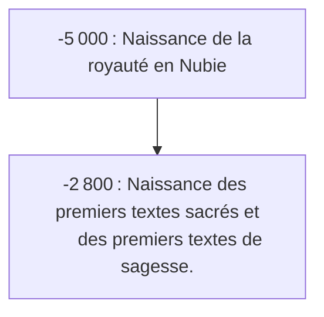

> Les dates contenues dans ce document se basent sur le `calendrier grégorien`.
{.is-info}

Cette page relate des avancées avancées sociétales de l’humanité.[^1]

[^1]: Jean Philippe Omotunde. Manuel d’études des Humanités Classiques Africaines. Editions MENAIBUC. `2007`, Volume 1. 157 p. ISBN 978-2-35349-011-0